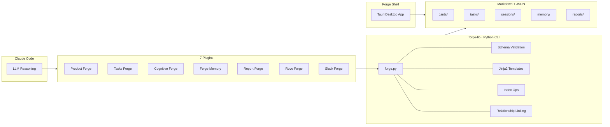

<div align="center">


# The Forge

**AI-native product management for Claude Code**

Manage products, track tasks, capture knowledge, debate decisions, generate reports,
and configure Atlassian agents — all from your terminal.

[]()
[]()
[]()
[]()

</div>

---

## What is The Forge?

The Forge is a suite of **7 Claude Code plugins** backed by a shared **Python data layer** and a **Tauri desktop app** for visual dashboards. It brings structured product management into your AI coding workflow — no context switching, no separate tools.

Plugins handle conversation and workflow. A deterministic Python CLI (`forge-lib`) handles all file operations, validation, and indexing. Forge Shell gives you a desktop GUI to browse everything the plugins create.


---

## Plugins

| | Plugin | What it does |
|---|--------|-------------|
| :clipboard: | **[Product Forge](product-forge/README.md)** | Initiatives, epics, stories — full product hierarchy with auto-linked relationships |
| :white_check_mark: | **[Tasks Forge](tasks-forge/README.md)** | Sequential task tracking with status workflow and priority management |
| :brain: | **[Cognitive Forge](cognitive-forge/README.md)** | Multi-agent debates and explorations with 5 specialized reasoning agents |
| :bulb: | **[Forge Memory](forge-memory/README.md)** | Organizational knowledge with taxonomy — products, modules, teams, integrations |
| :bar_chart: | **[Report Forge](report-forge/README.md)** | 8 report types generated via multi-agent orchestration |
| :robot: | **[Rovo Forge](rovo-forge/README.md)** | Interactive builders for Atlassian Rovo Jira & Confluence agents |
| :speech_balloon: | **[Slack Forge](slack-forge/README.md)** | Channel intelligence harvester — surfaces tasks, knowledge, and JIRA activity |

---

## Architecture



**Key design principle:** LLM handles conversation, Python handles data. Commands dropped from 250–300 lines (v1) to 80–100 lines (v2) by delegating all file operations, validation, and templating to `forge-lib`.

---

## Forge Shell — Desktop Dashboards

A [Tauri](https://tauri.app) desktop app that gives you visual dashboards for everything the plugins create.

| | |
|---|---|
|  | **Product Forge** — Browse initiatives, epics, and stories in a filterable grid |
|  | **Tasks Board** — Kanban-style board with status columns and priority filters |
|  | **Roadmap** — Timeline visualization of your product roadmap |

---

## Quick Start

```bash
# 1. Install the Python data layer
cd forge-lib && pip install -r requirements.txt

# 2. Verify
python forge.py --help

# 3. Add marketplace to Claude Code
ln -s /path/to/the-forge ~/.claude/marketplaces/forge

# 4. Launch Forge Shell (optional)
cd forge-shell && npm install && npm run tauri dev
```

See individual plugin READMEs for detailed workflows and command references.

---

## Documentation

| Resource | Description |
|----------|-------------|
| [forge-lib CLI Reference](forge-lib/README.md) | Full CLI docs, usage patterns, examples |
| [Product Forge](product-forge/README.md) | Card hierarchy, relationships, workflows |
| [Tasks Forge](tasks-forge/README.md) | Task workflow, status transitions |
| [Cognitive Forge](cognitive-forge/README.md) | Multi-agent reasoning sessions |
| [Forge Memory](forge-memory/README.md) | Knowledge taxonomy and recall |
| [Report Forge](report-forge/README.md) | 8 report types, multi-agent generation |
| [Rovo Forge](rovo-forge/README.md) | Atlassian Rovo agent builders |
| [Slack Forge](slack-forge/README.md) | Slack channel intelligence harvester |
| [Forge Shell](forge-shell/README.md) | Desktop app build and usage |

---

## Author

**Jeremy Brice**

---

<div align="center">
<sub>Built with Python · Rust · Vanilla JS · Claude Code</sub>
</div>
