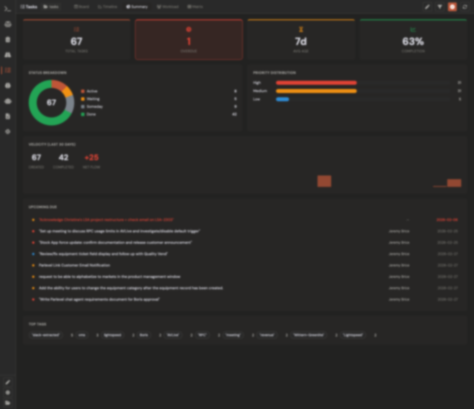
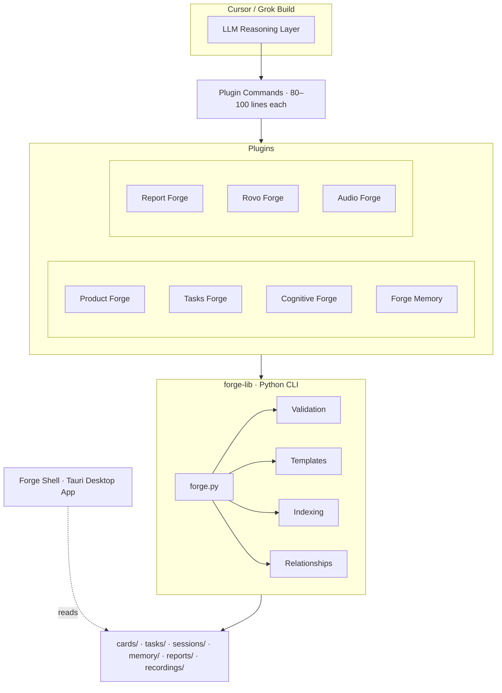
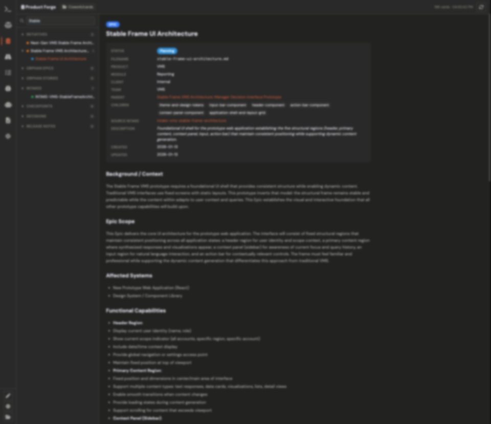
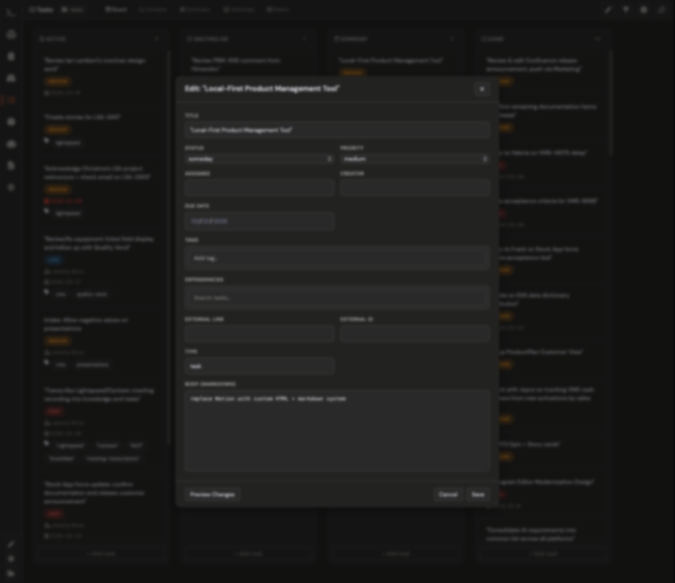
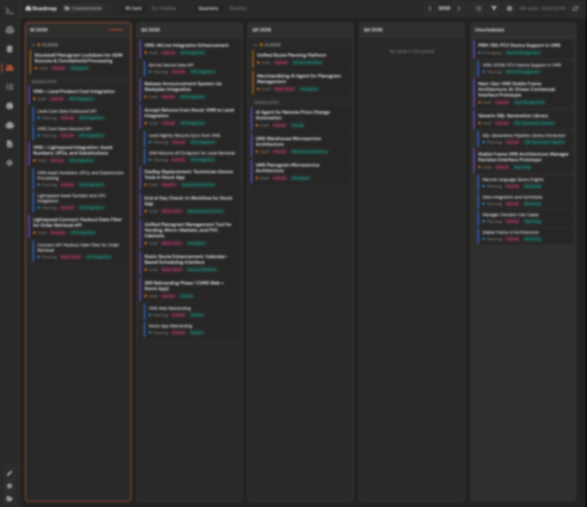

<div align="center">


# The Forge

**AI-native product management for Cursor and Grok Build**

Manage products, track tasks, capture knowledge, debate decisions, generate reports,
and configure Atlassian agents — all from your terminal.

[]()
[]()
[]()
[]()

</div>

---

## What is The Forge?

The Forge is a suite of **7 plugins** backed by a shared **Python data layer** and a **Tauri desktop app** for visual dashboards. It brings structured product management into your AI coding workflow — no context switching, no separate tools.

Plugins handle conversation and workflow. A deterministic Python CLI (`forge-lib`) handles all file operations, validation, and indexing. Forge Shell gives you a desktop GUI to browse everything the plugins create.



---

## Plugins

| | Plugin | What it does |
|---|--------|-------------|
| <picture><source media="(prefers-color-scheme: dark)" srcset="docs/images/clipboard-regular-white.svg"></picture> | **[Product Forge](product-forge/README.md)** | Initiatives, epics, stories — full product hierarchy with auto-linked relationships |
| <picture><source media="(prefers-color-scheme: dark)" srcset="docs/images/square-check-regular-white.svg"></picture> | **[Tasks Forge](tasks-forge/README.md)** | Sequential task tracking with status workflow and priority management |
| <picture><source media="(prefers-color-scheme: dark)" srcset="docs/images/lightbulb-regular-white.svg"></picture> | **[Cognitive Forge](cognitive-forge/README.md)** | Multi-agent debates and explorations with 5 specialized reasoning agents |
| <picture><source media="(prefers-color-scheme: dark)" srcset="docs/images/brain-solid-white.svg"></picture> | **[Forge Memory](forge-memory/README.md)** | Organizational knowledge with taxonomy — products, modules, teams, integrations |
| <picture><source media="(prefers-color-scheme: dark)" srcset="docs/images/chart-bar-regular-white.svg"></picture> | **[Report Forge](report-forge/README.md)** | 8 report types generated via multi-agent orchestration |
| <picture><source media="(prefers-color-scheme: dark)" srcset="docs/images/robot-solid-white.svg"></picture> | **[Rovo Forge](rovo-forge/README.md)** | Interactive builders for Atlassian Rovo Jira & Confluence agents |
| <picture><source media="(prefers-color-scheme: dark)" srcset="docs/images/microphone-solid-white.svg"></picture> | **[Audio Forge](audio-forge/README.md)** | Record system audio + microphone on macOS and transcribe with local Whisper. |

---

## Architecture



**Key design principle:** LLM handles conversation, Python handles data. Commands dropped from 250–300 lines (v1) to 80–100 lines (v2) by delegating all file operations, validation, and templating to `forge-lib`.

---

## Forge Shell — Desktop Dashboards

A [Tauri](https://tauri.app) desktop app that gives you visual dashboards for everything the plugins create.

| | |
|---|---|
|  | **Product Forge** — Browse initiatives, epics, and stories in a filterable grid |
|  | **Tasks Board** — Kanban-style board with status columns and priority filters |
|  | **Roadmap** — Timeline visualization of your product roadmap |

---

## Quick Start

```bash
# 1. Install the Python data layer
cd forge-lib && pip install -r requirements.txt

# 2. Verify
python forge.py --help

# 3. Open this repo in Cursor, or start Grok Build here.
#    Both hosts read AGENTS.md. Cursor source is .cursor/; Grok pairs are .grok/.
#    Optional Relay refresh: ./install.sh

# 4. Launch Forge Shell (optional)
cd forge-shell && npm install && npm run tauri dev
```

See individual plugin READMEs for detailed workflows and command references.

---

## Documentation

| Resource | Description |
|----------|-------------|
| [forge-lib CLI Reference](forge-lib/README.md) | Full CLI docs, usage patterns, examples |
| [Product Forge](product-forge/README.md) | Card hierarchy, relationships, workflows |
| [Tasks Forge](tasks-forge/README.md) | Task workflow, status transitions |
| [Cognitive Forge](cognitive-forge/README.md) | Multi-agent reasoning sessions |
| [Forge Memory](forge-memory/README.md) | Knowledge taxonomy and recall |
| [Report Forge](report-forge/README.md) | 8 report types, multi-agent generation |
| [Rovo Forge](rovo-forge/README.md) | Atlassian Rovo agent builders |
| [Audio Forge](audio-forge/README.md) | macOS audio recording and Whisper transcription |
| [Forge Shell](forge-shell/README.md) | Desktop app build and usage |

---

## Author

**Jeremy Brice**

---

<div align="center">
<sub>Built with Python · Rust · Vanilla JS · Cursor · Grok Build</sub>
</div>
