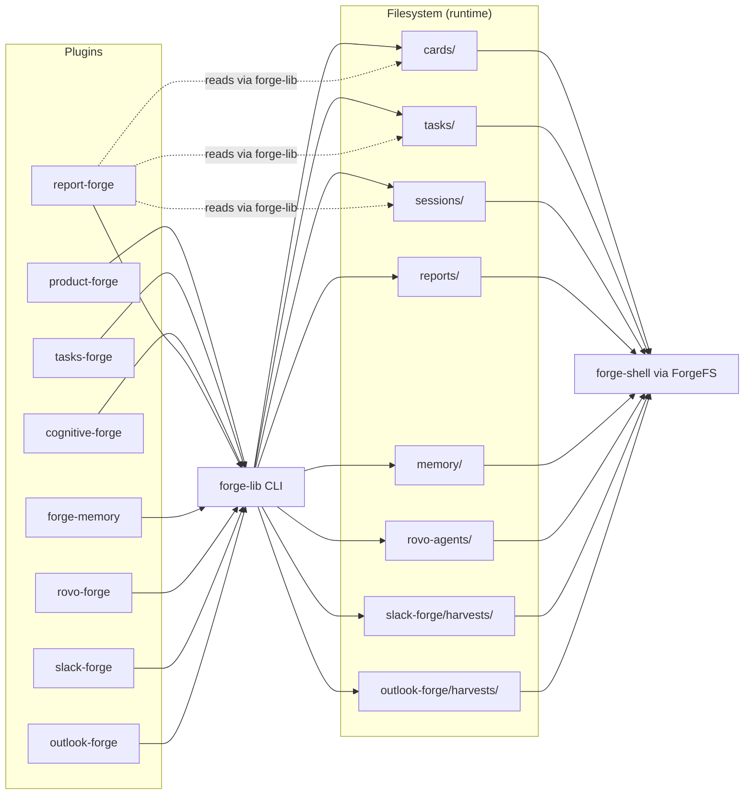

# Data Flow — The Forge Marketplace v2

## Data Ownership Map

All plugins write through forge-lib CLI. Data directories and index files are created at runtime via `forge <entity> init` — they are not checked into the repo.

| Directory | Writer | Readers | Index File |
|-----------|--------|---------|------------|
| `cards/` (initiatives/, epics/, stories/, intakes/, checkpoints/, decisions/, release-notes/) | product-forge | forge-shell (product-forge.js, roadmap.js), report-forge | `cards/index.json` |
| `tasks/` | tasks-forge | forge-shell (tasks.js), report-forge | `tasks/index.json` |
| `memory/` | forge-memory | forge-shell (memory.js) | None (uses CLAUDE.md) |
| `sessions/` (debates/, explorations/) | cognitive-forge | forge-shell (cognitive-forge.js), report-forge | `sessions/index.json` |
| `reports/` | report-forge | forge-shell (report-forge.js) | `reports/index.json` |
| `rovo-agents/` ({slug}/agent.md) | rovo-forge | forge-shell (rovo-agent-forge.js) | `rovo-agents/index.json` |
| `slack-forge/harvests/` | slack-forge | forge-shell (slack-forge.js) | `slack-forge/harvests/index.json` |
| `outlook-forge/harvests/` | outlook-forge | forge-shell (outlook-forge.js) | `outlook-forge/harvests/index.json` |

## Data Flow Diagram

## Shared Data Contracts

### cards/ — Highest Cross-Plugin Impact

**Schema files:** `forge-lib/schemas/initiative.json`, `epic.json`, `story.json`, `decision.json`, `checkpoint.json`, `intake.json`, `release-note.json`

**Frontmatter keys parsed by forge-shell** (card-data.js):

| Key | Used By | Breaking Change Risk |
|-----|---------|---------------------|
| `title`, `type`, `status` | CardData hierarchy builder, all card views | HIGH — breaks board rendering |
| `parent`, `children` | CardData `buildHierarchy()` | HIGH — breaks tree navigation |
| `product`, `module`, `client` | Taxonomy discovery (card-data.js:223-234) | HIGH — breaks filtering |
| `jira_card` | product-forge Jira sync commands | MEDIUM |
| `release`, `team`, `confidence`, `estimate_hours` | Card detail views | LOW |

### tasks/

**Schema:** `forge-lib/schemas/task.json`

**Frontmatter keys** (tasks.js:669-681): `title`, `type`, `status`, `priority`, `assignee`, `creator`, `created`, `updated`, `due_date`, `dependencies`, `tags`, `external_link`, `external_id`

**Breaking change risk:** Changing `status` values breaks board column rendering. Renaming `priority`, `assignee`, or `due_date` breaks task board filters.

### sessions/

**Schema:** `forge-lib/schemas/session.json`

**Frontmatter keys** (cognitive-forge.js): `type` (filtering), `created` (sorting). Session type is inferred from directory name (debates/ or explorations/) if the `type` field is absent.

### reports/

**Schema:** `forge-lib/schemas/report.json`

**Frontmatter keys** (report-forge.js:279-325): `title`, `topic`, `category`, `created` (sorting and search/filter).

## forge-shell Data Loading

**forge-shell does NOT use index.json.** It scans directories directly via ForgeFS and parses markdown frontmatter.

**ForgeFS** (`forge-shell/app/js/fs-adapter.js`):
- Dual-mode: Tauri (native desktop) and Browser (File System Access API)
- Methods: `readDir()`, `readFile()`, `getFileMeta()`

**ForgeUtils.FS** (`forge-shell/app/js/utils.js`):
- Higher-level wrapper: `pickDirectory()`, `getSubDir()`, `getFile()`

**ForgeUtils.parseFrontmatter()** (`utils.js:653-657`):
- Regex-based YAML frontmatter extraction from `.md` files
- Returns `{frontmatter: {}, body: ""}`

**Implications:**
- Index.json changes do NOT affect forge-shell displays
- Frontmatter key changes DO affect forge-shell — update the corresponding view controller
- Each view controller scans its own data directory independently

## Relationship Graph

**Managed by:** `forge-lib/core/relationship_ops.py`

**Valid parent-child relationships:**

| Parent | Allowed Children |
|--------|-----------------|
| Initiative | Epic, Decision, Checkpoint |
| Epic | Story, Decision |
| Intake | Initiative |
| Story, Checkpoint, Decision, Release-note | None (leaf nodes) |

**Storage:** `parent` field (filename) on child, `children` array (filenames) on parent. Bidirectional — forge-lib updates both sides automatically.

**CLI commands:**
- `forge relationship link <parent> <child> [--directory DIR]`
- `forge relationship unlink <parent> <child> [--directory DIR]`
- `forge relationship validate [--directory DIR]`

**Cross-entity reference:** Task → Story via `story` field in task frontmatter (tasks-forge specific, not managed by relationship_ops).
