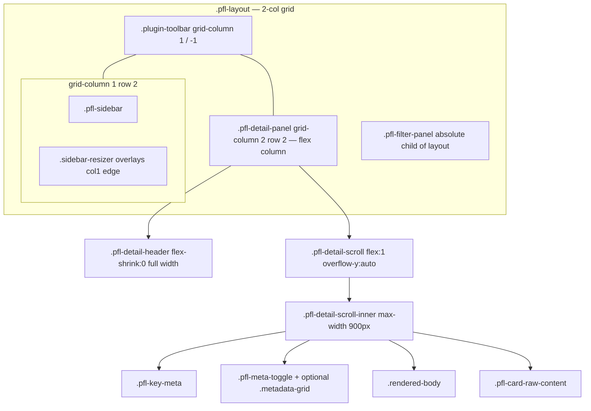
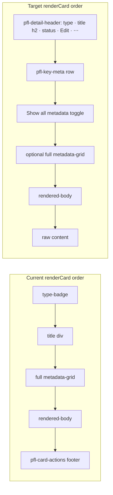
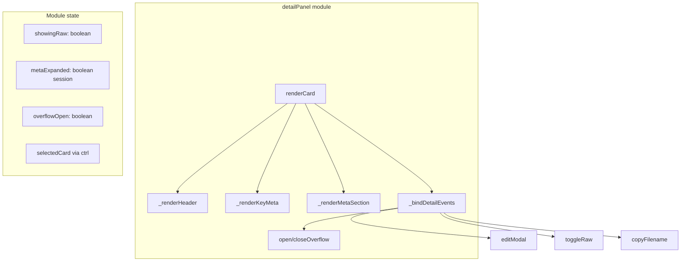
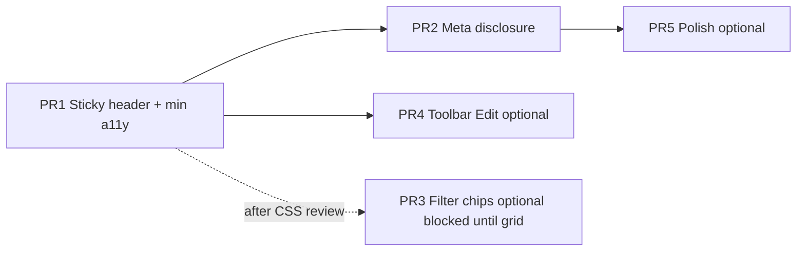

# Product Forge Detail Panel UX Redesign

| Field | Value |
|-------|--------|
| **Author** | _TBD_ |
| **Date** | 2026-07-09 |
| **Status** | Draft (revised after design review) |
| **Scope** | `forge-shell` Product Forge Local view (`view-product-forge-local`) |
| **Primary files** | `forge-shell/app/js/product-forge.js`, `forge-shell/app/css/product-forge.css` |
| **Shared CSS** | **No `components.css` changes in v1.** Reuse existing classes (`.metadata-grid`, `.type-badge`, `.status-pill`, `.plugin-toolbar`, `.rendered-body`, `.empty-state`) via composition and `pfl-*` overrides only. |
| **Related specs** | Filter panel standardization (`docs/superpowers/specs/2026-07-08-pfl-filter-panel-standardization-design.md`); sidebar progressive findability (`docs/superpowers/specs/2026-07-09-pfl-sidebar-progressive-findability-design.md`) |

---

## Overview

The Product Forge Local card detail panel currently stacks **type badge → title → full metadata grid → rendered markdown body → action buttons** inside a single scrolling surface (`.pfl-detail-panel`). Primary actions (**Edit Card**, **View Raw**, **Copy Filename**) live in a footer strip (`.pfl-card-actions`), so users must scroll past all metadata and the full body to reach them. That is the opposite of Linear / GitHub issue / Notion page patterns, where identity and primary actions stay fixed while content scrolls.

This design proposes a **hybrid north star** synthesized from three brainstorm concepts:

1. **Sticky identity header + action chrome** (Concept 1) — always-visible type · title · status · Edit · overflow menu for secondary actions.
2. **Summary + progressive disclosure** (Concept 2) — compact key-meta row; full metadata behind “Show all metadata”.
3. **Context-aware toolbar Edit as secondary affordance** (Concept 3, hybrid only) — optional plugin-toolbar Edit when a card is selected; sticky detail header remains primary.

**No backend, schema, forge-lib, frontmatter, or `components.css` changes.** Pure product-forge UI in forge-shell. Other plugins that share the “meta → body → footer buttons” pattern may adopt the same chrome later as a follow-on.

---

## Background & Motivation

### Current state

View ID: `view-product-forge-local`. Layout root: `.pfl-layout` — a **two-column** CSS grid (`sidebar-width | 1fr`) with a toolbar spanning both columns. The **sidebar resizer is not a third column**; it sits in `grid-column: 1` with the sidebar (`justify-self: end` via shared `.sidebar-resizer` rules) and overlays the right edge of the sidebar track.

| Region | Implementation |
|--------|----------------|
| Toolbar | `.plugin-toolbar`: sidebar toggle, title, folder path, filter badge, refresh indicator, refresh |
| Sidebar | Tree + search + context strip (progressive findability work); `grid-row: 2; grid-column: 1` |
| Resizer | `.sidebar-resizer` — same row/column as sidebar edge (overlay), not a separate grid track |
| Detail | `<main class="pfl-detail-panel">` → **both** empty state and `.pfl-card-detail` as permanent children (one `.hidden`) |
| Filter | Slide-over `.pfl-filter-panel` — **must remain a direct child of `.pfl-layout`** (standard pattern) |

Detail rendering is entirely owned by `detailPanel.renderCard(card)` in `product-forge.js` (~lines 532–642). It builds HTML in this order:

1. `.type-badge` (type color via `CardData.getTypeColor`)
2. Optional parse error banner
3. `.pfl-card-title-header` — title (currently a `<div>`)
4. `.metadata-grid` — **all** present frontmatter fields (Status always shown as pill or `&mdash;`, Filename, release/product/module/client/team, confidence, estimates, jira, domain, decision fields, parent/children chips, source intake, generated_*, related_stories, description, created, updated)
5. `.rendered-body` — markdown via `ForgeUtils.MD.render`
6. `.pfl-card-actions` — Edit / View Raw / Copy Filename
7. `.pfl-card-raw-content.hidden` — raw source

CSS today (`product-forge.css`):

```css
.pfl-detail-panel {
  grid-row: 2;
  grid-column: 2;
  overflow-y: auto;
  padding: 24px;
  background: var(--bg-primary);
  position: relative;
}

.pfl-card-detail {
  max-width: 900px;   /* reading width cap today */
}
```

The **scrollport is `.pfl-detail-panel`** (`overflow-y: auto`). `renderCard` sets `detailEl.scrollTop = 0` on `.pfl-card-detail`, which is **already ineffective** when switching cards—a pre-existing bug. After the flex split, the correct target is `.pfl-detail-scroll` (and optionally reset nested `.pfl-card-raw-content` scroll if raw was open).

### Pain points

1. **Scroll-to-actions** — Edit is the highest-frequency detail action (also bound to keyboard `e` when not in an input), yet the button is at the bottom of a potentially long document.
2. **Metadata as a wall** — `.metadata-grid` lists every non-empty field with equal weight. Product/team/parent/updated are high-signal; filename/created/description-in-meta/generated lists are secondary for reading. Body (the actual card content) is pushed down.
3. **Actions compete with content** — footer strip appears only after body; users who never scroll miss secondary actions (Raw, Copy).
4. **Toolbar is view-level, not selection-level** — when a card is selected, the plugin toolbar still only exposes tree/filter/refresh chrome; no selection-aware primary action (Concept 3).

### Cross-plugin pattern note

The same “meta grid → body → bottom action(s)” shape appears in:

| Plugin | Detail actions | Footer pattern |
|--------|----------------|----------------|
| **product-forge** | Edit, View Raw, Copy Filename | Yes (`.pfl-card-actions`) |
| **rovo-agent-forge** | Edit Agent | Yes (`.raf-agent-actions`) |
| **cognitive-forge** | (none — read-only) | Meta + body only |
| **report-forge / slack / outlook** | Varies; metadata-grid + body | Mostly read-focused |

**Decision:** Ship and refine the pattern in **product-forge only**. Do not extract shared chrome to `components.css` until a second plugin adopts the pattern.

### Recent related work (do not regress)

- Filter panel is a direct child of `.pfl-layout` with `position: absolute` slide-over (2026-07-08 standardization). `top: var(--toolbar-height); z-index: 20`.
- Sidebar progressive findability: context strip, pins, search results mode (2026-07-09).
- Existing sticky usage: `.pfl-context-strip` in the **sidebar** (`position: sticky; top: 0`) — proof that sticky works when the scroll container is the sidebar.

---

## Goals & Non-Goals

### Goals

1. **Primary actions always reachable** without scrolling the card body (sticky detail header with Edit + overflow menu).
2. **Body becomes the primary reading surface** — metadata does not dominate above-the-fold space; **reading width stays capped** (see Key Decision 11).
3. **Progressive disclosure** with a clear always-visible vs “Show all metadata” field set.
4. **Implementable from this doc** — concrete HTML tree, CSS flex/overflow split, and `renderCard` changes.
5. **Incremental delivery** via small, independently mergeable PRs (see PR Plan). Committed path: **PR1 → PR2**.
6. **Accessibility** — keyboard (`e` remains); **PR1 ships minimum overflow dismiss** (Esc, outside-click, `aria-expanded`, focus return to trigger).
7. **Preserve** dual empty/detail children, edit modal, raw toggle, copy-filename toast, nav links (`data-pfl-nav` / child chips), auto-refresh re-render of detail, filter slide-over placement.

### Non-Goals

- Card schema, forge-lib, templates, or `CardData` field order changes.
- Changes to `components.css` in v1.
- Full visual redesign of Product Forge (colors, tree, modal).
- Implementing sticky-header pattern across all forge-shell plugins in v1.
- Making toolbar Edit the **only** Edit affordance (Concept 3 pure).
- Expanding filter dimensions beyond current initiative/epic/story status filters.
- Inline editing of fields in the detail header (Edit still opens `editModal`).
- Mobile-native app; forge-shell remains desktop/browser-oriented (narrow widths still considered for resilience).
- **Always-visible children / release in key-meta** — downward hierarchy nav and release stay behind “Show all metadata” in v1 (see Key Decision 5 and Progressive disclosure). Users expand meta for children chips.

---

## Proposed Design

### North star (hybrid)

```
┌─ Plugin toolbar ──────────────────────────────────────────────────────────┐
│ ☰  Product Forge  📁 …/cards                          filter badge  n  🔄 │
├────────────┬──────────────────────────────────────────────────────────────┤
│  Sidebar   │  ┌─ Sticky detail header (full panel width) ──────────────┐  │
│  (tree)    │  │ [TYPE]  Card Title…              [Status]  [Edit] [⋯] │  │
│            │  ├─ Scroll region (content max-width 900px) ─────────────┤  │
│            │  │ Product · Team · Parent › … · Updated 2026-07-01      │  │
│            │  │ [Show all metadata ▾]  (children, release, … here)    │  │
│            │  │ ─────────────────────────────────────────────────────  │  │
│            │  │ .rendered-body  (primary reading surface)              │  │
│            │  │ …                                                      │  │
│            │  │ (raw block when toggled)                               │  │
│            │  └────────────────────────────────────────────────────────┘  │
│            │                              filter slide-over →             │
└────────────┴──────────────────────────────────────────────────────────────┘
```

**Concept mapping**

| Concept | Role in hybrid | Phase |
|---------|----------------|-------|
| **C1** Sticky header + actions | Core structure; removes scroll-to-actions | **PR1 (committed)** |
| **C2** Key meta + collapsible full meta | Reading density / progressive disclosure | **PR2 (committed)** |
| **C3** Toolbar Edit | Secondary affordance only; header remains primary | PR4 (optional) |
| Filter chips under toolbar | Related UX track; **redesigned placement required** | PR3 (optional; blocked until grid addendum) |

### Layout model: flex split (preferred over pure `position: sticky`)

**Why not only `position: sticky` as first child of today’s panel?**  
Today `.pfl-detail-panel` is the scrollport. The **true minimal CSS delta** would be: leave `overflow-y: auto` on the panel, put a sticky header as the first child of the scrolling content (`position: sticky; top: 0`), and leave empty-state handling alone. That often works for simple cases (A5 / A5b). It is fragile with:

- dual permanent children (empty state + card detail) competing for scroll geometry,
- nested overflow on `.pfl-card-raw-content`,
- overflow menu containment / clipping,
- filter panel stacking (`z-index: 20`).

A **flex column split** is more predictable and matches modal chrome (`.pfl-modal-content` already uses flex header / scroll body / footer):

- Outer `.pfl-detail-panel`: `display: flex; flex-direction: column; overflow: hidden; padding: 0` (padding moves inward).
- Sticky chrome: `flex-shrink: 0` (never scrolls); **full panel width**.
- Scroll body: `flex: 1; min-height: 0; overflow-y: auto`; **inner content max-width 900px**.



### Before / after structure



### Component structure



---

## API / Interface Changes

**None at network or forge-lib level.** Local UI contracts only.

### HTML structure (target for `.pfl-card-detail`)

```html
<div class="pfl-card-detail">
  <!-- Fixed chrome: does not scroll; full panel width -->
  <header class="pfl-detail-header">
    <div class="pfl-detail-header-main">
      <span class="type-badge" style="background: …">story</span>
      <h2 class="pfl-card-title-header">Notification template builder</h2>
      <!-- status pill only when fm.status is truthy (intentional; see O3 / Decision 4) -->
      <span class="status-pill" style="background: …">In Progress</span>
    </div>
    <div class="pfl-detail-header-actions">
      <button type="button" class="primary" data-pfl-action="edit" title="Edit card (E)">
        Edit
      </button>
      <div class="pfl-overflow">
        <button type="button" class="pfl-overflow-trigger" data-pfl-action="overflow"
                aria-haspopup="menu" aria-expanded="false" title="More actions"
                id="pfl-overflow-trigger">
          <i class="fa-solid fa-ellipsis" aria-hidden="true"></i>
        </button>
        <div class="pfl-overflow-menu hidden" role="menu" aria-labelledby="pfl-overflow-trigger">
          <button type="button" role="menuitem" data-pfl-action="raw">View Raw</button>
          <button type="button" role="menuitem" data-pfl-action="copy-filename">Copy Filename</button>
        </div>
      </div>
    </div>
  </header>

  <!-- Scrollable reading surface -->
  <div class="pfl-detail-scroll">
    <div class="pfl-detail-scroll-inner">
      <!-- optional parse error banner -->
      <div class="pfl-key-meta">…</div>
      <button type="button" class="pfl-meta-toggle" data-pfl-action="toggle-meta"
              aria-expanded="false">
        Show all metadata ▾
      </button>
      <div class="metadata-grid pfl-meta-full hidden">… existing rows …</div>
      <div class="rendered-body">…</div>
      <div class="pfl-card-raw-content hidden">…</div>
    </div>
  </div>
</div>
```

**Empty-state dual-child contract (do not break):**  
`<main class="pfl-detail-panel">` **always** contains both:

1. `.pfl-empty-state.empty-state`
2. `.pfl-card-detail`

Selection toggles `.hidden` (`display: none !important` from shared utilities). **Keep both children; rely on `.hidden`; never replace empty state by re-mounting the panel shell or by making `renderCard` the only child of `<main>`.** Shared `.empty-state` already uses `height: 100%` + flex centering and `padding: 40px`, which is enough after panel `padding: 0`.

### Layout shell (empty vs selected)

```css
/* product-forge.css — target */

/* Reading-width token — keep 900px parity with today */
.pfl-detail-panel {
  --pfl-detail-content-max: 900px;
  grid-row: 2;
  grid-column: 2;
  display: flex;
  flex-direction: column;
  overflow: hidden;          /* was overflow-y: auto */
  padding: 0;                /* padding moves to children */
  background: var(--bg-primary);
  position: relative;
  min-width: 0;
}

/* Card detail fills panel; no max-width on this shell */
.pfl-card-detail {
  display: flex;
  flex-direction: column;
  flex: 1;
  min-height: 0;
  max-width: none;           /* header may span full panel width */
}

.pfl-detail-header {
  flex-shrink: 0;
  display: flex;
  align-items: flex-start;
  justify-content: space-between;
  gap: 12px;
  padding: 16px 24px 12px;
  border-bottom: 1px solid var(--border-light);
  background: var(--bg-primary);
  z-index: 5;
}

.pfl-detail-header-main {
  display: flex;
  flex-wrap: wrap;
  align-items: center;
  gap: 8px 10px;
  min-width: 0;
  flex: 1;
}

.pfl-detail-header .type-badge {
  margin-bottom: 0;          /* override components.css margin-bottom: 8px under pfl only */
}

/* Class-based sizing — h2 semantic element; do not rely on bare h2 rules */
.pfl-detail-header .pfl-card-title-header {
  font-size: 18px;           /* tighter than body-era 22px for chrome density */
  font-weight: 700;
  line-height: 1.3;
  margin: 0;
  min-width: 0;
  overflow: hidden;
  text-overflow: ellipsis;
  white-space: nowrap;
  max-width: 100%;
}

.pfl-detail-header-actions {
  display: flex;
  align-items: center;
  gap: 8px;
  flex-shrink: 0;
}

/*
 * ⋯ trigger — MUST be pfl-scoped. Shared .btn-icon is only defined under
 * .plugin-toolbar .btn-icon (components.css); bare .btn-icon has no icon chrome.
 * Mirror toolbar 32×32 icon button metrics locally.
 */
.pfl-overflow-trigger {
  width: 32px;
  height: 32px;
  display: inline-flex;
  align-items: center;
  justify-content: center;
  border-radius: var(--radius-sm);
  padding: 0;
  font-size: 16px;
  line-height: 1;
  background: none;
  border: 1px solid var(--border-color);
  color: var(--text-secondary);
  cursor: pointer;
  transition: all var(--transition);
}
.pfl-overflow-trigger:hover {
  background: var(--bg-hover);
  color: var(--text-primary);
}
.pfl-overflow-trigger:focus-visible {
  outline: 2px solid var(--accent);
  outline-offset: 2px;
}

.pfl-detail-scroll {
  flex: 1;
  min-height: 0;
  overflow-y: auto;
  padding: 16px 24px 32px;
}

/* Reading column: restore today's 900px content cap inside the scrollport */
.pfl-detail-scroll-inner {
  max-width: var(--pfl-detail-content-max, 900px);
}

.pfl-key-meta {
  display: flex;
  flex-wrap: wrap;
  gap: 6px 14px;
  font-size: 12px;
  color: var(--text-secondary);
  margin-bottom: 10px;
}

.pfl-key-meta .pfl-key-meta-item {
  display: inline-flex;
  align-items: baseline;
  gap: 4px;
  max-width: 100%;
}

.pfl-key-meta .pfl-key-meta-label {
  color: var(--text-muted);
  font-weight: 600;
  text-transform: uppercase;
  letter-spacing: 0.3px;
  font-size: 10px;
}

.pfl-meta-toggle {
  background: none;
  border: none;
  color: var(--accent);
  font-size: 12px;
  font-weight: 600;
  padding: 4px 0 12px;
  cursor: pointer;
  text-align: left;
}

.pfl-meta-toggle:hover {
  text-decoration: underline;
}

.pfl-meta-full {
  margin-bottom: 16px;
}

.pfl-overflow {
  position: relative;
}

.pfl-overflow-menu {
  position: absolute;
  right: 0;
  top: calc(100% + 4px);
  min-width: 160px;
  background: var(--bg-primary);
  border: 1px solid var(--border-color);
  border-radius: var(--radius-md);
  box-shadow: var(--shadow-md);
  padding: 4px;
  z-index: 15;
}

.pfl-overflow-menu button {
  display: block;
  width: 100%;
  text-align: left;
  padding: 8px 10px;
  border: none;
  background: transparent;
  border-radius: var(--radius-sm);
  font-size: 13px;
  cursor: pointer;
  color: var(--text-primary);
}

.pfl-overflow-menu button:hover {
  background: var(--bg-hover);
}

/* Empty state: permanent sibling; flex:1 when visible; .hidden when not */
.pfl-detail-panel > .pfl-empty-state {
  flex: 1;
  /* shared .empty-state already centers + padding: 40px — sufficient without panel padding */
}
```

### JS changes to `detailPanel.renderCard`

Pseudocode aligned with existing style (string HTML + event binding):

```js
const detailPanel = {
  showingRaw: false,
  metaExpanded: false,   // session-scoped (PR2)
  overflowOpen: false,

  renderCard(card) {
    // empty: detailEl.classList.add('hidden'); emptyState remove hidden; closeOverflow(); return
    // selected: emptyState add hidden; detailEl remove hidden
    this.showingRaw = false;
    this.closeOverflow();   // always closed on re-render / card switch / auto-refresh

    // … build header + scroll-inner HTML …
    // use class="pfl-overflow-trigger" — NOT bare btn-icon

    detailEl.innerHTML = html;

    // Fix scroll reset: target the actual scrollport (pre-existing bug was
    // detailEl.scrollTop on non-scrolling .pfl-card-detail).
    const scroll = detailEl.querySelector('.pfl-detail-scroll');
    if (scroll) scroll.scrollTop = 0;
    const raw = detailEl.querySelector('.pfl-card-raw-content');
    if (raw) raw.scrollTop = 0;

    this._bindDetailEvents(detailEl, card);
  },

  openOverflow() {
    const menu = $q('.pfl-overflow-menu');
    const trigger = $q('.pfl-overflow-trigger');
    if (!menu || !trigger) return;
    this.overflowOpen = true;
    menu.classList.remove('hidden');
    trigger.setAttribute('aria-expanded', 'true');
  },

  closeOverflow(opts) {
    const menu = $q('.pfl-overflow-menu');
    const trigger = $q('.pfl-overflow-trigger');
    const wasOpen = this.overflowOpen;
    this.overflowOpen = false;
    if (menu) menu.classList.add('hidden');
    if (trigger) {
      trigger.setAttribute('aria-expanded', 'false');
      if (opts && opts.returnFocus && wasOpen) trigger.focus();
    }
  },

  // _metaRow remains for full grid rows
  // toggleRaw: toggle .hidden on .pfl-card-raw-content; label stays "View Raw" (no flip — same as today)
};
```

### Binding notes (PR1 minimum — not deferred)

- Keep `data-pfl-action="edit|raw|copy-filename"` so existing action semantics stay familiar.
- Add `overflow` (PR1). Add `toggle-meta` (PR2).
- **Overflow open/close (required in PR1):**
  1. Click trigger → toggle menu; set `aria-expanded`.
  2. **Outside click** → `closeOverflow()` (document pointerdown; ignore clicks inside `.pfl-overflow`).
  3. **Escape precedence** (extend `_bindKeyboard`):
     1. If edit modal visible → close modal (existing).
     2. Else if overflow open → `closeOverflow({ returnFocus: true })`.
     3. Else if search focused with value → clear search (existing).
  4. Choosing a menuitem (raw / copy) → perform action then `closeOverflow()`.
  5. Card switch / `renderCard` / auto-refresh re-render → `closeOverflow()` (no returnFocus).
- Nav links (`data-pfl-nav`) still bound on scroll region.
- On card switch: close overflow; reset `showingRaw`; **keep `metaExpanded`** across switches (O1).
- Scroll reset: always `.pfl-detail-scroll` (and raw nested scroll); never rely on `.pfl-card-detail.scrollTop`.
- **View Raw label:** does **not** flip to “Hide Raw” (matches current code; raw visibility is the class toggle only).

### Optional Concept 3: toolbar Edit

When `selectedCard` is set, show a toolbar control after the spacer / before filter (inside `.plugin-toolbar`, so shared `.btn-icon` styles apply):

```html
<button class="btn-icon pfl-toolbar-edit hidden" data-pfl-action="edit-selected"
        title="Edit selected card (E)">
  <i class="fa-solid fa-pen"></i>
</button>
```

- Toggle `.hidden` in `selectCard` / `renderCard(null)`.
- Handler: `editModal.open(selectedCard)` — filename string, same as keyboard `e`.
- **Do not remove** sticky header Edit.

### Filter chip strip (optional related track — redesign before implementation)

Active status filters currently appear only **inside** the slide-over panel and as a **count badge** on the filter icon. Chips under the toolbar are optional and **not on the committed PR1→PR2 path**.

#### Why the original Option A sketch was unsafe

Today:

```css
.pfl-layout {
  grid-template-rows: var(--toolbar-height) 1fr;
  grid-template-columns: var(--plugin-sidebar-current, var(--plugin-sidebar-width)) 1fr;
}
.pfl-sidebar { grid-row: 2; grid-column: 1; }
.pfl-detail-panel { grid-row: 2; grid-column: 2; }
/* .sidebar-resizer also grid-row: 2 (shared components.css) */
```

Naively adding `grid-template-rows: toolbar | auto | 1fr` **without** reassigning content rows leaves sidebar/detail on `grid-row: 2` (the chip’s auto row) and an empty `1fr` row — layout collapse.

#### Required grid placement if PR3 ships (Option A — complete)

When `FilterPanel.getActiveCount() > 0`, add class `has-filter-chips` on `.pfl-layout` and a chip strip element as a **direct layout child** (after toolbar, before sidebar). When count is 0, the host must **not** occupy a grid row (see inactive host rules below).

```html
<div class="pfl-layout has-filter-chips">
  <div class="plugin-toolbar">…</div>
  <!-- Mount only when count > 0, OR always present but .hidden when count is 0 -->
  <div class="pfl-active-filters" data-pfl-active-filters>…chips…</div>
  <aside class="pfl-sidebar">…</aside>
  <div class="sidebar-resizer" …></div>
  <main class="pfl-detail-panel">…</main>
  <div class="pfl-filter-panel" data-pfl-filter-panel></div>
</div>
```

```css
.pfl-layout.has-filter-chips {
  grid-template-rows: var(--toolbar-height) auto 1fr;
}

/* Placement MUST be gated under the flag — bare .pfl-active-filters must not claim grid-row: 2 */
.pfl-layout.has-filter-chips .pfl-active-filters {
  grid-row: 2;
  grid-column: 1 / -1;
  /* chip row chrome; may reuse .filter-bar spacing patterns via pfl rules */
}

/* Content track moves to row 3 only when chips visible */
.pfl-layout.has-filter-chips .pfl-sidebar,
.pfl-layout.has-filter-chips .sidebar-resizer,
.pfl-layout.has-filter-chips .pfl-detail-panel {
  grid-row: 3;
}

/* When no chips: default two-row grid; sidebar/detail/resizer stay at grid-row: 2 */
```

**Inactive host (count === 0) — required:**

1. Remove `has-filter-chips` from `.pfl-layout` (restores two-row template and content on row 2).
2. **And** ensure `.pfl-active-filters` does not participate in the grid:
   - **Preferred:** do not mount the host until count > 0; unmount when count returns to 0, **or**
   - Keep a permanent host but apply `.hidden` / `display: none` so it takes no grid area (shared `.hidden` is fine).

Never leave a visible or grid-participating `.pfl-active-filters` node without `has-filter-chips` — unscoped `grid-row: 2` on the host would collide with sidebar/detail (also row 2).

**Filter panel top vs chips:** when chips are visible, the slide-over still uses `top: var(--toolbar-height)` and will **overlay the chip strip** as well as the detail column. That is acceptable for v1 of PR3 (chips remain visible only when the panel is closed or partially under the panel’s left edge). Optional polish: set `top: calc(var(--toolbar-height) + var(--pfl-filter-chips-height, 0px))` when `has-filter-chips` — **not required** for first chip ship.

**Constraint:** filter panel remains **direct child of `.pfl-layout`**, not inside detail. Chip strip is also a layout child (like toolbar), not inside detail.

**Option B** (chips inside toolbar after folder path) avoids grid-row surgery but risks toolbar density — acceptable fallback if Option A proves painful.

**PR3 is blocked** on implementing the complete grid rules above (or choosing Option B). Do not merge PR3 from an incomplete sketch. Prefer **not** parallelizing PR3 with PR1 without a careful CSS conflict review (both touch layout children / overflow).

---

## Progressive disclosure — field taxonomy

### Always visible (sticky header)

| Element | Source | Notes |
|---------|--------|-------|
| Type badge | `fm.type` | Existing `.type-badge` + `getTypeColor` |
| Title | `fm.title \|\| filename` | `<h2 class="pfl-card-title-header">`; class-based 18px sizing; ellipsis + `title` attr |
| Status pill | `fm.status` | Shown **only when truthy** (`if (fm.status)`). Intentionally **no** `&mdash;` placeholder for rare empty-status cards (behavior change vs today). **Omitted from the metadata grid starting in PR1** (not deferred to PR2) — header-only when set (Decision 4 / O3). |
| Edit | action | Primary button; short label “Edit” (was “Edit Card”) |
| ⋯ menu | actions | View Raw, Copy Filename via `.pfl-overflow-trigger` |

Parse errors remain a banner at the **top of the scroll inner** (not sticky).

### Always visible when present (key-meta row — compact)

Show only non-empty values; omit the entire item if empty. Order:

| Priority | Field | Label | Rendering |
|----------|-------|-------|-----------|
| 1 | `product` | Product | plain text |
| 2 | `team` | Team | plain text |
| 3 | `parent` | Parent | `.meta-link` + `data-pfl-nav` (same as today) |
| 4 | `updated` | Updated | plain date string |

**Not in key-meta (v1 — explicit):** `children`, `release`, and all other fields. Downward hierarchy navigation (child chips) and release require expanding full metadata. Acceptable tradeoff for a compact summary row; re-open only if user feedback after PR2 shows hierarchy pain.

If **none** of the four key-meta fields are present, omit `.pfl-key-meta` entirely.

### Behind “Show all metadata” (full `.metadata-grid`)

Everything currently rendered in `renderCard`’s grid **except** status. **PR1 applies this immediately:** when the full grid is still always visible (pre-disclosure), do **not** render a Status meta row — status is header-only when `fm.status` is truthy. Avoids dual header+grid status for one PR. Include key-meta fields again when expanded in PR2 (full grid = complete form view, still without status). **Filename is always present** today, so the meta toggle is always shown when a card is selected (QA 10).

| Category | Fields |
|----------|--------|
| Identity / file | Filename (`code`) |
| Org / delivery | Release, Product, Module, Client, Team |
| Planning | Confidence, Est. Hours, Story Points, Jira Card |
| Type-specific | Domain, Decision Type, Stakeholders, Version, Checkpoint/Decision/Release dates |
| Graph | Parent, Children, Source Intake, Gen. Initiatives, Gen. Epics, Related Stories |
| Narrative meta | Description (frontmatter `description` — *not* body) |
| Audit | Created, Updated |

Toggle copy:

- Collapsed: `Show all metadata ▾` / `aria-expanded="false"`
- Expanded: `Hide metadata ▴` / `aria-expanded="true"`

Default: **collapsed**; **persist `metaExpanded` across card switches** within the session (O1). Reapply after auto-refresh re-render.

### Not in metadata

| Content | Placement |
|---------|-----------|
| Markdown body | `.rendered-body` inside `.pfl-detail-scroll-inner` |
| Raw file | After body; hidden until View Raw |
| Actions | Header / overflow only — **remove** bottom `.pfl-card-actions` |

---

## Data Model Changes

**None.**

- No frontmatter schema changes.
- No `cards/index.json` or forge-lib changes.
- No new localStorage keys required for v1 (optional later: `pfl-meta-expanded` preference).
- Session-only UI state: `detailPanel.showingRaw`, `detailPanel.metaExpanded`, `detailPanel.overflowOpen`.

---

## Alternatives Considered

### A1 — Pure Concept 1 only (sticky header, keep full grid always open)

| Pros | Cons |
|------|------|
| Smallest change; directly fixes scroll-to-actions | Metadata wall still pushes body down |
| Low risk CSS | Misses reading-surface goal |

**Verdict:** Valid MVP slice (maps to PR1 alone), but incomplete north star. Ship as first PR then layer C2.

### A2 — Pure Concept 3 only (toolbar actions, lean detail, no sticky header)

| Pros | Cons |
|------|------|
| Detail becomes pure reading surface | Toolbar already holds filter/refresh/path; Edit easy to miss among icons |
| No flex split in detail | Secondary actions (Raw/Copy) worse unless also in toolbar |

**Verdict:** Rejected as sole design. Toolbar Edit is optional secondary only.

### A3 — Sticky footer action bar (actions pin bottom instead of top)

| Pros | Cons |
|------|------|
| Less header redesign | Identity (title/status) still scrolls away |
| Familiar “form footer” pattern | Conflicts with long-read docs where footers feel like “end of form” |

**Verdict:** Rejected; north star prioritizes identity + actions together at top (Linear/GitHub).

### A4 — Full redesign (shared detail chrome component for all plugins)

| Pros | Cons |
|------|------|
| Consistency across shell | Large blast radius; couples product-forge timeline to multi-plugin refactor |

**Verdict:** Deferred. Prefer product-forge-first; no `components.css` extraction in v1.

### A5 — `position: sticky` as first child of current scrollport (minimal CSS delta)

| Pros | Cons |
|------|------|
| Smallest CSS change: keep panel `overflow-y: auto`, sticky header first child of scrolling content | Dual empty/detail children, nested raw overflow, menu clipping, filter z-index make height less predictable |
| No flex `min-height: 0` choreography | Empty-state centering vs sticky chrome is awkward |

**Verdict:** Documented as the true minimal delta. **Prefer flex split** for empty-state dual-child, predictable header height, and overflow menu containment. Acceptable fallback if flex fights layout in implementation.

### A5b — Sticky without flex, but rewrite empty state out of the scrollport

Larger than A5 and still loses flex modal parity. Not preferred.

---

## Security & Privacy Considerations

| Topic | Assessment |
|-------|------------|
| Threat model | Local desktop/browser UI over user-selected project files. No new network calls. |
| XSS | Continue using `ForgeUtils.escapeHTML` / `ESC` for all frontmatter strings; body only via `ForgeUtils.MD.render` (existing pipeline). Overflow menu labels are static. |
| Clipboard | Copy Filename already uses `navigator.clipboard`; no change in sensitivity (filename only). |
| Auth | N/A — local FS access already gated by Tauri / File System Access / server path. |
| Privacy | No new telemetry. |

### Accessibility (primary “security” surface for this UI change)

1. **Header is a `<header>`**; title is `<h2 class="pfl-card-title-header">` with **class-based** font sizing (no reliance on global `h2` rules). Document title is not set (out of scope).
2. **Overflow menu (PR1 minimum):**
   - `aria-haspopup="menu"`, `aria-expanded` toggled on open/close
   - `role="menu"` / `menuitem`
   - Esc closes (precedence: modal → overflow → search)
   - Outside click closes
   - Return focus to `.pfl-overflow-trigger` on Esc close
   - Focus trap **not** required for 2-item menu in v1 (PR5 polish)
3. **Meta toggle (PR2):** `aria-expanded` reflects state; button text updates.
4. **Keyboard:** existing `e` → edit preserved; Tab order Edit → ⋯ after title region.
5. **Contrast:** reuse existing `.status-pill` / `.type-badge` tokens.
6. **Reduced motion:** overflow appear is instant (no animation required).
7. **Narrow widths:** header wraps; actions `flex-shrink: 0`; title ellipsizes; content column still max 900px.

---

## Observability

Pure client UI; no metrics backend.

| Signal | Approach |
|--------|----------|
| Functional regressions | Manual QA checklist (below) + existing `node --test` suite must stay green (helpers/sidebar tests). No new `renderCard` unit tests required (consistent with prior PFL UI work). |
| Dev diagnostics | Keep existing Toast for copy success/fail |
| Failure modes | Edit modal open failures already toast; raw toggle is silent |

**Manual QA checklist (ship gate)**

1. Select card with long body → Edit and ⋯ visible without scrolling.
2. Scroll body → header remains fixed; filter slide-over still covers detail correctly.
3. Expand/collapse metadata; parent/child nav chips work when expanded (PR2).
4. View Raw shows/hides raw block; scroll position remains usable; raw nested scroll resets on card switch.
5. Copy Filename still toasts.
6. Keyboard `e` opens edit; Esc closes modal first, then overflow if open, then search clear.
7. Empty state still centers; both empty + detail nodes remain in DOM; selecting card restores header layout.
8. Auto-refresh while card open re-renders detail without layout jump; **overflow open + auto-refresh closes menu without JS error**.
9. Sidebar collapse/resize + filter open simultaneously — no double scrollbars on detail.
10. Card with only type/title (minimal frontmatter) — no empty key-meta row; meta toggle still shown (Filename always in full grid).
11. Card switch always resets `.pfl-detail-scroll` to top (fixes pre-existing ineffective reset).
12. Wide window: body/key-meta/meta grid stay ≤900px; header bar may span full panel width.
13. ⋯ trigger is 32×32 with border/hover (not unstyled default button).

---

## Rollout Plan

| Stage | Approach |
|-------|----------|
| Feature flags | **Not required** — pure local UI; ship behind incremental PRs. If risk-averse, gate meta collapse with `const META_DISCLOSURE = true` for one PR cycle. |
| Staging | Run `npm run serve` / `tauri:dev`; exercise product-forge with a real `cards/` tree. |
| Rollback | Revert single PR; no data migration. CSS/JS only. |
| Order | **Committed path: PR1 → PR2.** PR3–5 optional. PR1 alone fixes the main pain. |

---

## Risks

| Risk | Severity | Mitigation |
|------|----------|------------|
| Sticky/flex + overflow double scrollbars | Medium | `min-height: 0` on flex children; panel `overflow: hidden`; only `.pfl-detail-scroll` scrolls |
| Filter panel z-index over header | Medium | Keep filter `z-index: 20` > header `z-index: 5`; panel still layout child |
| Bare `.btn-icon` unstyled in detail | High if ignored | Use `.pfl-overflow-trigger` with explicit 32×32 rules (Issue 1) |
| Reading width regression | High if ignored | Cap `.pfl-detail-scroll-inner` at 900px; header full width (Issue 3) |
| Incomplete overflow a11y | Medium | Esc + outside-click + aria-expanded + focus return in **PR1** |
| PR3 grid-row collapse | Critical if PR3 naive | Full row reassignment or Option B; PR3 blocked until specified |
| Toolbar density if C3 Edit added | Low–Med | Icon-only; hide when no selection; defer to PR4 |
| Long titles explode header height | Medium | Single-line ellipsis + `title` tooltip |
| Status missing for empty-status cards | Low | Intentional; real cards always have status |
| Users miss Raw/Copy in overflow | Low | Familiar ⋯ pattern; toast on copy |
| Empty state vs flex layout regression | Medium | Dual children + `.hidden`; empty `flex: 1`; QA case 7 |
| Cross-plugin inconsistency | Low | Product-forge-first; no forced migration |
| `renderCard` rebind loses expanded meta | Low | Persist `metaExpanded`; reapply after re-render |
| Overflow open during auto-refresh | Low | `closeOverflow()` at start of `renderCard` |
| Narrow/cmux embedded browser | Low | Flex wrap; test at ~900px shell width |

---

## Open Questions

| ID | Question | Default if unanswered |
|----|----------|----------------------|
| O1 | Persist “Show all metadata” expand state across card switches / sessions? | Session-only module boolean → **keep across switches** |
| O2 | Duplicate product/team/parent/updated in full grid when expanded? | **Yes include** — full grid = complete dump |
| O3 | Omit Status from full grid / omit pill when missing? | **Yes omit** from full grid **in PR1 onward** (header-only when truthy); **omit pill when missing** (no `&mdash;`) |
| O4 | Label “Edit” vs “Edit Card”? | **“Edit”** in sticky chrome |
| O5 | Put filename in key-meta? | **No** — only in full meta; Copy Filename covers clipboard |
| O6 | Ship toolbar Edit (C3) in same release train? | **No** — PR4 optional after sticky + disclosure land |
| O7 | Extract detail chrome to `components.css` now? | **No** — keep `pfl-*`; **zero shared CSS edits in v1** |
| O8 | Active filter chips under toolbar in same epic? | **Optional PR3** after complete grid placement; not committed path |
| O9 | Content max-width value? | **900px** (match current `.pfl-card-detail`) via `--pfl-detail-content-max` |
| O10 | Children / release in key-meta? | **No for v1** — expand full meta (Decision 5) |

---

## Key Decisions

1. **Hybrid north star (C1 + C2 + optional C3)** — Fixes scroll-to-actions first; progressive disclosure second; toolbar Edit only as secondary. Rationale: highest confidence concepts first; toolbar density risk deferred.

2. **Flex split over pure sticky** — `.pfl-detail-panel` becomes non-scrolling flex column; `.pfl-detail-scroll` owns vertical scroll. Rationale: more reliable with dual empty/detail children, overflow menu containment, and filter overlay. Sticky-as-first-child of current scrollport is documented as smaller delta (A5) but not preferred.

3. **Product-forge-only scope; no `components.css` changes in v1** — Do not refactor rovo/cognitive detail panels; do not add global `.btn-icon`. Rationale: isolate risk; compose shared classes with `pfl-*` overrides.

4. **Status moves to sticky header when present; omitted from full grid starting in PR1; no `&mdash;` when missing** — Rationale: status is identity when set; empty-status cards are rare. Do **not** leave a Status row in the always-visible PR1 grid (avoids one-PR dual display).

5. **Key-meta = product · team · parent · updated only** — Children and release are **not** key-meta in v1; downward nav requires expanding full metadata. Rationale: keep summary compact per brainstorm; avoid chip-row height in the always-visible band. Revisit only with post-PR2 feedback.

6. **Secondary actions in ⋯ overflow, not footer; trigger is `.pfl-overflow-trigger`** — Rationale: compact header; Edit primary; toolbar-scoped `.btn-icon` does not style detail actions.

7. **No schema/backend changes** — Pure presentation over existing frontmatter.

8. **Filter chips are optional and layout-level; PR3 blocked on complete grid-row reassignment** — Must not nest inside detail; must reassign sidebar/resizer/detail to `grid-row: 3` when chips row is present (or use Option B). Chip placement CSS is gated under `.has-filter-chips`; when count is 0, remove the flag **and** hide/omit the host so it cannot collide with content on row 2.

9. **Incremental PRs; committed path is PR1 → PR2 only** — PR1 alone is user-visible value.

10. **Default metadata collapsed** — Body-first reading surface; `metaExpanded` persists across card switches in-session (O1).

11. **Reading width: header full panel width; scroll content max-width 900px** — `.pfl-detail-scroll-inner { max-width: 900px }` restores today’s reading column; sticky header bar may span the full detail panel so actions stay right-aligned at the panel edge.

12. **PR1 includes minimum overflow a11y** — Esc (with modal → overflow → search precedence), outside-click dismiss, `aria-expanded`, focus return to trigger on Esc. PR5 only for focus-visible polish / STYLE_GUIDE / optional focus trap.

13. **Dual empty/detail children retained** — Selection toggles `.hidden` only; never re-mount the panel shell to swap states.

14. **Scroll reset targets the scrollport** — `.pfl-detail-scroll` (and raw nested scroller); documents and fixes pre-existing ineffective `detailEl.scrollTop` on `.pfl-card-detail`.

---

## References

- Implementation: [`forge-shell/app/js/product-forge.js`](file:///Users/jeremybrice/Documents/GitHub/the-forge/forge-shell/app/js/product-forge.js) — `detailPanel.renderCard`, `FilterPanel`, `_renderLayout`, keyboard `e` / Escape
- Styles: [`forge-shell/app/css/product-forge.css`](file:///Users/jeremybrice/Documents/GitHub/the-forge/forge-shell/app/css/product-forge.css) — `.pfl-detail-panel`, `.pfl-card-detail { max-width: 900px }`, `.pfl-card-actions`, `.pfl-filter-panel`
- Shared chrome: [`forge-shell/app/css/components.css`](file:///Users/jeremybrice/Documents/GitHub/the-forge/forge-shell/app/css/components.css) — `.plugin-toolbar .btn-icon` (toolbar-only), `.metadata-grid`, `.type-badge`, `.status-pill`, `.rendered-body`, `.filter-bar`, `.empty-state`, `.sidebar-resizer`
- Style guide: [`forge-shell/STYLE_GUIDE.md`](file:///Users/jeremybrice/Documents/GitHub/the-forge/forge-shell/STYLE_GUIDE.md) — toolbar + sidebar contract (two-column grid + resizer overlay)
- Field definitions: [`forge-shell/app/js/card-data.js`](file:///Users/jeremybrice/Documents/GitHub/the-forge/forge-shell/app/js/card-data.js) — `FIELD_ORDER`, status/type colors
- Prior pattern peers: `rovo-agent-forge.js` (footer Edit), `cognitive-forge.js` (meta + body)
- Filter panel standard: `docs/superpowers/specs/2026-07-08-pfl-filter-panel-standardization-design.md`
- Sidebar findability: `docs/superpowers/specs/2026-07-09-pfl-sidebar-progressive-findability-design.md`

---

## PR Plan

### PR 1 — Sticky detail header + move actions out of footer + min overflow a11y

| | |
|--|--|
| **Title** | `pfl: sticky detail header with Edit and overflow actions` |
| **Files** | `forge-shell/app/js/product-forge.js` (`detailPanel.renderCard`, overflow open/close, `_bindKeyboard` Esc precedence, scroll reset, action binding), `forge-shell/app/css/product-forge.css` (flex panel, header, `.pfl-overflow-trigger`, overflow menu, scroll-inner max-width, remove `.pfl-card-actions` usage) |
| **Depends on** | None |
| **Description** | Restructure detail into non-scrolling header (type · title · status · Edit · ⋯ with Raw/Copy) + scrolling body with **900px content inner**. Keep **full metadata grid always visible** in the scroll region for this PR (no progressive disclosure yet). **Omit Status from the metadata grid in PR1** — header-only when `fm.status` is truthy (matches Decision 4; no dual header+grid status). Remove bottom `.pfl-card-actions`. **Ship minimum overflow a11y:** Esc dismiss (after modal), outside-click, `aria-expanded`, focus return on Esc. Use `.pfl-overflow-trigger` (not bare `.btn-icon`). Fix scroll reset to `.pfl-detail-scroll` (and raw nested). Preserve dual empty/detail children, edit modal, keyboard `e`, nav chips, raw block. Manual QA checklist items 1–2, 4–9, 11–13. |

### PR 2 — Progressive disclosure for metadata + key-meta row

| | |
|--|--|
| **Title** | `pfl: key-meta row and collapsible full metadata in detail` |
| **Files** | `forge-shell/app/js/product-forge.js` (`_renderKeyMeta`, `_renderMetaDisclosure`, `metaExpanded` state), `forge-shell/app/css/product-forge.css` (`.pfl-key-meta`, `.pfl-meta-toggle`) |
| **Depends on** | PR 1 |
| **Description** | Add compact product/team/parent/updated row. Collapse full `.metadata-grid` behind Show all / Hide metadata. Status already omitted from grid in PR1 (header-only); keep that. Default collapsed; preserve expand state across card switches within session. Children/release only in full meta. Body becomes primary above-the-fold content when meta is collapsed. |

### PR 3 — Active filter chips under plugin toolbar (optional; blocked until grid complete)

| | |
|--|--|
| **Title** | `pfl: show active status filter chips under toolbar` |
| **Files** | `forge-shell/app/js/product-forge.js` (`_renderLayout` chip host, chip update on filter events), `forge-shell/app/css/product-forge.css` (`.pfl-layout.has-filter-chips` three-row grid, row reassignment for sidebar/resizer/detail, `.pfl-active-filters`) |
| **Depends on** | **Complete grid placement addendum in this design (done above).** Not parallel-merge-safe with PR1 without CSS conflict review. Prefer after PR1 lands. |
| **Description** | When active filter count > 0: `has-filter-chips` on layout; chip strip placement **only** via `.pfl-layout.has-filter-chips .pfl-active-filters { grid-row: 2; grid-column: 1 / -1 }`; sidebar, resizer, and detail `grid-row: 3`. Removable chips + optional Clear all. Filter panel remains layout child; note it may overlay chips at `top: toolbar-height`. When count is 0: remove `has-filter-chips` **and** hide/omit `.pfl-active-filters` (`display: none` / `.hidden` or unmount) so it never claims grid-row 2 alone. **Do not merge** without gated placement + inactive-host rules. Alternative: Option B (toolbar-inline chips) if grid approach is deferred further. |

### PR 4 — Toolbar Edit affordance when card selected (optional C3)

| | |
|--|--|
| **Title** | `pfl: toolbar Edit button for selected card` |
| **Files** | `forge-shell/app/js/product-forge.js` (`_renderLayout` button inside `.plugin-toolbar`, `selectCard` / `renderCard` visibility) |
| **Depends on** | PR 1 recommended (dual affordances intentional); not hard-blocked |
| **Description** | Icon-only Edit in plugin toolbar (shared `.btn-icon` OK here) when `selectedCard` is set; `editModal.open(selectedCard)`. Hidden on empty selection. Does not remove sticky header Edit. |

### PR 5 — Polish, a11y extras, and STYLE_GUIDE note (optional cleanup)

| | |
|--|--|
| **Title** | `pfl: detail header a11y polish and style-guide note` |
| **Files** | `forge-shell/app/js/product-forge.js` (optional arrow-key menu nav / focus trap), `forge-shell/app/css/product-forge.css` (extra focus-visible if needed), `forge-shell/STYLE_GUIDE.md` (short note: product-forge detail sticky header pattern; two-column grid + resizer overlay; filter panel still layout child) |
| **Depends on** | PR 1; ideally PR 2 |
| **Description** | **Not** the home of Esc/outside-click (those ship in PR1). Focus-visible polish, STYLE_GUIDE documentation for future plugins, optional menu focus trap. No behavior change for tree/filters. |

---

### Suggested merge order



**Minimum viable user value:** merge **PR 1** alone.  
**North star complete (committed path):** **PR 1 + PR 2**.  
**Optional:** **PR 3** (after complete grid rules), **PR 4**, **PR 5**.  
**Do not treat PR3–5 as required for north star.**
