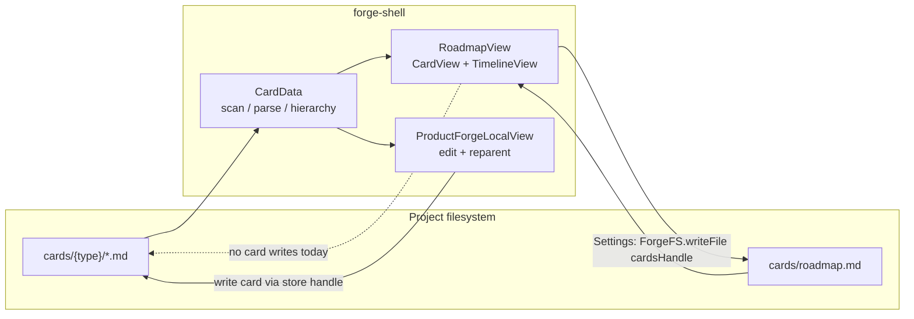
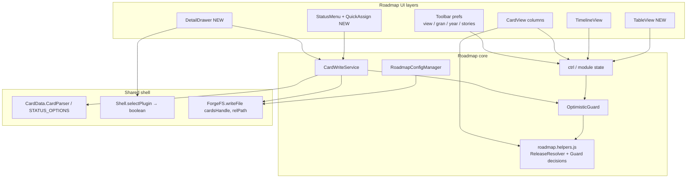
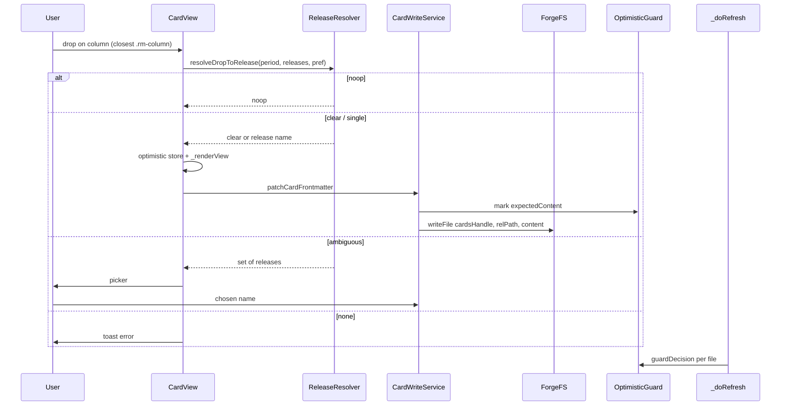
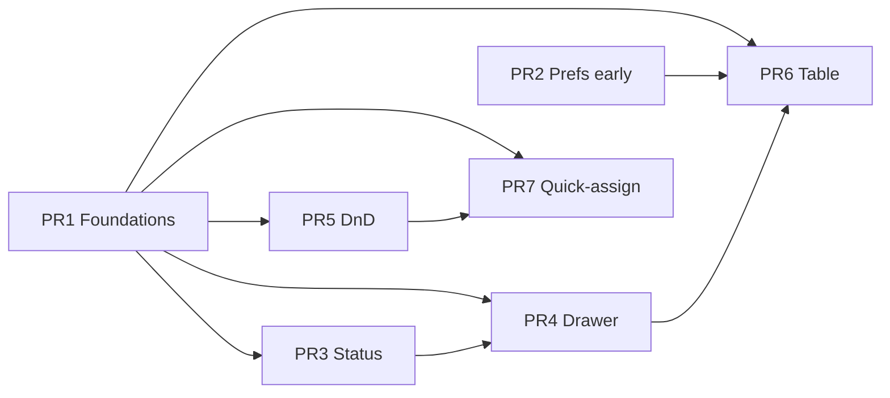

# Roadmap Forge UX: Interactive Planning Surface (P0 + P1)

| Field | Value |
|-------|--------|
| **Author** | _TBD_ |
| **Date** | 2026-07-12 |
| **Status** | Draft (revised after design review) |
| **Scope** | `forge-shell` Roadmap view (`#view-roadmap`) — interactive planning on top of Product Forge cards |
| **Primary files** | `forge-shell/app/js/roadmap.js`, `forge-shell/app/js/roadmap.helpers.js` (**new**), `forge-shell/app/css/roadmap.css`, `forge-shell/test/roadmap.helpers.test.js` (**new**) |
| **Shared touchpoints** | `forge-shell/app/js/card-data.js`, `forge-shell/app/js/product-forge.js`, `forge-shell/app/js/shell.js`, `forge-shell/app/js/fs-adapter.js` / `utils.js` FS helpers |
| **Landing path** | `docs/superpowers/specs/2026-07-12-roadmap-interactive-planning-surface.md` |
| **Out of scope (P2/P3)** | Timeline bar drag-resize, progress signals, search, first-run empty-state polish |
| **Related patterns** | Tasks board DnD (`tasks.js`), Product Forge reparent + detail panel (`product-forge.js`), PFL detail UX redesign (`docs/superpowers/specs/2026-07-09-pfl-detail-panel-ux-redesign.md`) |

---

## Overview

The Forge Shell Roadmap view (`roadmap.js` ~1.2k LOC) already visualizes Product Forge cards as a **card board** (period columns + Unscheduled) and a **timeline** (Gantt-style swim lanes). Scheduling is **release-centric**: an initiative’s `frontmatter.release` name is matched against `cards/roadmap.md` `releases[]` (`name`, `start_date`, `end_date`), and cards appear in period columns via `TimeUtils.cardInPeriod` / `releaseOverlapsPeriod`. Today the surface is **read-only**: status is a decorative color dot, cards are not selectable, reschedule requires editing cards in Product Forge or editing release metadata in Settings, and toolbar preferences (`default_view`, `time_granularity`, `current_year`, `show_stories`) load from `roadmap.md` but most toggles never write back.

This design turns Roadmap into an **interactive planning surface** for P0 + P1:

| Priority | Feature | User outcome |
|----------|---------|--------------|
| **P0** | Inline status change | Click status → type-aware menu → write card frontmatter |
| **P0** | Detail drawer + jump to Product Forge | Side drawer summary + “Open in Product Forge” |
| **P0** | Drag-and-drop reschedule | Drag initiative between period columns / Unscheduled → update `release` |
| **P1** | Table view | Dense sortable table; shared filters; row → drawer |
| **P1** | Persist view preferences | Toolbar toggles save to `roadmap.md` |
| **P1** | Quick-assign menu | ⋯ / right-click: Set release, Add to bucket, Clear schedule |

Roadmap remains a **planning surface**, not a second full card editor. Card writes use the **portable** `ForgeFS.writeFile(cardsHandle, relativePath, content)` contract (same as `RoadmapConfigManager.save` for `roadmap.md`), not broken browser FSA stubs from `scanCardsDir`. Config writes reuse `RoadmapConfigManager.save`. Implementation is sliced into independently reviewable PRs with pure helpers extracted for tests.

---

## Background & Motivation

### Current architecture (as implemented)



| Concern | Implementation today |
|---------|----------------------|
| Config load/save | `RoadmapConfigManager.load/save` — YAML frontmatter in `cards/roadmap.md` via **`ForgeFS.writeFile(cardsHandle, 'roadmap.md', content)`** (portable dual-mode) |
| Card scan | Shared `CardData.scanCardsDir(cardsHandle)` + local `CardData.CardStore` |
| Card “handles” in store | Tauri/server: path strings; **browser FSA: plain `{name, kind}` stubs** from `readDir` — **not** `FileSystemFileHandle`s with `createWritable()` |
| PFL card write | `CardParser.serialize` + `ForgeUtils.FS.writeFile(handle, content)` — works when handle is a path string; **fragile/broken for browser stubs** |
| Period mapping | `TimeUtils.getQuarters` / `getMonths`; `getReleaseForCard`; `cardInPeriod` |
| Filters | In-memory `FilterPanel.filters` (product, client, module, status, release) |
| Auto-refresh | 5s poll `_doRefresh` reloads config + full card scan; **always** `store.set`s every scanned file; re-renders on any add/mod/delete |
| Card write (Roadmap) | **None** today |
| Cross-plugin nav | `Shell.selectPlugin(pluginId)` destroys previous controller, calls `ctrl.init(this.rootHandle)` without await; **no deep-link / preselect API**; silent no-op if plugin hidden |
| File watcher | Tauri maps `/cards/` → `product-forge-local` only; dead map `/roadmap-data/` → `roadmap` (config actually lives at `cards/roadmap.md`); Roadmap relies on 5s polling |

### Pain points

1. **Status is display-only** — planners cannot triage initiative/epic state without leaving Roadmap.
2. **No card identity affordance** — rendered nodes lack `data-*` identity; click does nothing; no path to detail or Product Forge.
3. **Reschedule is high friction** — assigning a release means open Product Forge → Edit → pick release (datalist from `CardData.roadmapConfig`), or change release date ranges globally.
4. **Preferences are ephemeral** — `_bindToolbar` mutates `activeView`, `granularity`, `currentYear`, `rmConfig.show_stories` but never calls `RoadmapConfigManager.save` (except Settings modal).
5. **No dense scan mode** — Card/Timeline only; large portfolios lack a sortable table.

### Why now

Tasks already proves board DnD + multi-view in Shell (`tasks.js` `moveTaskToStatus` + optimistic `markChanged` / debounced write). Product Forge proves card serialization and type-aware status. Roadmap already owns the release/period model and a **proven portable config write** (`ForgeFS.writeFile(cardsHandle, …)`). The missing piece is wiring interaction → portable card writes + careful optimistic UI against the 5s refresh.

---

## Goals & Non-Goals

### Goals

1. Make Roadmap a **planning-first** surface: change status, assign/clear release, bucket membership, inspect summary, jump to full edit.
2. Keep the **release-centric** scheduling model; teach it in DnD (period drop → release assignment, not free-form “column status”).
3. **Serialize** like Product Forge (`CardParser.serialize`, preserve body, set `updated`) but **write** via the portable dual-mode API used by `RoadmapConfigManager.save`.
4. Persist toolbar planning prefs in `roadmap.md` so desktop and browser/cmux sessions share defaults via the project tree.
5. Ship incrementally: each PR reviewable, mergeable, and useful alone.
6. Dual-mode FS: Tauri path strings, browser File System Access directory handles, and server `/api/fs/*` — all via `ForgeFS.writeFile(cardsHandle, relativePath, content)`.
7. Extract pure logic to `roadmap.helpers.js` with `node --test` coverage (repo standard).

### Non-Goals (this phase)

| Item | Notes |
|------|-------|
| Timeline bar drag / resize | P2+; bars stay tooltip-only |
| Free-form date ranges on cards | Still release name only; release calendar lives in Settings |
| Full card editor in Roadmap | Drawer is summary + quick actions only |
| Reparent / create / delete cards | Product Forge ownership |
| Progress % / rollup signals | P2+ |
| Full-text search | P2+ |
| First-run empty-state redesign | Out of scope unless foundation requires minimal empty copy |
| forge-lib CLI or schema migration for `release` | Shell already uses `release`; schema drift is noted, not fixed here |
| Reordering cards within a column as priority | DnD is schedule-only, not rank |
| Epic/story column DnD | Initiatives are the schedule unit in card view; epics may get status/drawer only |
| Shared `components.css` redesign | Prefer `rm-*` styles + reuse existing chips/menus |
| Fixing Product Forge’s browser handle-write bug | Out of scope; Roadmap must not copy the broken contract |

---

## Design Work Organization (single vs multi-doc)

### Recommendation: **one program design doc + PR-sliced implementation** — **AFFIRMED**

| Option | Fit | Trade-off |
|--------|-----|-----------|
| **A. Single design doc (recommended, approved)** | P0+P1 share foundations (portable write, selection, release↔period mapping, optimistic refresh). One decision record avoids contradictory partial specs. | Longer doc; mitigate with explicit PR plan and dependency graph. |
| **B. Multi-doc program** (foundation + feature slices) | Useful if teams parallelize across quarters or ownership splits. | High risk of re-deciding release snap rules and drawer UX per doc; more handoff cost than this scope warrants. |
| **C. Spec-per-PR only** | Fast start. | Loses coherent interaction model; reviewers cannot see end-state. |

**Deploy structure:**

1. **This document** — architectural source of truth for P0+P1. Land at `docs/superpowers/specs/2026-07-12-roadmap-interactive-planning-surface.md`.
2. **PR descriptions** — each PR links to the relevant section + “PR Plan” ID; no separate mini-specs required. **Do not** split status vs drawer into separate design docs.
3. **Optional follow-on** — P2 (timeline drag-resize, progress, search) gets a new design doc that **references** this one rather than forking foundations.

Do **not** invent a second config file for prefs — `roadmap.md` already defines the preference keys.

---

## Proposed Design

### High-level architecture



### Shared foundations (extract first)

These are the **non-UI** building blocks every feature slice depends on. Ship pure services + DOM **identity attributes** in PR1 — **not** focusable action buttons without handlers (see PR1 scope).

#### 1. Card DOM contract

Every interactive card node (initiative, epic, story) must carry identity for event delegation:

```html
<!-- PR1: identity only. No status/⋯ buttons until PR3/PR7 bind handlers. -->
<div class="rm-initiative-card"
     data-rm-filename="notification-system-overhaul"
     data-rm-type="initiative"
     data-rm-status="Approved">
  <div class="rm-card-title">…</div>
  <div class="rm-card-meta">
    <span class="rm-status-dot" style="background:…"></span>
    <span class="rm-status-label">Approved</span>
    …
  </div>
</div>
```

**PR3** upgrades the status display to a real control:

```html
<button type="button" class="rm-status-hit"
        data-rm-action="status" aria-label="Change status">
  <span class="rm-status-dot" …></span>
  <span class="rm-status-label">Approved</span>
</button>
```

**PR7** adds:

```html
<button type="button" class="rm-card-more" data-rm-action="more"
        aria-label="Card actions">⋯</button>
```

**PR5** sets `draggable="true"` on initiatives only.

Rules (once handlers exist):

- **Click on card body** (not status/more) → open/select drawer (PR4).
- **Click status hit target** → status menu (stopPropagation) (PR3).
- **⋯ or contextmenu** → quick-assign menu (PR7).
- **Only initiatives** get `draggable="true"` in Card view (schedule unit) (PR5).
- Timeline bars and labels gain `data-rm-filename` for click → drawer (no drag in this phase).

**Column DOM contract (PR1 identity / PR5 DnD):**

```html
<div class="rm-column"
     data-rm-period-index="0"
     data-rm-period-start="2026-01-01"
     data-rm-period-end="2026-03-31">
  …
  <div class="rm-column-body">…buckets, cards, empty states…</div>
</div>

<div class="rm-column rm-unscheduled"
     data-rm-period-index="unscheduled">
  …
</div>
```

- `data-rm-period-index` is an integer into the current `periods` array, or the sentinel string `unscheduled`.
- Start/end attributes mirror `periods[i]` for debugging and resolver input without walking JS closures.

#### 2. `CardWriteService` — portable write path (mandatory)

**Do not** use `store.fileHandles` + `ForgeUtils.FS.writeFile(handle, content)` as the Roadmap contract. In browser FSA mode, `scanCardsDir` stores:

```js
handle: typeof cardsHandle === 'string'
  ? `${cardsHandle}/${entry.name}/${fileEntry.name}`  // path — OK
  : fileEntry  // { name, kind } — NO createWritable()
```

`ForgeUtils.FS.writeFile` in non-path mode calls `fileHandle.createWritable()`, which fails on those stubs. Product Forge currently uses that pattern; it is **not** the dual-mode contract Roadmap should copy. Roadmap Settings already use the portable form:

```js
await ForgeFS.writeFile(cardsHandle, 'roadmap.md', content);
```

**Canonical Roadmap card write:**

```js
// Relative path under cards/
function cardRelativePath(card) {
  return card.dirName + '/' + card.filename + '.md';
  // e.g. initiatives/notification-system-overhaul.md
}

async function patchCardFrontmatter(filename, mutatorFn) {
  var card = store.get(filename);
  if (!card || !cardsHandle) throw new Error('Card not writable: ' + filename);

  var prevFm = JSON.parse(JSON.stringify(card.frontmatter));
  mutatorFn(card.frontmatter);
  card.frontmatter.updated = ForgeUtils.todayISO();

  var content = CardData.CardParser.serialize(card.frontmatter, card.body);
  var relPath = cardRelativePath(card);

  // mark BEFORE await write so concurrent refresh cannot win the race
  OptimisticGuard.mark(filename, { expectedContent: content, writtenAt: Date.now() });

  try {
    await ForgeFS.writeFile(cardsHandle, relPath, content);
    var reparsed = CardData.CardParser.parse(filename, content, card.dirName);
    // Keep existing handle map entry if any; not used for Roadmap writes
    store.set(filename, reparsed, Date.now(), store.fileHandles.get(filename));
    return reparsed;
  } catch (e) {
    card.frontmatter = prevFm;
    OptimisticGuard.clear(filename);
    throw e;
  }
}
```

| Mode | `cardsHandle` | Write behavior |
|------|---------------|----------------|
| Tauri | path string | `ForgeFS.writeFile` → Rust `write_file` with joined path |
| Server / cmux | path string | `POST /api/fs/write` |
| Browser FSA | directory handle | Navigates `dirName` + creates writable on real file handle |

**Optional fallback (not primary):** if `store.fileHandles.get(filename)` is a **string** path (Tauri/server), `ForgeUtils.FS.writeFile(path, content)` also works — but implementers must still use `cardsHandle + relativePath` as the single code path to avoid browser bugs.

**Module placement:** orchestration lives in `roadmap.js`; pure helpers (path join is trivial; guard decisions; release resolution) live in `roadmap.helpers.js`. Do **not** put `CardWriteService` in `card-data.js` in PR1 (keeps PFL risk zero). Optional later cleanup can promote a shared writer if PFL adopts the portable path.

**Dual-mode QA (required):** every write feature (status, release, prefs) must be smoke-tested on Tauri macOS, Chrome FSA, and server/cmux.

#### 3. `OptimisticGuard` — single ordered algorithm

`_doRefresh` today always re-parses every file and `store.set`s it; `lastModified` only gates **re-render**, not skip of overwrite. Tasks mitigates differently (signature + toast suppress); Roadmap needs an explicit guard.

**Fingerprint** = full serialized file content string equality (`fileData.content === expectedContent`). No partial field hash.

**TTL** = 15 seconds from `writtenAt`.

##### Algorithm (normative)

**A. On user mutation (`patchCardFrontmatter`):**

1. Snapshot `prevFm` (deep clone of frontmatter).
2. Apply `mutatorFn` to in-memory `card.frontmatter`; set `updated`.
3. Optionally update optimistic DOM (status label/dot) **or** call `_renderView` for structural moves (DnD).
4. `content = CardParser.serialize(…)`.
5. **`OptimisticGuard.mark(filename, { expectedContent: content, writtenAt: Date.now() })`** — must run **before** `await write` so a concurrent refresh cannot apply stale disk.
6. `await ForgeFS.writeFile(cardsHandle, relPath, content)`.
7. On success: `store.set` reparsed card with `Date.now()` as timestamp; **keep pending** until a scan sees matching content (step B) or TTL expires.
8. On failure: restore `prevFm`, `OptimisticGuard.clear(filename)`, re-render if needed, rethrow / toast.

**B. On each scanned file inside `_doRefresh`:**

Call pure helper (unit-tested):

```js
// roadmap.helpers.js
function guardDecision(pendingEntry, diskContent, now, ttlMs) {
  // pendingEntry: { expectedContent, writtenAt } | null
  // returns: 'apply' | 'skip' | 'apply-and-clear' | 'force-apply-ttl'
  if (!pendingEntry) return 'apply';
  if (diskContent === pendingEntry.expectedContent) return 'apply-and-clear';
  if (now - pendingEntry.writtenAt < ttlMs) return 'skip';
  return 'force-apply-ttl';
}
```

| Decision | Store behavior | Pending | Render |
|----------|----------------|---------|--------|
| `apply` | `store.set` from disk | n/a | normal change detection |
| `apply-and-clear` | `store.set` from disk | clear | normal |
| `skip` | **do not** `store.set` from disk; keep in-memory optimistic card | keep | treat as no external change for this file |
| `force-apply-ttl` | `store.set` from disk | clear + `console.warn` | may overwrite user intent if external edit won |

**C. Concurrent external edit while pending:** if disk content ≠ expected and ≠ pre-write snapshot, and still within TTL → **skip** (preserve optimistic). After TTL → force-apply disk (external or failed flush wins) with warn. No merge UI in this phase.

**D. Re-render policy:**

- Status-only change: prefer targeted DOM update of `.rm-status-dot` / `.rm-status-label` / `data-rm-status` when the card node exists; still mark/write via the algorithm above.
- Schedule change (column membership): full `_renderView` after optimistic in-memory update.
- After any full `_renderView`, **re-apply** selection chrome (see Drawer) and re-bind events.

**E. Config writes** (prefs, buckets): separate flag `configWritePending` / content fingerprint for `roadmap.md` so `_doRefresh` does not clobber in-flight config the same way (mirror mark → write → clear on match).

#### 4. `ReleaseResolver` (pure, in `roadmap.helpers.js`)

| Function | Behavior |
|----------|----------|
| `releasesOverlappingPeriod(releases, period)` | Filter where `releaseOverlapsPeriod` |
| `resolveDropToRelease(period, releases, preferredName?)` | See truth table below |
| `periodLabelsForRelease(release, periods)` | Labels of periods the release spans |
| `clearReleaseFm(fm)` | **`fm.release = null`** only — never `delete fm.release` |

**Clear / assign serialization (pinned to PFL):**

- **Clear schedule / Unscheduled:** `fm.release = null` (YAML emits `release: null`), matching Product Forge `_getFormData` empty-field → `null` behavior.
- **Assign:** store the **exact** `config.releases[].name` string (case preserved).
- **Match for placement:** remains case-insensitive via existing `TimeUtils.getReleaseForCard` (`String(…).toLowerCase()`).
- **No-op compare:** treat current and target as same if both nullish, or if case-insensitive string equality holds (avoid churn / false dirty).

##### `resolveDropToRelease` truth table

Let `set = releasesOverlappingPeriod(releases, period)`.  
Let `pref` = card’s current `frontmatter.release` (string or null/undefined).  
`prefInSet` = pref is non-nullish and some `r.name` matches case-insensitively.

| \|set\| | prefInSet | Result `kind` | Action |
|--------|-----------|---------------|--------|
| 0 | — | `none` | Toast: no release covers period; **no write** |
| 1 | true (same release) | `noop` | No write; optional no toast |
| 1 | false / no pref | `single` | Assign `set[0].name` |
| N>1 | true | `noop` | Drag within multi-quarter / multi-overlap of current R — **no picker, no write** |
| N>1 | false / no pref | `ambiguous` | Show snap picker listing `set` |
| Unscheduled column | — | `clear` | `clearReleaseFm` → `release = null` (if already null → `noop`) |

Picker UI when `ambiguous`:

```
Assign to release
○ Q1 2026 Ship (Jan 1 – Mar 31)
○ Platform 26.2 (Feb 15 – May 30)
Cancel
```

Empty period toast:  
`No release covers this period. Define a release in Roadmap Settings.`  
Do **not** invent a synthetic release name from the period label.

**Multi-quarter releases:** if release R spans Q1–Q2, the initiative appears in **both** columns (`cardInPeriod` is overlap-based). Expected. Toast on new assign when span > 1 period:  
`Scheduled for {release} (spans Q1–Q2)`.

#### 5. Selection + detail shell state

Module state additions:

```js
var selectedFilename = null;   // drawer selection
var drawerOpen = false;
var prefsSaveTimer = null;     // debounced roadmap.md write
```

**Config source of truth for Roadmap actions:** always local `rmConfig` (loaded/saved by `RoadmapConfigManager`). Roadmap continues to set `CardData.roadmapConfig = rmConfig` on load/refresh for Product Forge’s release datalist — that is a **cache for PFL**, not what Roadmap menus read. Deep-link to PFL does **not** require refreshing PFL’s roadmapConfig beyond existing behavior; if the user never opened Roadmap, PFL’s release list may be empty (pre-existing).

Escape hierarchy (extend existing `_bindKeyboard`):

1. Open status/quick menu → close menu  
2. Open config modal → close modal (existing)  
3. Open drawer → close drawer  
4. Open filter panel → close filter (existing)

#### 6. Cross-plugin deep-link to Product Forge

Today: `Shell.selectPlugin(pluginId)` returns nothing, silently returns early if `visibility[pluginId]` is false, destroys previous controller, calls `ctrl.init(this.rootHandle)` without awaiting. PFL `init` is async; `_revealCard` is the correct post-load helper.

**Normative API:**

```js
// shell.js
/**
 * @returns {boolean} false if plugin hidden or unknown; true if switch started
 */
selectPlugin(pluginId, options) {
  if (!this.visibility[pluginId]) return false;
  if (!this._controllers[pluginId] && pluginId !== /* valid id check */) return false;

  const prev = this.activePlugin;
  this.activePlugin = pluginId;
  location.hash = pluginId;

  if (prev && prev !== pluginId && this._controllers[prev]?.destroy) {
    this._controllers[prev].destroy();
  }
  // toggle view containers + nav …

  const ctrl = this._controllers[pluginId];
  if (ctrl && ctrl.init) {
    // Fire-and-forget async init; options applied ONLY inside init after load
    Promise.resolve(ctrl.init(this.rootHandle, options || {})).catch(/* log */);
  }
  return true;
}
```

```js
// product-forge.js — single apply point after cards are loaded
async init(rootHandle, options) {
  this.destroy();
  // … layout, load cards …
  await this._loadCards();
  if (options && options.selectCard) {
    this._revealCard(options.selectCard); // expands tree + selectCard
  }
  this._startAutoRefresh();
  this._bindKeyboard();
}
```

**Rules:**

| Case | Behavior |
|------|----------|
| PFL hidden in plugin visibility | `selectPlugin` returns `false`; Roadmap toasts and **stays** on Roadmap |
| Switch Roadmap → PFL | Destroy Roadmap (current behavior); PFL full re-init; then `_revealCard` |
| PFL already active | Not the Roadmap path (user is on Roadmap). If ever called while active: still `init` destroys/reloads today — no special-case required for P0 |
| Hash-only navigation | Unchanged; no `selectCard` in hash for this phase |
| Double-apply | **Forbidden** — no `applyPendingOptions` after `Promise.resolve`; options only consumed inside `init` after `await _loadCards()` |

**Roadmap caller:**

```js
var ok = Shell.selectPlugin('product-forge-local', { selectCard: filename });
if (!ok) ForgeUtils.Toast.show('Product Forge is hidden or unavailable', 'error');
```

**Fallback (only if Shell API change is deferred):** `sessionStorage.setItem('pfl-pending-select', filename)` before `selectPlugin`; PFL `init` reads/clears. Preferred path remains return-boolean + options-to-init.

---

### Feature designs

### P0-1 — Inline status change

**Interaction**

1. User clicks `.rm-status-hit` on initiative/epic/story (when PR3 has bound the button).
2. Anchored popover lists `CardData.STATUS_OPTIONS[type]` only (type-aware Shell options).
3. Current status marked if it is in the list; choosing same value closes without write.
4. On choose: optimistic DOM update → `patchCardFrontmatter` sets `status` → short success toast; on failure revert + error toast.

**Foreign / forge-lib status values**

Cards written by CLI or older data may use statuses not in `CardData.STATUS_OPTIONS` (e.g. initiative schema has `Planning`, `In Progress`, `On Hold`, … while Shell has `Draft|Submitted|Approved|Superseded`).

| Rule | Behavior |
|------|----------|
| Display | Show current value **as-is** (dot color via `getStatusColor` fallback / muted if unknown) |
| Menu list | Shell options only |
| Current foreign value | Optionally show as a **disabled** menuitem at top (“Planning (current)”) so the user sees what will be overwritten; not required for P0 if disabled styling is costly |
| Selecting a Shell option | Overwrites foreign status with no extra warning |
| Filters | Unchanged: filter chips still union `STATUS_OPTIONS` keys only (pre-existing gap for foreign values) |

**A11y:** real `<button>`; menu `role="menu"` / `menuitemradio`; Escape closes.

**Types:** initiatives and epics always; stories when `show_stories` is on.

---

### P0-2 — Detail drawer + jump to Product Forge

**Layout**

Reuse the **filter-panel pattern** (absolute slide-over on the right of `.rm-content`):

```
.rm-content
  .rm-card-view | .rm-timeline-view | .rm-table-view
  .rm-filter-panel (existing, 280px, z-index 20)
  .rm-detail-drawer (new)
```

| Property | Spec |
|----------|------|
| Position | `position: absolute; top:0; right:0; bottom:0` overlay (does **not** push columns) |
| Width | **340px** (range 320–360px; wider than filter to fit hierarchy + description) |
| z-index | **25** (≥ filter’s 20 so drawer stacks above filter if both briefly open) |
| Mutual exclusion | Opening drawer closes filter; opening filter closes drawer |
| Narrow / mobile | Same overlay; full-height; no special split layout in P0 |
| Background | `var(--bg-secondary)` + left border / shadow matching filter panel |

**Selection persistence:** `_renderView` replaces `innerHTML` of view containers. After every render:

1. If `selectedFilename` still exists in store and `drawerOpen`, re-apply `.rm-selected` on matching `[data-rm-filename="…"]`.
2. Re-render drawer body from store (or leave drawer DOM outside the wiped containers — **prefer drawer as sibling of view containers**, not inside card/timeline root, so only selection chrome needs re-apply).

**Drawer contents (read-only summary)**

| Block | Content |
|-------|---------|
| Header | Type badge, title, close |
| Status row | Status pill (clickable → same status menu when PR3 exists) |
| Key meta | Product · Client · Module · Team |
| Schedule | Release name; if resolved, dates; period labels for current year/granularity |
| Hierarchy | Parent filename/title if in store; children count + short list (max ~5 + “N more”) |
| Description | `frontmatter.description` or first ~280 chars of body plain text |
| Actions | **Open in Product Forge** (primary); Set release / Clear schedule / bucket actions as P1 menus land |

**Non-goals in drawer:** edit title/body, reparent, delete, raw YAML.

**Click targets**

| Target | Action |
|--------|--------|
| Card body / table row / timeline bar or label | `openDrawer(filename)` |
| Status hit | status menu only |
| ⋯ | quick menu |
| Open in Product Forge | `Shell.selectPlugin(…)` as above |

---

### P0-3 — Drag-and-drop reschedule

**Reference:** Tasks column DnD for `dragover`/`drop` + payload; PFL valid/invalid hover classes for feedback. **Not** PFL reparent semantics.

#### Hit-testing and event binding (normative)

1. Each `.rm-column` has `data-rm-period-index` (+ start/end) as in DOM contract.
2. Bind `dragover`, `dragleave`, `drop` on **`.rm-column`** (or `.rm-column-body` with bubble). Always `e.preventDefault()` on `dragover` so drop fires for nested targets.
3. Resolve target column: `e.target.closest('.rm-column')` — works when pointer is over nested `.rm-bucket-group`, another initiative, epic child, empty-state, or padding.
4. **Drop-on-card / drop-on-epic ⇒ same as drop-on-column period.** Never reparent. Never change bucket membership via column DnD.
5. Visual: add `rm-drag-over` to the **column** (or column-body), not to individual cards.
6. Unscheduled uses `.rm-column.rm-unscheduled` with `data-rm-period-index="unscheduled"` — same handlers.
7. Payload: `text/plain` = filename.

#### Rules

| Rule | Detail |
|------|--------|
| Draggable | Initiatives only (`.rm-initiative-card`, PR5 sets `draggable`) |
| Droppable | Any point inside a period column or Unscheduled (via `closest`) |
| Unscheduled | `clearReleaseFm` → `release = null` |
| Period | `resolveDropToRelease` truth table |
| Buckets | **Unchanged** by column DnD |
| Confirm | **None** for simple assign/clear; picker only when `ambiguous` |
| Timeline | No bar drag in P0/P1; click opens drawer |

**Sequence**



**Drag threshold:** ignore click-as-drag if pointer movement &lt; 5px before `dragstart` cancels drawer open conflict (implement via not opening drawer on `dragend` if a drag occurred).

---

### P1-4 — Table view

**Toolbar:** Card | Timeline | Table (`fa-grip`, `fa-chart-gantt`, `fa-table`).

**Rows:** one per **initiative** (planning unit). Epic count column for density. No epic rows in P1.

**Columns**

| Column | Source | Sortable |
|--------|--------|----------|
| Title | `fm.title` / filename | Yes |
| Type | `initiative` | Yes |
| Status | `fm.status` | Yes |
| Product | `fm.product` | Yes |
| Client | `fm.client` | Yes |
| Module | `fm.module` | Yes |
| Release | `fm.release` | Yes |
| Period | derived labels or `—` | Yes (first period start) |
| Epics | `children.length` | Yes |

**Filters:** `FilterPanel.filterHierarchy`. Row click → drawer. Status cell interactive when PR3 exists. Sticky header.

**`default_view: 'table'`** allowed after PR6. Load path must allowlist (see Prefs).

---

### P1-5 — Persist view preferences

**Keys** on `roadmap.md`: `default_view`, `time_granularity`, `current_year`, `show_stories`.

**Write strategy:** debounce 400ms → full `RoadmapConfigManager.save(cardsHandle, rmConfig)`. Pause while Settings modal open. If `prefsSaveTimer` pending, `_doRefresh` must not stomp prefs fields from disk; always apply disk releases/buckets/swim_lanes.

**`default_view` allowlist / coerce (load path — PR2):**

```js
var ALLOWED_VIEWS = ['card', 'timeline', 'table'];
function coerceView(v, tableImplemented) {
  if (ALLOWED_VIEWS.indexOf(v) === -1) return 'card';
  if (v === 'table' && !tableImplemented) return 'card'; // UI only
  return v;
}
// activeView = coerceView(rmConfig.default_view, TABLE_IMPLEMENTED)
// Optionally keep rmConfig.default_view as 'table' on disk so after PR6 it sticks
```

Until PR6, if YAML contains `table`, **UI shows card** but disk value may be preserved so post-PR6 sessions open table. Document in PR2. **`_renderView` must not treat unknown/table as timeline** (today’s binary `activeView === 'card' ? … : timeline` is a footgun — fix to explicit switch in PR2).

Silent save; error toast only.

---

### P1-6 — Quick-assign menu

**Triggers:** ⋯ (PR7); `contextmenu` on initiative (preventDefault).

| Item | Write target |
|------|--------------|
| Set release… | card `release` = exact name |
| Clear schedule | `release = null` |
| Add to / remove from bucket | `rmConfig.buckets` + config save |
| Open in Product Forge | navigation |
| Change status… | alias status menu |

Epics: status + open in PFL; Set release allowed for metadata parity with PFL edit fields (column placement remains initiative-driven).

---

## API / Interface Changes

### Roadmap controller (internal)

| API | Purpose |
|-----|---------|
| `cardRelativePath(card)` | `dirName/filename.md` |
| `CardWriteService.patch(filename, mutator)` | Portable frontmatter write |
| `ReleaseResolver.*` / `guardDecision` | Pure helpers in `roadmap.helpers.js` |
| `OptimisticGuard.mark/clear` + refresh integration | Refresh safety |
| `openDrawer` / `closeDrawer` | Selection UI |
| `schedulePrefsSave()` | Debounced config write |
| `assignRelease(filename, releaseName \| null)` | Shared by DnD, menu, drawer |
| `setCardStatus(filename, status)` | Shared by menu + status control |
| `addToBucket` / `removeFromBucket` | Quick-assign |

### Shell

```js
Shell.selectPlugin(pluginId, options?: { selectCard?: string }): boolean
```

### Product Forge

```js
async init(rootHandle, options?: { selectCard?: string })
// after await _loadCards(): if options.selectCard → _revealCard(options.selectCard)
// no applyPendingOptions
```

### Config schema (additive)

```yaml
default_view: card | timeline | table   # table after PR6; coerce until then
time_granularity: quarterly | monthly
current_year: 2026
show_stories: false
releases: [...]
buckets: [...]
swim_lanes: [...]
```

### Card frontmatter writes

| Field | Values |
|-------|--------|
| `status` | `CardData.STATUS_OPTIONS[type]` (may overwrite foreign) |
| `release` | exact release `name` string, or **`null`** to clear |
| `updated` | `ForgeUtils.todayISO()` |

---

## Data Model Changes

### No forge-lib migration required

Same card files and `roadmap.md` keys. `default_view` may become `table`.

### Schema drift (informational)

`forge-lib/schemas/initiative.json`: different status enums; `additionalProperties: false`; **no `release`**. Shell + this design continue to write `release` and Shell statuses. Forge-lib fix is a separate chore.

### Bucket membership

Unchanged structure; quick-assign mutates `buckets[].initiatives` filenames.

### Migration

None. Coerce unknown `default_view` on load.

---

## Alternatives Considered

### 1. Free-form period columns (`period: 2026-Q2` on cards)

**Rejected** — dual source of truth with releases; breaks timeline bars.

### 2. Full Product Forge detail panel embedded in Roadmap

**Rejected** — not a planning surface; couples large PFL code.

### 3. Prefs in `localStorage` only

**Rejected** — keys already on `roadmap.md`; share across Shell modes.

### 4. Promote all writes through forge-lib CLI

**Rejected** — Shell does not use forge-lib for PFL saves; schema drift.

### 5. Confirm dialog on every release change

**Rejected** — single-file change; Unscheduled undoes schedule.

### 6. Copy PFL `ForgeUtils.FS.writeFile(store.fileHandles)` for cards

**Rejected** — browser FSA stubs from `scanCardsDir` are not writable handles. Portable `ForgeFS.writeFile(cardsHandle, relPath, content)` is mandatory.

---

## Security & Privacy Considerations

| Topic | Assessment |
|-------|------------|
| Threat model | Local project files only |
| Paths | Relative path built only from `card.dirName` + `card.filename` from scan — never from user title |
| Injection | `escapeHTML` on all rendered strings; menus from known enums + config names |
| Auth / privacy | Unchanged local FS grants |

---

## Observability

| Signal | Implementation |
|--------|----------------|
| User feedback | Toasts on success/error; silent prefs save |
| Dev diagnostics | `console.warn` on guard TTL force-apply, failed writes |
| Refresh indicator | Existing count · time; optional “Saving…” during write |

---

## Risks

| Risk | Severity | Mitigation |
|------|----------|------------|
| Browser write via broken handles | **High** (avoided) | Portable `ForgeFS.writeFile(cardsHandle, relPath)` only |
| Optimistic vs 5s refresh | **High** | Single ordered OptimisticGuard algorithm + unit tests |
| Multi-release ambiguity | **Medium** | Truth table + picker; preferredName noop |
| Multi-quarter multi-column | **Low** (expected) | Toast explains span |
| Shared release date edits move many cards | **Medium** | DnD assigns membership only; Settings owns calendar |
| Prefs vs Settings concurrent write | **Medium** | Pause prefs autosave while modal open |
| Deep-link when PFL hidden | **Low** | `selectPlugin` → boolean + toast |
| Foreign status overwrite | **Low** | Display as-is; menu Shell-only |
| Dead `/roadmap-data/` watcher path | **Low** | Polling works; cleanup O7/O8 |
| Accidental drag vs click | **Low** | 5px threshold / drag flag |
| `roadmap.js` LOC growth | **Medium** | Extract `roadmap.helpers.js` + tests in PR1 |

---

## Observability & Performance targets

| Metric | Target |
|--------|--------|
| Status optimistic UI | &lt; 100ms |
| Local write | &lt; 500ms typical |
| Prefs debounce | 400ms |
| Guard TTL | 15s |
| Table sort | Client-side; no virtualization in P1 |

---

## Rollout Plan

**Acceptance gates (product):**  
- **P0 complete** when PR1 + PR3 + PR4 + PR5 merge.  
- **P1 complete** when PR2 + PR6 + PR7 merge.

**Recommended calendar / merge order** (P0/P1 are gates, not “delay prefs”):

1. **PR1** Foundations (helpers + tests + identity attrs + write/guard)  
2. **PR2 early** Persist prefs (high value, low UI risk; no hard dep on PR1 but share config-pending pattern if available)  
3. **PR3** Inline status  
4. **PR4** Drawer + deep-link  
5. **PR5** DnD reschedule  
6. **PR6** Table view  
7. **PR7** Quick-assign  

No feature flags. Rollback = revert PR; data is ordinary frontmatter.  
**QA matrix:** Tauri macOS, Chrome FSA, server/cmux; empty releases; multi-release overlap; multi-quarter; Unscheduled round-trip; foreign status; hidden PFL plugin.

---

## Open Questions

| ID | Question | Recommendation |
|----|----------|----------------|
| O1 | Epic `release` affect columns? | **No** — initiative-driven |
| O2 | Promote writer to `card-data.js` in PR1? | **No** — Roadmap-local + portable path first |
| O3 | Fix forge-lib initiative schema? | **No** — separate chore |
| O4 | Drag handle vs whole-card? | Whole-card + 5px / drag flag |
| O5 | Prefs toast every time? | **No** — silent |
| O6 | Table epic rows? | **No** — count column |
| O7 | Map Tauri `/cards/` watcher to Roadmap? | Nice-to-have; not blocking |
| O8 | Dead `/roadmap-data/` → roadmap mapping | **Cleanup:** remove or retarget; when wiring watcher, map `cards/roadmap.md` + card paths to active Roadmap **without** dropping PFL refresh on `/cards/` |

---

## Key Decisions

| # | Decision | Rationale |
|---|----------|-----------|
| K1 | **Single design doc for all P0+P1** | Shared foundations; packaging affirmed |
| K2 | **Release-centric scheduling retained** | Existing TimeUtils + timeline + PFL release field |
| K3 | **Period drop assigns release name, never invents dates** | Calendar lives in Settings |
| K4 | **Ambiguous multi-release → picker** | Silent first-match mis-schedules |
| K5 | **Unscheduled / clear → `fm.release = null`** | Match PFL serialization; no key delete |
| K6 | **Initiatives only for column DnD** | Matches `_getInitiativesForPeriod` |
| K7 | **Optimistic writes + single ordered guard** | 5s refresh always overwrites otherwise |
| K8 | **Portable write: `ForgeFS.writeFile(cardsHandle, dirName/filename.md, content)`** | Browser FSA stubs in `fileHandles` are not writable; match Settings/config path |
| K9 | **Type-aware statuses from `CardData.STATUS_OPTIONS`** | Match PFL; foreign values display as-is, menu overwrites |
| K10 | **Drawer is summary, not editor** | Planning surface constraint |
| K11 | **`Shell.selectPlugin(id, opts) → boolean`; options only in async init post-load** | Detect hidden plugin; avoid double-select race |
| K12 | **Prefs persist to `roadmap.md` with debounce** | Cross-mode share |
| K13 | **`default_view` allowlist; coerce `table` until TableView ships** | Avoid timeline footgun |
| K14 | **Quick-assign writes card and/or config** | Release on card; buckets on config |
| K15 | **No confirm on simple schedule/status** | Planner speed |
| K16 | **Incremental PR plan; calendar PR1→PR2 early→…** | Independently reviewable |
| K17 | **Pure helpers in `roadmap.helpers.js` + tests (default, not optional)** | Repo test pattern; LOC control |
| K18 | **DnD hit-test via `closest('.rm-column')` + period data attrs** | Buckets/nested cards must not break drops or reparent |
| K19 | **Roadmap actions use local `rmConfig`; `CardData.roadmapConfig` is PFL cache only** | Avoid coupling drawer Set release to PFL singleton lifecycle |
| K20 | **Assign stores exact release name; match is case-insensitive** | Stable YAML + existing getReleaseForCard |

---

## References

| Resource | Path / note |
|----------|-------------|
| Roadmap controller | `forge-shell/app/js/roadmap.js` |
| Roadmap styles | `forge-shell/app/css/roadmap.css` |
| Shared card layer | `forge-shell/app/js/card-data.js` (`scanCardsDir` handle stubs ~196–204) |
| Product Forge | `forge-shell/app/js/product-forge.js` |
| Tasks DnD | `forge-shell/app/js/tasks.js` |
| FS adapter | `forge-shell/app/js/fs-adapter.js` (`ForgeFS.writeFile(root, relativePath, content)`) |
| Shell routing | `forge-shell/app/js/shell.js` (watcher `/cards/` → PFL; dead `/roadmap-data/`) |
| Helper test pattern | `forge-shell/app/js/product-forge.helpers.js`, `forge-shell/test/*.helpers.test.js` |
| Style guide | `forge-shell/STYLE_GUIDE.md` |

---

## PR Plan

P0/P1 labels are **acceptance gates**. **Calendar order:** PR1 → PR2 (early) → PR3 → PR4 → PR5 → PR6 → PR7.



---

### PR1 — Roadmap interaction foundations

| | |
|--|--|
| **Title** | `roadmap: portable card write, optimistic guard, helpers + tests, DOM identity` |
| **Depends on** | None |
| **Files** | `app/js/roadmap.helpers.js` (**new**), `test/roadmap.helpers.test.js` (**new**), `app/js/roadmap.js`, wire script tag in `index.html` if needed |
| **Description** | Extract pure `ReleaseResolver` (incl. `clearReleaseFm` → `null`, `resolveDropToRelease` truth table), `guardDecision`, and related period helpers to `roadmap.helpers.js` dual-export pattern (browser global + `module.exports`) with `node --test`. Implement `CardWriteService` using **`ForgeFS.writeFile(cardsHandle, card.dirName + '/' + card.filename + '.md', content)`** and OptimisticGuard integrated into `_doRefresh` per normative algorithm. Add **identity** `data-rm-filename` / `data-rm-type` / `data-rm-status` on cards and **`data-rm-period-index|start|end`** on columns. **Do not** ship focusable status/⋯ buttons without handlers. No user-facing status menus, drawer, or DnD yet. |

---

### PR2 — Persist toolbar preferences to roadmap.md

| | |
|--|--|
| **Title** | `roadmap: persist view, granularity, year, and show_stories prefs` |
| **Depends on** | None hard; **ship early after PR1** when possible for config-pending pattern |
| **Files** | `app/js/roadmap.js` |
| **Description** | Debounced save of prefs keys via `RoadmapConfigManager.save`. Pause while Settings modal open. **Allowlist** `default_view ∈ {card, timeline, table}`; if `table` but TableView not implemented (**until PR6**, not PR5), **coerce UI to `card`** (optionally preserve disk value). Fix `_renderView` to explicit switch so non-card never falls through to timeline incorrectly. Silent success; error toast on failure. |

---

### PR3 — Inline status change

| | |
|--|--|
| **Title** | `roadmap: inline type-aware status menu writes card frontmatter` |
| **Depends on** | **PR1** |
| **Files** | `app/js/roadmap.js`, `app/css/roadmap.css` |
| **Description** | Introduce `.rm-status-hit` **buttons** and bind status popover (`CardData.STATUS_OPTIONS[type]`). Foreign status display-as-is; menu overwrites. Optimistic + portable write. |

---

### PR4 — Detail drawer + Open in Product Forge

| | |
|--|--|
| **Title** | `roadmap: detail drawer and deep-link into Product Forge` |
| **Depends on** | **PR1**; soft-depends **PR3** for status control in drawer |
| **Files** | `app/js/roadmap.js`, `app/css/roadmap.css`, `app/js/shell.js`, `app/js/product-forge.js` |
| **Description** | Overlay drawer ~340px, z-index 25, mutual exclusion with filter. Re-apply `.rm-selected` after every `_renderView`. `Shell.selectPlugin(id, opts) → boolean`; PFL `init` applies `selectCard` only via `_revealCard` after `_loadCards`. Toast if false. Roadmap uses local `rmConfig` for schedule display. |

---

### PR5 — Drag-and-drop reschedule (card view)

| | |
|--|--|
| **Title** | `roadmap: drag initiatives across periods to assign or clear release` |
| **Depends on** | **PR1** |
| **Files** | `app/js/roadmap.js`, `app/css/roadmap.css` |
| **Description** | Initiative draggable; bind dragover/drop with `closest('.rm-column')`; period attrs; truth-table resolve; Unscheduled → `release: null`; multi-release picker; column-level `rm-drag-over`. Drop-on-nested-card never reparents. No timeline bar drag. |

---

### PR6 — Table view mode

| | |
|--|--|
| **Title** | `roadmap: sortable table view with shared filters` |
| **Depends on** | **PR1**; **PR4** for row→drawer; **PR2** for persisting `table` (UI coerce until this PR) |
| **Files** | `app/js/roadmap.js`, `app/css/roadmap.css` |
| **Description** | Third mode; initiative rows; columns as specified; sort; filters; set `TABLE_IMPLEMENTED` so coerce allows table. |

---

### PR7 — Quick-assign context menu

| | |
|--|--|
| **Title** | `roadmap: quick-assign menu for release, bucket, and clear schedule` |
| **Depends on** | **PR1**; reuses `assignRelease` from **PR5** if present |
| **Files** | `app/js/roadmap.js`, `app/css/roadmap.css` |
| **Description** | Introduce ⋯ **buttons** + contextmenu; Set release / Clear (`null`) / bucket config writes / Open in PFL. |

---

### PR sizing guidance

| PR | Review focus |
|----|----------------|
| PR1 | Portable write + guard algorithm + helper tests + no dead buttons |
| PR2 | Allowlist/coerce; explicit view switch; prefs vs Settings |
| PR3 | Foreign status; a11y |
| PR4 | Boolean deep-link; drawer dimensions; selection re-apply |
| PR5 | Hit-testing; preferredName truth table; clear=null |
| PR6 | Sort/filter; table persistence |
| PR7 | Dual writes card/config |

### Explicit non-goals checklist (do not expand PR scope)

- Timeline bar drag-resize  
- Progress / % complete signals  
- Search box  
- First-run empty-state marketing  
- forge-lib schema updates  
- Within-column priority ordering persistence  
- Full markdown editing in drawer  
- Fixing PFL browser handle-write (separate)

---

*End of design document.*
