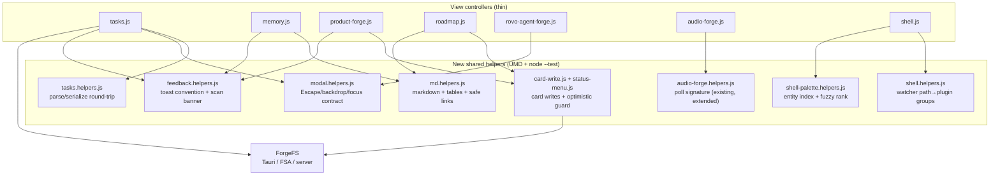

# Forge Shell UX: Consistency & Feedback Program (WP1–WP8)

| | |
|---|---|
| **Author** | Jeremy Brice |
| **Date** | 2026-07-16 |
| **Status** | Draft |
| **Scope** | forge-shell only — 8 work packages fixing all findings of the 2026-07-16 UX audit, sliced into 9 stacked PRs |
| **Primary files** | `forge-shell/app/js/tasks.js`, `memory.js`, `product-forge.js`, `roadmap.js`, `shell.js`, `utils.js`, `audio-forge.js`, `rovo-agent-forge.js`, `card-data.js`; **new:** `tasks.helpers.js`, `md.helpers.js`, `modal.helpers.js`, `feedback.helpers.js`, `card-write.js`, `status-menu.js`, `shell.helpers.js`, `shell-palette.helpers.js`, `shell-palette.js` |
| **Shared touchpoints** | `forge-shell/app/index.html` (script tags, confirm dialog), `components.css`, `productivity.css` (→ `tasks-memory.css` in PR9), `shell.css`, `roadmap.css`, `product-forge.css`, `STYLE_GUIDE.md`, `forge-shell/test/*` |
| **Landing path** | `docs/superpowers/specs/2026-07-16-forge-shell-ux-consistency-program.md` |
| **Out of scope** | forge-lib schema migration; task edit-modal dirty-state guard; roadmap scan-banner adoption; palette deep-links beyond Product Forge; `prod-*` class-string rename; any mobile/responsive work |
| **Related patterns** | [2026-07-12 Roadmap interactive planning surface](2026-07-12-roadmap-interactive-planning-surface.md) (CardWriteService origin, OptimisticGuard, portable `ForgeFS.writeFile` contract, stacked-PR delivery); `forge-shell/STYLE_GUIDE.md` (toolbar/sidebar contracts) |

## Overview

A 2026-07-16 UX audit of forge-shell (8 parallel audit dimensions, adversarially verified) produced eight findings, ranging from active data corruption to hygiene drift. This program fixes **all eight** as one coherent effort, because the findings share root causes: view controllers duplicating what should be shared infrastructure (toasts, markdown, confirm dialogs, card writes), and pure logic trapped inside `window`-bound controllers where it can't be unit-tested.

| # | Audit finding | Severity | WP | Lands in |
|---|---------------|----------|----|----------|
| 1 | Tasks board edits silently destroy `parent`/`source`/unknown frontmatter; drag indicator promises reordering that never happens | data loss | WP1 | PR1 |
| 2 | Freshness broken: Memory never detects new files (poll, Refresh, watcher all no-op), Audio has no poller, watcher toasts per-file and maps a dead `/roadmap-data/` path | high | WP2 | PR6 |
| 3 | Failure feedback fragmented: monochrome 2s pill vs typed toasts, silent `saveTags` failure, no optimistic rollback | high | WP3 | PR4 (per-view pill implementations retained by decision — see Non-Goals) |
| 4 | Find/filter mislabeled or missing: Tasks `fa-filter` opens field settings, Roadmap has no text search, no global search | high/medium | WP4 | PR7 + PR8 |
| 5 | Write parity uneven: one-click status only in Roadmap; no card create/delete anywhere in the UI | medium | WP5 | PR5 |
| 6 | Overlay dismissal inconsistent; shared Confirm dialog has zero keyboard support | medium/high | WP6 | PR3 |
| 7 | Two live markdown renderers with different feature sets; some views render none | medium | WP7 | PR2 |
| 8 | Ghost "Productivity" plugin: 2,049 lines of dead JS, misleadingly named live CSS, stale docs | cleanup | WP8 | PR9 |

Key program decisions (details in per-WP sections and Key Decisions):

- **Every new pure-logic module is a UMD helper file** (`window.X` + `module.exports`) with a `node --test` suite, following the `roadmap.helpers.js` precedent — controllers stay thin, logic becomes testable.
- **Round-trip frontmatter preservation** replaces fixed-field serialization in Tasks: unknown keys survive every edit (WP1). This is the only finding causing silent data corruption and lands first.
- **One feedback contract**: persistence failures are always error toasts (6s); the status pill is demoted to ambient success only; optimistic mutations roll back on write failure (WP3).
- **Card writes get one shared service** (`card-write.js`, extracted from Roadmap's proven implementation) consumed by Roadmap and Product Forge; tasks writes stay on `TasksHelpers` — two domains, two write paths, deliberately (WP5, C7).
- **Dismissal is a documented contract**: Escape + backdrop-click close every overlay; `ForgeUtils.Confirm` gains keyboard + focus management once, so every consumer inherits it (WP6).
- **Delivery is 9 stacked PRs against `main`, merged in order** (the repo's #35–#41 convention), every PR keeping `cd forge-shell && npm test` green. Ten cross-WP contradictions were resolved during sequencing (C1–C10, recorded in Key Decisions).

## Background & Motivation

### How we got here

The 2026-07-12 Roadmap program (PRs #35–#41) made Roadmap the first *interactive* forge-shell surface — inline status, drag-reschedule, drawer, deep-links, persisted prefs. That work raised the bar and exposed the gap: the other seven views evolved independently, each re-implementing (or skipping) feedback, dismissal, rendering, and refresh behaviors. A structured audit followed on 2026-07-16: eight parallel auditors (toolbars/filters, search, edit parity, feedback, navigation, detail views, ergonomics, freshness), findings merged and then adversarially verified — every surviving finding was independently re-derived from code by an independent skeptical verification pass and value-judged by a UX lens.

### Concerns today

| Concern | Implementation today |
|---|---|
| Task persistence | `parseTaskFile`/`serializeTaskFile` (`tasks.js:718–804`) rebuild YAML from a fixed 15-key list; `parent`, `source`, and any unknown key are destroyed on every auto-save. Files written by the view violate forge-lib's `schemas/task.json` (`additionalProperties: false`) |
| Failure feedback | Shared typed `ForgeUtils.Toast` exists (`utils.js:603–618`) but Tasks and Memory duplicate a monochrome 2s `showStatus` pill; `saveTags` swallows write failures after optimistic mutation; board moves never roll back |
| Freshness | Memory's poll signature (`memory.js:462–505`) only stats already-known files; Audio is the only data view with no poller; the Tauri watcher toasts per-file (including own writes) and still maps dead `/roadmap-data/` |
| Find & filter | Tasks' `fa-filter` icon opens a field-visibility modal; the real filter strip hides behind a magnifier; Roadmap has zero text search; no cross-plugin search exists |
| Write affordances | Roadmap has inline status/quick-assign/drag; Product Forge renders status as a static pill reachable only via the 10-field edit modal; no view can create or delete a card |
| Dismissal | Product Forge and Roadmap close on Escape; Tasks' edit modal and Rovo's modals don't; `ForgeUtils.Confirm` (`utils.js:623–638`) — guarding permanent deletes — has no Escape/Enter/focus handling |
| Markdown | Four views share `ForgeUtils.MD.render`; `memory.js:335` ships a private renderer with a different feature set; Tasks/Roadmap-drawer render raw text |
| Dead code | `productivity.js` (2,049 lines) registers a controller that `index.html` never loads and `shell.js` can never select, yet shell still probes its dirs and `STYLE_GUIDE.md` documents it as implemented; `productivity.css` is live infrastructure for tasks.js (226 `prod-*` class uses) under a misleading name |

### Pain points

1. **A single drag on the Tasks board permanently severs the task→story link** that `forge relationship link` maintains — invisible to the user because the field is never rendered.
2. Design deep-dives found further live bugs in the same layer: block-style YAML lists (forge-lib's default for `tags`) are dropped by `parseYAML` (`tasks.js:646–678`); the edit modal's string `priority` makes `serializeTaskFile` **throw**, so modal saves touching priority fail today; `autoSave` bumps `task.updated` only *after* serializing, so written files carry a stale date; same-column drops rewrite files needlessly.
3. Users cannot trust what they see: stale Memory views claim "refreshed", failed writes flash the same gray pill as successes, and optimistic board moves survive on screen after the disk write failed.
4. Muscle memory breaks across views: Escape works in two views and silently fails in the next; the same `fa-filter` icon means "filter" in two views and "column settings" in a third.
5. Finding anything means already knowing which plugin owns it; the flagship Roadmap view cannot be text-searched at all.

### Why now

WP1's data loss is active corruption compounding with every board interaction. The roadmap program just proved the delivery model (shared write service, optimistic guard, helpers + `node --test`, stacked PRs) — this program generalizes those patterns to the rest of the app while they're fresh, and unblocks future feature work from a consistent base.

## Goals & Non-Goals

### Goals

1. **Stop the data loss**: task file round-trips preserve every frontmatter key, match forge-lib's emitted YAML shapes, and validate against `schemas/task.json`.
2. **Truthful feedback**: every persistence failure is a visible error; optimistic UI rolls back when the disk write fails; unreadable files surface as a banner, not an empty state, in the three directory-scanning views (tasks, memory, product-forge); remaining views are follow-up (O12).
3. **Real freshness**: external file changes (new/edited/deleted) reach every active view in ≤5s in all three runtimes; own writes never toast; watcher noise is batched.
4. **Consistent discovery**: filter/search affordances mean the same thing in every toolbar; Roadmap is text-searchable; Cmd+K reaches the owning view of any entity from anywhere, with card entities revealed directly (broader deep-links are follow-up).
5. **Write-affordance parity for cards**: inline status change, create, and delete exist where users look at cards, built on one shared, tested write service.
6. **One dismissal contract**: Escape and backdrop-click close every transient surface, with a documented layering/z-index order and a keyboard-complete Confirm.
7. **One markdown renderer** with one feature set (including pipe tables) and hardened link handling, used by every view that renders entity bodies.
8. **Remove the ghost**: no dead controller, no misleading file names, docs that match reality.
9. **Ship incrementally**: 9 stacked PRs, each reviewable, mergeable, and useful alone; `npm test` green at every tip.
10. **Extract pure logic into UMD helpers with `node --test` coverage** (the `roadmap.helpers.js` standard) — every new behavior in this program that can be a pure function is one.
11. **Stay portable**: all writes go through `ForgeFS` path-string APIs so Tauri, Chrome FSA, and server/cmux modes behave identically.

### Non-Goals (this phase)

| Item | Notes |
|---|---|
| forge-lib schema/CLI changes | Shell-side fixes only; the `schemas/task.json` `additionalProperties` conflict with modal-only fields (`creator`, `dependencies`, `external_link`/`external_id`) is flagged to the schema owner, not solved here |
| Task edit-modal dirty-state guard | Deferred; the hook point (`editModal.close`) is noted in WP6 but not wired |
| Roadmap adoption of the scan-error banner | Roadmap keeps its current error surfaces this phase; tracked as follow-up in O12 |
| Consolidating per-view status-pill implementations | The pill *convention* is unified (WP3); the two ~7-line implementations stay per-view by decision |
| Palette deep-links beyond Product Forge | Only `product-forge-local` consumes `init(options.selectCard)` today; other controllers gain deep-link options in follow-up work |
| `prod-*` class-string rename | PR9 renames the *file* only; class strings are a documented exception to avoid churning 2 heavy controllers |
| Timeline bar drag-resize, progress signals, other Roadmap P2 items | Tracked in the roadmap program's backlog, not here |
| Mobile/responsive work | forge-shell is desktop-only (per 2026-07-08 deprecation) |

## Design Work Organization

**One program design doc + PR-sliced implementation** — same model the roadmap program affirmed. The eight work packages interlock (ten cross-WP contradictions had to be resolved during design; see Key Decisions), so a single doc is the only way to keep the contracts coherent; per-WP docs would have hidden exactly the collisions that C1–C10 resolve. Implementation is sliced into 9 stacked PRs whose order is dependency-driven, not finding-severity-driven — the PR Plan section is the delivery contract.

## Proposed Design

### High-level architecture

The program's through-line is **moving shared behavior out of controllers into tested helper modules**, then making controllers consume them:



Two write domains stay deliberately separate: **cards** (`cards/` — Roadmap, Product Forge) route through `card-write.js`; **tasks** (`tasks/`) route through `TasksHelpers.serializeTaskFile`. They share conventions (optimistic guard, error toasts, own-write suppression) but not code paths, because their file shapes and index semantics differ (C7).

Sections below are ordered by PR landing order, not WP number.

### WP1 (PR1) — Tasks data layer: round-trip frontmatter, parent chip, honest drag

Every write from the Tasks board (column drag, inline title edit, modal save) re-serializes frontmatter from a fixed 15-key whitelist, silently deleting `parent`, `source`, and any unknown keys — severing the task→story links forge-lib writes — and unconditionally emitting keys (`creator`, `dependencies`, `external_link`, `external_id`) that `forge-lib/schemas/task.json` (`additionalProperties: false`) forbids, so a single board edit makes a forge-lib file fail schema validation. PR1 replaces the parser/serializer with a round-trip-faithful, node-testable helpers module; surfaces `parent` as a navigable chip on cards and in the edit modal; and swaps the fake between-card insertion line for the roadmap-style whole-column drop highlight, deleting debug logging. Ships: new `forge-shell/app/js/tasks.helpers.js` + `forge-shell/test/tasks.helpers.test.js`, tasks.js rewiring, two CSS rule groups, one script tag.

**Current behavior**

| File | Behavior |
|---|---|
| forge-shell/app/js/tasks.js:646-678 | Local `parseYAML` handles only flat `key: value`; forge-lib's block-style `tags:` lists parse as null (lost); quoted titles keep literal quote characters |
| forge-shell/app/js/tasks.js:718-767 | `parseTaskFile` maps into a fixed 15-key object; `parent`, `source`, and unknown keys dropped at parse time |
| forge-shell/app/js/tasks.js:769-804 | `serializeTaskFile` rebuilds YAML from the fixed key list in fixed order, writes `null` for empties, and unconditionally emits schema-forbidden keys |
| forge-shell/app/js/tasks.js:815-848 | `autoSave` runs `serializeTaskFile(task)` **before** bumping `task.updated`, so the written file carries the stale date |
| forge-shell/app/js/tasks.js:1946-1978 | `editModal._getFormData` keeps select values as strings; string priority fails the strict `PRIORITY_VALUES.includes` check — modal saves touching priority throw today |
| forge-shell/app/js/tasks.js:1106-1156 | `getDropPosition` + `showDropIndicator` draw a 3px `.prod-drop-indicator` insertion line implying reorder-at-position; drop only calls `moveTaskToStatus`, cards re-sort by filename — a false affordance. Three `[DRAG-DROP]` console lines (1146, 1150, 1152) |
| forge-shell/app/js/tasks.js:1348-1356 | `moveTaskToStatus` rewrites the file even when a card is dropped on its own column |
| forge-shell/app/css/productivity.css:100-107, 285-290 | `.prod-cards.prod-drag-over` and `.prod-drop-indicator` live here and are also referenced by the unloaded ghost `forge-shell/app/js/productivity.js` (PR9's deletion target) |

**Design**

1. **`TasksHelpers` module — full-preserve parse, not line patching.** New dependency-free UMD factory (`window.TasksHelpers` / `module.exports`, same pattern as `forge-shell/app/js/roadmap.helpers.js`) owning `splitFrontmatter`, `parseTaskFile`, `serializeTaskFile`, `coercePriority`, `stripMdExt`, `isTaskRef`, plus the status/priority constant tables tasks.js currently duplicates. Roadmap solved the identical lossy-write problem with full parse + ordered re-stringify (`CardWriteService.patchCardFrontmatter`, forge-shell/app/js/roadmap.js:138-195); line-level patching cannot express the Tasks edit surface (modal rewrites title/tags/dependencies/body in one save) and would leave the normalization bugs unfixed. `ForgeUtils.YAML` is not reusable: utils.js is window-bound (untestable under `node --test`), and it re-serializes unknown keys, destroying e.g. multiline block scalars written by other tools. So the parser walks frontmatter lines statefully: **known keys** (the 15 current keys plus `parent`/`source`) are parsed and normalized — inline `[a, b]` *and* block `- item` lists, quote stripping/unescaping, `''`/`null`/`~` → null, trailing-comment stripping — while **unknown keys** are captured as verbatim raw line blocks and re-emitted byte-for-byte in their original position. Per-key list style (`inline`/`block`) and original key order are recorded so writes preserve the file's shape:

   ```js
   parseTaskFile(filename, content) → null | {
     filename, title, type, status, priority, assignee, creator,
     created, updated, due_date, dependencies, tags,
     external_link, external_id, parent, source, body,
     __fm: {
       keyOrder:  ['title', 'type', ...],          // original top-level order
       unknown:   { custom_field: [rawLines...] }, // verbatim blocks
       listStyle: { tags: 'block' },               // per-list emission style
       warnings:  ['Invalid status ...']           // surfaced via console.warn
     }
   }
   ```

2. **Serializer rules.** `serializeTaskFile(task)` emits known keys in the file's original order, then appends view-added keys in `TASK_FIELD_ORDER`, then splices unknown blocks back at their recorded positions. Null-valued keys already present in the original file re-emit as `key: null` in place; keys absent from the original and empty are **not** emitted — this is what keeps forge-lib files schema-valid (no more unconditional `creator`/`dependencies`/`external_link`/`external_id`). Titles are always double-quoted with escaping; other strings quote only when needed (`': '`, `' #'`, leading/trailing spaces, all-digits). Invalid status/priority throw the exact legacy message strings so existing catch blocks and toasts behave identically. Task frontmatter serialization permanently lives on `TasksHelpers.serializeTaskFile`; no shared status-write service supersedes it *(adjusted in sequencing)*.

3. **tasks.js rewiring + autoSave reorder.** Delete local `parseYAML`, `parseTaskFile`, `serializeTaskFile`; alias the constant tables to `TasksHelpers` (labels/icons/chip maps stay local). `parseTaskFiles` keeps its ForgeFS scan, calls `TasksHelpers.parseTaskFile`, and logs `__fm.warnings` with the filename. `autoSave` gets the minimal reorder only: bump `task.updated` **before** serialize so the written content carries the new date, keeping the legacy toast/`showStatus` error surface unchanged — the `writeTaskNow` extraction with in-memory rollback lands in WP3/PR4 *(adjusted in sequencing)*. `editModal._getFormData` coerces priority through `TasksHelpers.coercePriority` (`'3'`→3, `''`→null, garbage kept raw for the validator), fixing today's modal-save throw.

4. **Parent chip + cross-plugin navigation.** `createCard` renders a `.prod-parent-chip` button (`data-action="open-parent"`, sitemap icon, extensionless slug) for tasks with a truthy non-`'null'` parent; the existing card click dispatch gains the branch and calls `e.stopPropagation()` so the chip never opens the task's own modal. `editModal.open` renders the same chip as a read-only row — deliberately **not** a `data-task-field` input, so `_getFormData` and Preview Changes never touch parent. Navigation mirrors `openInProductForge` (forge-shell/app/js/roadmap.js:2465-2490) against the verified deep-link contract (`Shell.selectPlugin(id, {selectCard})` → product-forge `_revealCard`, forge-shell/app/js/product-forge.js:1346-1353):

   ```js
   function openParentCard(task) {
     var target = TasksHelpers.stripMdExt(task.parent || '');
     if (!target) return;
     if (TasksHelpers.isTaskRef(target)) {          // parent is another task → local modal
       var p = tasks.find(function (t) { return TasksHelpers.stripMdExt(t.filename) === target; });
       if (p) { editModal.open(p); return; }
     }
     // story/card parent → Product Forge, with roadmap's guard + catch-fallback
     try { Shell.selectPlugin('product-forge-local', { selectCard: target }); }
     catch (e) { Shell.selectPlugin('product-forge-local'); }
   }
   ```

   `selectCard` misses degrade to product-forge's own "Card not found in Product Forge" toast — no new error UI.

5. **Honest drag.** Delete `getDropPosition` and `showDropIndicator` entirely; rewire `createColumn`'s `dragover`/`dragleave`/`drop` to the roadmap whole-column pattern (forge-shell/app/js/roadmap.js:2150-2183): `dragover` sets `dropEffect='move'` and toggles the highlight class on the `.prod-column` root while sweeping it off sibling columns; `dragleave` clears when `relatedTarget` leaves the column; `drop` and `dragend` run a global `clearColumnDragOver()` sweep (covers Escape-cancelled drags). All three `[DRAG-DROP]` console lines are removed. `moveTaskToStatus` gains a same-column no-op guard (`if (!task || task.status === newStatus) return;`) so dropping a card back on its own column never rewrites the file. The highlight uses a **new** class, `.prod-column.prod-col-drag-over` (accent ring + light/dark tint mirroring roadmap.css:215-224), plus a `.prod-parent-chip` rule group, both added to `forge-shell/app/css/productivity.css`. PR1 deliberately does **not** delete `.prod-drop-indicator` or `.prod-cards.prod-drag-over` — the ghost `productivity.js` still references them until PR9 deletes both together; the new class name guarantees PR9 never edits the same lines *(adjusted in sequencing)*.

6. **Load order.** `forge-shell/app/index.html` gains `<script src="js/tasks.helpers.js"></script>` immediately before `js/tasks.js` (line 128), mirroring the `roadmap.helpers.js` → `roadmap.js` ordering.

**New/changed interfaces**

| Name | Signature | Location | Consumers |
|---|---|---|---|
| `TasksHelpers` | UMD → `{ STATUS_VALUES, TERMINAL_STATUSES, PRIORITY_VALUES, DEFAULT_STATUS, DEFAULT_PRIORITY, KNOWN_KEYS, TASK_FIELD_ORDER, splitFrontmatter, parseTaskFile, serializeTaskFile, coercePriority, stripMdExt, isTaskRef }` | forge-shell/app/js/tasks.helpers.js | tasks.js (all parse/serialize/coerce paths); test/tasks.helpers.test.js; WP3/PR4's `writeTaskNow` wraps its callers |
| `parseTaskFile` | `(filename, content) → null \| task` with flat fields + `__fm` capsule (see the `parseTaskFile` shape in Design item 1) | forge-shell/app/js/tasks.helpers.js | tasks.js task objects everywhere; renderers read the same flat fields as today, `__fm` rides along untouched (read only by `serializeTaskFile`) |
| `openParentCard` | `(task) → void` — private to TasksView IIFE | forge-shell/app/js/tasks.js | card chip (`data-action="open-parent"`); modal chip (`data-action="open-parent-modal"`, closes modal first) |
| `.prod-col-drag-over`, `.prod-parent-chip` | CSS classes (new names; ghost-shared rules untouched) | forge-shell/app/css/productivity.css | tasks.js DOM only |

**Acceptance criteria**

- [ ] Round-trip fidelity: drag a forge-lib-generated task (quoted title, block-style tags, `parent:`) to another column; re-open the file — `parent`/`source` unchanged, tags intact and still block-style, only `status` and `updated` differ, no `creator`/`dependencies`/`external_link`/`external_id` keys added, and forge-lib schema validation still passes.
- [ ] Unknown-key fidelity: a made-up scalar key (with trailing comment) and a multiline unknown block survive an inline title edit byte-identical and in original position.
- [ ] Updated-date correctness: after any board edit, the `updated:` value inside the written file equals today.
- [ ] Modal priority save: changing Priority to P1 saves without the legacy 'Cannot save task: invalid priority' error; file shows `priority: 1` (integer, unquoted).
- [ ] Parent chip (card): tasks with `parent` show the chip; click switches to Product Forge and reveals/flashes the card, or shows the existing 'Card not found' toast; a `task-NNN` parent opens the local edit modal instead; no chip without parent; chip click does not open the task's own modal.
- [ ] Parent chip (modal): read-only Parent row appears only when parent exists; saving never modifies or drops parent; Preview Changes never lists it.
- [ ] Drag honesty: whole-column accent highlight in light and dark themes; no insertion line ever appears; highlight clears on drop, dragleave, and Escape-cancelled drag; same-column drop performs no file write (mtime unchanged).
- [ ] `grep -c 'DRAG-DROP' forge-shell/app/js/tasks.js` returns 0; `getDropPosition`/`showDropIndicator` are gone; `.prod-drop-indicator` and `.prod-cards.prod-drag-over` rules remain untouched in productivity.css.
- [ ] tasks.helpers.js loads immediately before tasks.js; app boots clean in server mode (`node server.js`) and the board renders as before.
- [ ] `npm test` in forge-shell/ passes, including the new suite.

**Tests**

- Unit — parse (`forge-shell/test/tasks.helpers.test.js`, `node:test` + `assert/strict`): forge-lib template file → quotes stripped, block tags → array, `parent`/`source` populated, `listStyle` recorded; view-legacy files (inline arrays, `'null'` strings) parse identically to the old parser; priority missing→3, `null`→null, `'3abc'` kept raw + warning; invalid status → warning; <2 `---` fences → null; body containing `---` lines preserved.
- Unit — serialize: exact legacy throw messages; in-place `key: null` re-emission vs. omission of absent-and-empty keys; new keys appended in `TASK_FIELD_ORDER`; title always quoted; conditional quoting rules; block vs inline list style preserved; new list keys default inline.
- Unit — round-trip properties over a ~15-file corpus (unknown scalars, multiline unknown blocks, comments in unknown blocks, escapes, CRLF, tags with spaces): parse→serialize→parse semantically stable; serialize∘parse idempotent byte-for-byte on its own output; unknown blocks byte-identical in original relative order.
- Unit — `coercePriority`, `stripMdExt`, `isTaskRef` (`'task-002'`, `'task-002-slug'` yes; `'story-001-x'` no).
- Integration (manual, `node server.js` → 127.0.0.1:4173): every acceptance criterion; 5s external-change watcher still detects out-of-band edits after several UI saves; Timeline/Summary/Workload/Matrix render unchanged. Tauri spot-check (one drag + one modal save) if the toolchain is available.
- Regression: full `npm test` — existing roadmap/product-forge/sidebar/audio helper suites unchanged.

### WP7 (PR2) — Unified markdown renderer: MDHelpers with tables + safe links

One markdown renderer for the whole shell. The existing `ForgeUtils.MD` moves verbatim into a new UMD module `forge-shell/app/js/md.helpers.js` (node-testable per the `.helpers.js` pattern, wrapper copied from `roadmap.helpers.js:5-11`), then gets extended to a superset: pipe tables, double-quote escaping in inline text, an href scheme whitelist, and a new `toPlainText()` for excerpts. memory.js's private `renderMarkdownToHtml` is deleted and its 3 call sites switch to the shared renderer; roadmap's drawer excerpt stops leaking markdown tokens. tasks.js needs no change — body is only ever edited in a textarea, never displayed read-only (`tasks.js:1636`, diff preview `2018-2021`) — this re-verification overturns the audit's 'tasks render raw text' sub-item: no read-only body surface exists, and the diff preview intentionally shows source. *(adjusted in sequencing)* This ships as **PR2**, ahead of the other utils.js work, so the large `ForgeUtils.MD` block is deleted from utils.js early and the later utils.js PRs (Confirm in PR3, Toast/ScanBanner in PR4) rebase against the slim delegate once instead of repeatedly.

**Current behavior**

| File | Behavior |
|------|----------|
| `forge-shell/app/js/utils.js:224-316` | `ForgeUtils.MD`: line-based block parser (h1-h6, hr, blockquote, ul `-`/`*`/`+`, ol, fenced code parsed first, paragraphs join consecutive lines) + `_inline` (bold, em, code, links). Escapes `& < >` but **not** `"`; link hrefs emitted verbatim — `[x](javascript:alert(1))` yields a live `javascript:` anchor and a `"` in the URL breaks out of the href attribute. No tables. No tests; `utils.js:4` assigns `window.ForgeUtils` so the file can't be `require()`d |
| `forge-shell/app/js/memory.js:335-368` | Private `renderMarkdownToHtml`: escapes whole input upfront, then regex passes. h1-h3 only, no links/blockquote/hr; code fences processed *after* bold/em so emphasis markers inside fences become `<strong>`/`<em>`; table cells split with `.filter(c=>c.trim())` so empty cells drop and columns misalign; per-line `<p>` wrapping. Tables are the only feature `MD.render` lacks. Call sites: 690 (overview fallback), 713 (memory-file fallback), 883 (directory-file modal) |
| `forge-shell/app/js/memory.js:692, 715, 882` | Output wrapped in `prod-markdown-content` containers styled by `productivity.css:1587-1626` (no blockquote/hr rules) |
| `forge-shell/app/css/components.css:307-352` | `.rendered-body` already styles h1-h3, p, lists, code, pre, blockquote, hr, **and** table/th/td (343-352) — table CSS pre-exists though `MD.render` never emits tables |
| `forge-shell/app/js/product-forge.js:649`, `cognitive-forge.js:387/394`, `report-forge.js:457/476`, `rovo-agent-forge.js:437/444` | The only current `MD.render` consumers; all wrap output in `.rendered-body`. Nothing references `MD._inline`/`_parseBlocks` externally |
| `forge-shell/app/js/roadmap.js:1336-1345, 1479-1484` | Drawer `_descriptionExcerpt`: `fm.description` or first ~280 chars of **raw** body, whitespace-collapsed, escaped into `.rm-drawer-excerpt` — `##`, `**`, `[]()`, ``` ``` ``` leak as literal noise. Drawer never renders the full body (has an "Open in Product Forge" CTA at 1490-1491) |
| `forge-shell/app/js/productivity.js:1289` | Third duplicate `renderMarkdownToHtml` — but productivity.js is not loaded in `app/index.html:119-136` (ghost file). Out of scope here; removed by the productivity.js deletion PR |

**Design**

1. **Extract and harden the renderer.** Create `forge-shell/app/js/md.helpers.js` exporting `MDHelpers` (UMD: `module.exports` + `root.MDHelpers`), fully self-contained — no `ForgeUtils`/`window` references — so `require()` works under `node --test`. The parser/renderer moves byte-identical from `utils.js:227-316`, then three hardening changes: `esc()` additionally escapes `"` (matching `ForgeUtils.escapeHTML`), closing the href attribute-injection hole; a `safeHref()` scheme whitelist gates link URLs; unsafe schemes degrade to plain text (URL dropped entirely, no anchor):

   ```js
   safeHref(url) {
     // runs on already-escaped url; strips whitespace/control chars to
     // defeat "java\nscript:" obfuscation. null = disallowed.
     var probe = String(url).replace(/[\s\x00-\x1f]+/g, '').toLowerCase();
     return /^(https?:\/\/|mailto:|#|\/|\.\/|\.\.\/)/.test(probe) ? url : null;
   }
   // _inline link rule:
   t.replace(/\[(.+?)\]\((.+?)\)/g, function (m, text, url) {
     var h = MDHelpers._safeHref(url);
     return h ? '<a href="' + h + '" target="_blank" rel="noopener">' + text + '</a>' : text;
   });
   ```

2. **Pipe-table support.** New `table` block type in `_parseBlocks`, inserted after the code-fence branch and before headings. A table starts only when a `|…|` row is immediately followed by a strict separator row (`|---|` with optional alignment colons — recognized and ignored); this guards against false-positive tables at the 4 pre-existing call sites. `splitRow` preserves empty interior cells, fixing memory's `.filter()` misalignment bug; body rows are padded/truncated to header width and cells go through `_inline`:

   ```js
   isTableRow = (l) => /^\s*\|.*\|\s*$/.test(l);
   isTableSep = (l) => /^\s*\|(\s*:?-{2,}:?\s*\|)+\s*$/.test(l);
   splitRow = (l) => l.trim().replace(/^\|/, '').replace(/\|$/, '')
     .split('|').map((c) => c.trim());   // keeps EMPTY interior cells
   // in the line loop:
   if (cur && cur.type === 'table') {
     if (isTableRow(line) && !isTableSep(line)) { cur.rows.push(splitRow(line)); continue; }
     push();
   }
   if (isTableRow(line) && i + 1 < lines.length && isTableSep(lines[i + 1])) {
     push(); cur = { type: 'table', header: splitRow(line), rows: [] }; i++; continue;
   }
   ```

   `_renderBlock` emits `<table><thead>…<tbody>…` — no CSS work needed, `.rendered-body` table rules already exist (`components.css:343-352`).

3. **Plain-text excerpts.** New `toPlainText(src)`: strips fenced code blocks, table separator rows, leading heading/blockquote/list markers, rewrites `[text](url)` → `text`, removes emphasis/backtick markers, replaces `|` with space, collapses whitespace. Returns prose, **not** HTML-escaped — callers escape.

4. **Wire-up.** `utils.js` deletes the entire `ForgeUtils.MD` block (224-316) and replaces it with a two-line delegate so every existing `ForgeUtils.MD.render` call site keeps working unchanged; `app/index.html` inserts `<script src="js/md.helpers.js">` between fs-adapter.js (119) and utils.js (120) — order is load-bearing since utils.js reads `window.MDHelpers` at parse time:

   ```js
   /* MD — Markdown renderer. Implementation in md.helpers.js (UMD, node-testable). */
   ForgeUtils.MD = window.MDHelpers;
   ```

5. **memory.js switch.** Delete `renderMarkdownToHtml` (335-368); its 3 call sites (690, 713, 883) become `ForgeUtils.MD.render(...)`. The container class swaps `prod-markdown-content` → `rendered-body` on lines 692, 715, and 882 (sibling classes `prod-file-card-content prod-expanded` and inline styles stay), so memory output picks up the complete shared styling in `components.css:307-352` including blockquote/hr/table. *(adjusted in sequencing)* This decouples memory markdown styling from productivity.css **now**; the then-orphaned `.prod-markdown-content` CSS block (`productivity.css:1587-1626`) is deliberately left in place here and purged in **PR9** alongside the productivity.js ghost removal — PR9 must not delete productivity.css wholesale, since memory.js still uses other `prod-*` classes (`prod-file-card`, `prod-expanded`, `prod-visible`, `prod-memory-*`). Structured memory content (`renderParsedFlatTables`) is unaffected.

6. **roadmap.js excerpt.** `_descriptionExcerpt` (1336-1345) runs both branches (`fm.description` and raw body) through `ForgeUtils.MD.toPlainText` before the 280-char truncation; downstream escaping into `.rm-drawer-excerpt` (1482) is unchanged. Decision: the drawer stays excerpt-only — it is a summary surface with an "Open in Product Forge" CTA — and does **not** gain full markdown rendering.

7. **STYLE_GUIDE.md.** New standalone "Markdown rendering" subsection (appended near the shared-components section to avoid conflicts with PR3/PR4 doc edits): all read-only markdown goes through `ForgeUtils.MD.render` inside `.rendered-body`; never hand-roll regex renderers in views; use `toPlainText` for one-line excerpts; note the href whitelist and that raw HTML in content is always escaped.

**New/changed interfaces**

| Name | Signature | Location | Consumers |
|------|-----------|----------|-----------|
| `MDHelpers.render` | `render(src: string\|null) -> string` (HTML; `''` for falsy) | `forge-shell/app/js/md.helpers.js` | via `ForgeUtils.MD`: product-forge.js:649, cognitive-forge.js:387/394, report-forge.js:457/476, rovo-agent-forge.js:437/444 (unchanged); memory.js 690/713/883 (switched) |
| `MDHelpers.toPlainText` | `toPlainText(src: string\|null) -> string` (markdown-stripped prose; **not** HTML-escaped) | `forge-shell/app/js/md.helpers.js` | roadmap.js `_descriptionExcerpt` (~1336) |
| `MDHelpers._safeHref` | `_safeHref(url: string) -> string\|null` (null = disallowed scheme) | `forge-shell/app/js/md.helpers.js` | `_inline` link rendering; unit tests (internals `_parseBlocks`/`_renderBlock`/`_inline` also test-exported) |
| `ForgeUtils.MD` | two-line delegate: `ForgeUtils.MD = window.MDHelpers` | `forge-shell/app/js/utils.js` | all existing `ForgeUtils.MD.*` call sites, unchanged |

**Acceptance criteria**

- [ ] `grep -rn renderMarkdownToHtml forge-shell/app/js/` matches only productivity.js (the unloaded ghost); memory.js calls `ForgeUtils.MD.render` at its 3 former call sites.
- [ ] utils.js contains no markdown parser logic; `ForgeUtils.MD` is assigned from `window.MDHelpers`; md.helpers.js loads before utils.js in index.html.
- [ ] Unstructured memory file with a pipe table, bullets, `###` heading, bold, and a link renders a styled `<table>`, a real anchor (`target="_blank" rel="noopener"` — memory previously showed links as literal text), and correct headings in Overview tab, per-file tab, and the directory-file modal.
- [ ] Fidelity fixes visible: emphasis markers inside fenced code stay literal; a table row with an empty interior cell keeps column alignment.
- [ ] Memory markdown containers use `.rendered-body`; no visual regression in the four pre-existing `.rendered-body` views beyond pipe-table content now rendering as tables.
- [ ] XSS: `[x](javascript:alert(1))`, `[x](data:...)`, and `[x](https://a" onmouseover="...)` produce no `javascript:`/`data:` anchor and no unquoted event-handler attribute; raw `<script>`/`` is entity-escaped in every block type (double quotes now escaped in inline text).
- [ ] Roadmap drawer excerpt for a body starting `## Goal\n**Key:** value` contains no `#`, `*`, backtick, or `[]()`; drawer still excerpt-only; tasks.js diff shows zero changes.
- [ ] `cd forge-shell && npm test` passes including new `test/md.helpers.test.js`; STYLE_GUIDE.md documents the single-renderer rule, `.rendered-body`, `toPlainText`, and the href whitelist.

**Tests**

- New `forge-shell/test/md.helpers.test.js` (node:test + assert/strict, `require('../app/js/md.helpers.js')`), mirroring `test/roadmap.helpers.test.js` conventions; runs under existing `npm test`.
- Blocks: h1-h6; paragraph line-joining; ul via `-`/`*`/`+`; ol; multi-line blockquote; hr; fenced code preserves `**markers**` literally and escapes `<script>`; `render('') === ''` and `render(null) === ''`.
- Tables: exact thead/tbody structure with `_inline` applied to cells; empty interior cell preserved; short/long rows padded/truncated to header width; table terminated by blank or non-pipe line; pipe line without a following separator stays a paragraph; alignment-colon separators recognized.
- Inline/XSS: bold/em lookarounds; safe https/mailto/#/relative links get `target="_blank" rel="noopener"`; `javascript:`, `data:`, `vbscript:`, and whitespace-obfuscated schemes render as text with no `<a>`; `"` in URLs emitted as `&quot;` (assert output lacks `" onmouseover=`).
- `toPlainText`: strips headings, emphasis, backticks, fenced-code contents, list markers, blockquote `>`, table pipes/separators; `[t](u)` → `t`; collapses whitespace; `toPlainText(null) === ''`.
- End-to-end fixture: realistic unstructured memory file (intro paragraph, `**field:**` lines, `##` section, pipe table, list) — no raw markdown tokens in output, exactly one `<table>`.
- Regression greps + manual smoke (`node server.js` → 127.0.0.1:4173): memory views ×3, the four `.rendered-body` views with a pipe-table body, roadmap drawer excerpt, tasks edit-modal diff preview untouched, and the `javascript:`-link fixture rendering inert with no console errors.

### WP6 (PR3) — Overlay dismissal contract: keyboard-complete Confirm + Escape/backdrop everywhere

Every modal/overlay in forge-shell dismisses the same way: Escape closes the top-most surface, backdrop click closes (guarded against text-selection drag-out), and the shared `ForgeUtils.Confirm` dialog gains full keyboard support (Escape=cancel, Enter=confirm with button/textarea carve-out, Tab trap, focus management) that all four existing consumers inherit with zero call-site changes. Ships: a new node-testable `modal.helpers.js`, a rebuilt `Confirm`, a stacking fix, Escape/backdrop wiring for tasks/rovo/memory, and a codified "Overlay Dismissal Contract" section in `forge-shell/STYLE_GUIDE.md`. Roadmap and product-forge are already conformant and are untouched.

**Current behavior**

| File | Behavior |
|------|----------|
| `forge-shell/app/js/utils.js:623-638` | `ForgeUtils.Confirm.show()` toggles `.visible` on `#confirm-dialog`, returns a Promise; no keyboard handling, no focus management, no focus restore |
| `forge-shell/app/index.html:103-113` | Shared Confirm DOM; Cancel/Confirm buttons are inline-`onclick` with no ids, so nothing can target them for focus |
| `forge-shell/app/css/components.css:355-368` | `.modal-overlay { z-index:100 }` — tasks overlays sit at 150 (`productivity.css:1750,1834`), roadmap surfaces up to 1200, so Confirm can render **behind** view overlays |
| `forge-shell/app/js/tasks.js:506-518, 2797-2803` | Sole document keydown (Cmd/Ctrl+F, Escape-clears-search) bound in scaffold-once `bindToolbarEvents()`; `destroy()` removes it permanently → Cmd+F/Escape dead after navigating away and back |
| `forge-shell/app/js/tasks.js:1530-1563, 1595-1652` | Settings and edit overlays close via buttons only; no Escape, no backdrop click |
| `forge-shell/app/js/rovo-agent-forge.js:464-736` | Edit modal (`raf-visible` class); zero keydown listeners in the file, no backdrop close |
| `forge-shell/app/js/memory.js:110-135` | Backdrop close exists but is vulnerable to text-selection drag-out (`:123-129`); Escape (`:131-134`) is bound to the `#view-memory` element, so it never fires when focus is on `body` (macOS WebKit doesn't focus buttons on click) |
| `forge-shell/app/js/memory.js:1016` | Native `window.confirm` for delete — **out of scope here**; migrates to `ForgeUtils.Confirm` in PR5 *(adjusted in sequencing)* |
| `forge-shell/app/js/product-forge.js:2104-2174` | Reference pattern: `_bindKeyboard()`/`_unbindKeyboard()` per activation with explicit Escape hierarchy — untouched |
| `forge-shell/app/js/roadmap.js:328-356, 3010-3057` | Untouched; StatusMenu's capture-phase keydown is the codebase precedent WP6 reuses for Confirm modality |

**Design**

1. **Pure decision logic → `forge-shell/app/js/modal.helpers.js` (new, ~50 lines).** Dual window-global + CommonJS export mirroring `roadmap.helpers.js`, so key semantics are node-testable. Two functions, no DOM access: `confirmKeyAction(key, activeTag)` and `tasksEscapeTarget(state)`. Loaded via a `<script>` tag inserted immediately before `js/utils.js` in `forge-shell/app/index.html`.

   ```js
   confirmKeyAction: function (key, activeTag) {
     if (key === 'Escape') return 'cancel';
     if (key === 'Enter') {
       /* Buttons keep native Enter=click (Enter on focused Cancel cancels);
          textareas keep newline; everything else confirms. */
       if (activeTag === 'BUTTON' || activeTag === 'TEXTAREA') return null;
       return 'confirm';
     }
     if (key === 'Tab') return 'trap';
     return null;
   }
   ```

2. **Confirm rebuild (`forge-shell/app/js/utils.js:623-638`, replaced in place; signature unchanged).** `show()` records `document.activeElement`, then focuses the first `[autofocus]` inside `#confirm-details` if present (the fs-adapter path picker) else the Cancel button — which requires giving the two buttons ids (`#confirm-cancel`, `#confirm-ok`) in `index.html:109-110`, keeping their inline onclicks. While visible, one document keydown is bound in **capture phase** and calls `e.stopPropagation()` for all keys, so no view-level handler (roadmap/product-forge/tasks/memory/rovo) fires underneath — this is what makes Confirm truly modal without touching roadmap. Escape resolves `false`; Enter resolves `true` only per `confirmKeyAction` (so bare Enter on the pre-focused Cancel button still cancels — the safe default for tasks' destructive delete, while Enter in the path-picker input confirms); Tab cycles focusables inside `#confirm-dialog`. `resolve()` unbinds, restores prior focus, and **must not clear `#confirm-details` innerHTML** — `fs-adapter.js:147` reads the input's value after the promise resolves. `show()` defensively unbinds any prior handler (re-entrant show), and `resolve()` nulls `_resolve` so a second Escape after a click cannot double-resolve.

   ```js
   _onKeydown(e, dialog) {
     if (!dialog.classList.contains('visible')) return;
     e.stopPropagation();               /* modal: view handlers never fire */
     var tag = document.activeElement && document.activeElement.tagName;
     var action = window.ModalHelpers.confirmKeyAction(e.key, tag);
     if (action === 'cancel')       { e.preventDefault(); this.resolve(false); }
     else if (action === 'confirm') { e.preventDefault(); this.resolve(true); }
     else if (action === 'trap')    { this._trapTab(e, dialog); }
   }
   ```

3. **Stacking + focus ring (`forge-shell/app/css/components.css`).** Append `#confirm-dialog { z-index: 1300; }` after the `.modal-overlay` rules — 1300 is the documented reserved ceiling for the shared dialog; view overlays top out at 150 (tasks) and 1200 (roadmap), and the future command palette (PR8) sits at 1250, below Confirm *(adjusted in sequencing)*. Scoped to the id so other `.modal-overlay` consumers are unaffected. Add a `.confirm-actions button:focus-visible` outline rule only if manual check shows the theme provides no visible default ring (verify the exact accent custom-property name in `theme.css` first).

4. **Per-view Escape + lifecycle fix.** Each of tasks/rovo/memory gets the product-forge idiom: a module-level `_keydownHandler` plus `bindKeyboard()` called from `init()` on every activation (guarded `if (_keydownHandler) return`), handler bails unless the view root has `.active`, and closes exactly one surface per keypress.
   - `forge-shell/app/js/tasks.js` — this extraction is **canonical**: the keydown moves out of scaffold-once `bindToolbarEvents()` (delete `:505-518`) into `bindKeyboard()`, fixing the latent bug where `destroy()` (`:2797`, run on every view switch by `shell.js:117`) permanently killed Cmd+F/Escape. The handler keeps Cmd/Ctrl+F and implements the Escape hierarchy **edit-modal > settings > search** via `ModalHelpers.tasksEscapeTarget` — while a modal is up, Escape closes it and leaves search filters alone. WP4's duplicate `bindGlobalKeys` is dropped; PR8's palette handles its own keys via a separate capture/stopPropagation listener and adds no branch to this handler *(adjusted in sequencing)*. `destroy()` stays as-is.
   - `forge-shell/app/js/rovo-agent-forge.js` — new `bindKeyboard()` from `init()` (`:804`); Escape closes the edit modal only when the overlay has `raf-visible`. `destroy()` (`:870`) now also removes and nulls the handler (safe: init rebinds each activation).
   - `forge-shell/app/js/memory.js` — delete the broken view-scoped keydown (`:131-134`); same document-level `bindKeyboard()` from `init()` (`:1040`), Escape gated on `prod-visible`; `destroy()` (`:1060`) removes the handler alongside `stopMemoryWatching()`.

5. **Backdrop click with pointerdown guard.** Tasks edit + settings overlays and the rovo modal gain backdrop close; memory's existing plain `e.target === overlay` check (`:123-129`) is upgraded to the same guard. Close only when the initiating `pointerdown` *and* the `click` both landed on the backdrop — text-selection drags out of an edit textarea released over the backdrop never close the modal. These are element-level listeners bound once at scaffold (the overlay elements are created once and never replaced).

   ```js
   var armed = false;
   overlay.addEventListener('pointerdown', function (e) { armed = (e.target === overlay); });
   overlay.addEventListener('click', function (e) {
     if (e.target === overlay && armed) closeFn();
     armed = false;
   });
   ```

6. **Contract codified.** Append an "Overlay Dismissal Contract" section to `forge-shell/STYLE_GUIDE.md` (after the Sidebar Contract, end of file at `:241`): three required dismissal paths (close controls, one document-level keydown per view with explicit hierarchy, guarded backdrop click), `ForgeUtils.Confirm.show()` as the only sanctioned confirmation prompt (never `window.confirm()`), the capture-phase modality guarantee, and the full overlay-layering ladder recorded — views ≤1200 < reserved palette tier 1250 < Confirm 1300 — with `z-index: 1300` as the ceiling reserved for the shared dialog, so the palette tier lands in STYLE_GUIDE via PR3 (PR8 touches no docs). Reference implementations named: `product-forge.js _bindKeyboard` and `roadmap.js` (do not modify).

7. **Explicit scope-outs.** `memory.js:1016`'s `window.confirm` is *not* replaced here — it migrates to `ForgeUtils.Confirm` in PR5 under the new contract *(adjusted in sequencing)*. Escape/backdrop on the tasks and rovo edit modals discards unsaved edits exactly like today's Cancel button; dirty-state guarding is deferred (hook belongs inside `editModal.close()` so all three paths share it). No changes to `product-forge.js`, `roadmap.js`, or their CSS.

**New/changed interfaces**

| Name | Signature | Location | Consumers |
|------|-----------|----------|-----------|
| `ModalHelpers.confirmKeyAction` | `(key: string, activeTag: string\|null) → 'cancel'\|'confirm'\|'trap'\|null` | `forge-shell/app/js/modal.helpers.js` (new; window + CommonJS) | `ForgeUtils.Confirm`; node tests |
| `ModalHelpers.tasksEscapeTarget` | `({editOpen, settingsOpen, searchOpen}) → 'edit'\|'settings'\|'search'\|null` | `forge-shell/app/js/modal.helpers.js` | `tasks.js bindKeyboard()`; node tests |
| `ForgeUtils.Confirm` (extended contract) | `show(title, message, details) → Promise<boolean>`; `resolve(val)` — unchanged externally; now modal (capture-phase interception), keyboard-complete, focus-managed | `forge-shell/app/js/utils.js:623-638` (replaced in place) | `fs-adapter.js:135`, `product-forge.js:1996,2062`, `tasks.js:1359` — all inherit with zero call-site changes; PR5 adds sites |
| `bindKeyboard()` (per-view, module-private) | bound from `init()` each activation, idempotent guard, removed in `destroy()` (rovo/memory) | `tasks.js`, `rovo-agent-forge.js`, `memory.js` | view lifecycle (`shell.js:116-137`) |

**Acceptance criteria**

- [ ] Confirm keyboard: Escape resolves false (task not deleted); bare Enter activates the pre-focused Cancel (false); Tab/Shift+Tab wrap Cancel↔Confirm and focus never leaves `#confirm-dialog`; Tab-to-Confirm + Enter resolves true.
- [ ] Confirm focus: opens with `[autofocus]` (if present in details) or Cancel focused with a visible ring; prior focus restored after close either way.
- [ ] fs-adapter path picker (server mode, `node server.js`): input auto-focused; typing a path + Enter resolves true and the value is still readable after resolve (details not cleared); Escape yields the same AbortError as Cancel.
- [ ] Confirm modality: with roadmap's filter panel open (or tasks' search strip), Escape on a Confirm closes only the dialog — underlying view surface untouched; Cmd+F does not toggle search while a Confirm is visible.
- [ ] Confirm stacking: `#confirm-dialog` computes to `z-index: 1300` and renders above the z-150 tasks overlays.
- [ ] Tasks Escape hierarchy: edit modal + search strip open → Escape #1 closes only the modal, Escape #2 clears filters and closes search; settings overlay closes on Escape; Cmd/Ctrl+F still toggles search.
- [ ] Tasks lifecycle bug fixed: after Tasks → Memory → Tasks, Cmd+F and Escape still work.
- [ ] Backdrop click closes tasks edit, tasks settings, rovo modal, memory modal; clicks inside content do not; text-selection drag from the edit textarea released over the backdrop keeps the modal open.
- [ ] Rovo/memory Escape: closes the open modal, no-ops when closed, survives view round trips with no duplicate handlers; memory modal closes on Escape even when focus is on `body` (mouse-only open).
- [ ] Zero diff to `product-forge.js`, `roadmap.js`, `roadmap.css`, `product-forge.css`; `memory.js:1016` still uses `window.confirm` (PR5 migrates it).
- [ ] Each Confirm consumer resolves exactly once per show (no double-resolve on Escape-after-Cancel).
- [ ] `STYLE_GUIDE.md` contains the Overlay Dismissal Contract section; full node suite green including new tests.

**Tests**

- Unit (`forge-shell/test/modal.helpers.test.js`, new — same runner style as `test/roadmap.helpers.test.js`): `confirmKeyAction` exhaustive — `('Escape', *) → 'cancel'`; `('Enter','BUTTON') → null`; `('Enter','TEXTAREA') → null`; `('Enter','INPUT') → 'confirm'`; `('Enter', null) → 'confirm'`; `('Tab', *) → 'trap'`; other keys → null.
- Unit: `tasksEscapeTarget` precedence — all-open → `'edit'`; settings+search → `'settings'`; search only → `'search'`; all-closed → `null`.
- Existing suite unchanged and green (`node --test forge-shell/test/` or the repo's documented invocation).
- Manual smoke in browser mode (`node server.js`, Chrome) walking every acceptance criterion; the path-picker criterion specifically requires the server backend. Repeat critical paths in Tauri if available.
- Consumer regression matrix: tasks `deleteTask` (cancel via Escape / Enter-on-Cancel; confirm via Tab+Enter / click — file deleted only on confirm); product-forge reparent + unparent (Escape cancels with no writes; its own `e`/arrow shortcuts still work afterward); fs-adapter picker per criterion.
- Listener-leak check: `getEventListeners(document).keydown` count stable across 5× view switches among tasks/memory/rovo.

### WP3 (PR4) — Unified failure feedback: error-toast convention, rollback, scan-error banner

Establish one feedback convention across forge-shell views: failures always surface as `ForgeUtils.Toast` error toasts (6000 ms); the per-view `showStatus` pill is reserved for ambient success/progress; every optimistic write either rolls back to a snapshot or commits only after a successful write. Ships: a new pure-logic `feedback.helpers.js` (+ node tests), a shared dismissible `ForgeUtils.ScanBanner` fed by the tasks/memory/product-forge scan loops, toast hardening (ARIA role, click-to-dismiss), rollback plumbing in tasks.js, write-then-commit ordering in memory.js, an `outErrors` out-param on `scanCardsDir` with a `_doRefresh` resilience fix, and a "Feedback & Error Handling" section in `forge-shell/STYLE_GUIDE.md`. This PR must land before PR5 so new Product Forge flows are built against the convention and the resilient `_doRefresh`/`scanCardsDir` *(adjusted in sequencing)*.

**Current behavior**

The convention covers live views only — tasks.js, memory.js, product-forge.js, and shared code; productivity.js is dead code deleted in PR9 *(adjusted in sequencing)*. tasks.js line refs below predate PR1; PR4 rebases against the merged tree.

| File | Behavior |
|------|----------|
| forge-shell/app/js/utils.js:603-618 | `Toast.show(message, type, duration=3500)` — no click-to-dismiss, no ARIA role. No banner component exists anywhere. |
| forge-shell/app/js/tasks.js:147-153, 809-848 | Local `showStatus` pill (monochrome, 2 s) used for both success and errors. `autoSave` write failure → pill only (843); in-memory task stays diverged from disk. No rollback anywhere. |
| forge-shell/app/js/tasks.js:685-716 | `parseTaskFiles` scan loop: per-file and dir-level read failures → `console.warn` only; failed files silently vanish from the board. |
| forge-shell/app/js/tasks.js:1348-1356 | `moveTaskToStatus` mutates status, renders, and shows "Moved to X" before any write; on failure the card stays in the wrong column. |
| forge-shell/app/js/tasks.js:938-953, 1298-1346, 2039-2064 | `saveTags` failure swallowed (tag lost on reload); `addNewTask` errors use the pill while `deleteTask` uses toasts; `editModal.save` shows "Task saved successfully" before the debounced write runs. |
| forge-shell/app/js/memory.js:42-48, 944-1013 | Duplicate pill used for successes, validation, and errors. `saveModal` mutates `memoryData` before awaiting writes in the claudeMd/memoryFile/dirFile branches — failed writes leave a phantom "saved" cache. |
| forge-shell/app/js/memory.js:374-456, 1015-1032 | `loadMemory` silently skips unreadable files/subdirs. `deleteMemoryFile` reports errors via the pill. |
| forge-shell/app/js/card-data.js:171-218 | `scanCardsDir` read failures → `console.warn`/`error`; failed files simply absent from the returned Map, no error info escapes. |
| forge-shell/app/js/product-forge.js:1919-1977 | `_doRefresh` treats any file absent from the scan Map as deleted (1939-1945) — a transient read failure deletes the card from the UI and clears selection. |
| forge-shell/app/js/roadmap.js:146-175, 2249-2305 | Reference pattern: `CardWriteService.patchCardFrontmatter` snapshots, mutates optimistically, restores + rethrows on failure; caller toasts error and repaints. |
| forge-shell/STYLE_GUIDE.md:1-241 | No feedback/error-handling section. |

**Design**

1. **Severity channels, codified.** A new STYLE_GUIDE section defines the channel per situation; PR4 makes the live views conform to it exactly:

   | Channel | Use for |
   |---------|---------|
   | Error toast (6000 ms) | Any failed user-initiated read/write (save, move, create, delete) |
   | Warning toast | Validation problems ("Please enter a filename") |
   | Success toast | Discrete lifecycle ops (create, delete, settings saved) |
   | Status pill | High-frequency ambient success ("Saved", "Moved to X", "Refreshed") |
   | Scan banner | Persistent per-view "N files could not be read" from directory scans |
   | `console.warn` only | Background pollers, best-effort metadata reads |
   | Silent | Expected-missing resources (`tags.md`, `memory/`, `tasks/`), `localStorage` |

   The two per-view `showStatus` pill implementations (tasks.js, memory.js) deliberately remain separate — consolidating ~7 trivial lines is not worth a shared component; what this program unifies is the *convention* (errors never use the pill).

2. **Shared primitives.** `forge-shell/app/js/feedback.helpers.js` (new, UMD dual-export mirroring roadmap.helpers.js) holds all testable logic: `scanErrorSignature` (order-insensitive path signature), `scanBannerMessage` (pluralized count), `shouldShowBanner` (signature vs. dismissed signature), and `snapshotTask`/`restoreTask` (JSON deep copy / field-wise restore). `ForgeUtils.ScanBanner.update(bannerEl, errors, noun)` is appended to utils.js after `ForgeUtils.Confirm` (~line 639, append-only to minimize merge friction with later utils.js PRs): it renders icon + text + dismiss button into the view's `.scan-error-banner` div, sets a `title` tooltip listing `path — message` per file, and remembers dismissal on `bannerEl.dataset.dismissedSig` — an identical error set stays dismissed across re-renders, any changed set re-shows, an empty set clears banner and dismissal. `index.html` gains one script tag for feedback.helpers.js immediately before utils.js.

3. **Toast hardening.** Inside `Toast.show` (no signature change): `role="alert"` for error/warning, `role="status"` otherwise; whole-toast click-to-dismiss.

4. **Scan-error pipeline.** `scanCardsDir(cardsHandle, outErrors?)` gains a backward-compatible out-param: each existing catch keeps its console output and additionally pushes `{path, message}` when provided; directory-level failures use a trailing-`/` path by convention. roadmap.js call sites (roadmap.js:2897, 2952) pass nothing and are untouched. tasks.js `parseTaskFiles` resets/fills a module-level `scanErrors` array (dir-level entry for a `tasks/` readDir failure); memory.js `loadMemory` fills `memoryScanErrors` in its three real-failure catches while the expected-missing catches (no CLAUDE.md, no `memory/`) stay silent. Each view scaffolds `<div class="scan-error-banner hidden" data-ref="scan-banner">` (product-forge: `data-pfl-scan-banner`) directly after its toolbar and calls `ScanBanner.update` at its render/load tail (tasks: first statement of `renderTasks`; memory: end of `loadMemory`; product-forge: `_updateScanBanner()` from `_loadCards` and `_doRefresh`).

5. **Banner placement.** The banner is an absolutely-positioned overlay under the toolbar (`top: var(--toolbar-height)`, z-index 60, `color-mix` of `#e74c3c` into `var(--bg-secondary)` matching `.toast.error`), appended to components.css after the Toast block. `.prod-layout` (productivity.css:7-12) gains `position: relative` so the overlay anchors to the view; `.pfl-layout` already has it (product-forge.css:12), and as an overlay the banner takes no grid row, leaving the gated `has-filter-chips` row CSS untouched.

6. **tasks.js rollback plumbing.** `writeTaskNow(task)` is extracted from `autoSave`'s core and shared with `moveTaskToStatus`. It wraps `TasksHelpers.serializeTaskFile` from merged PR1 and must preserve PR1's updated-date fix and exact throw messages *(adjusted in sequencing)*:

   ```js
   async function writeTaskNow(task) {          // shared by autoSave + moveTaskToStatus
     task.updated = new Date().toISOString().split('T')[0];   // preserves PR1 fix
     var content = TasksHelpers.serializeTaskFile(task);      // throws BEFORE any IO
     suppressExternalToasts = true;
     try {
       await ForgeFS.writeFile(tasksDirHandle, task.filename, content);
       taskSignature = await buildTaskSignature();
     } finally { setTimeout(function () { suppressExternalToasts = false; }, 1000); }
   }
   // autoSave catch: if pendingRollback.filename === task.filename →
   //   FeedbackHelpers.restoreTask(task, pendingRollback.snapshot); hasChanges = false;
   //   renderTasks(); Toast 'Save failed — changes reverted: …' error 6000
   // else hasChanges = true; Toast 'Save failed: …'. Always: pendingRollback = null.
   ```

   `markChanged(task, snapshot)` captures the first snapshot per debounce window; its three callers (inline title edit, `editModal.save`, board move) pass `FeedbackHelpers.snapshotTask(task)` taken before mutation. `moveTaskToStatus` becomes an immediate awaited write mirroring roadmap's `assignRelease`: optimistic paint → `writeTaskNow` → "Moved to X" pill; catch → restore snapshot, `renderTasks()`, error toast. The premature "Task saved successfully" toast in `editModal.save` is deleted (autoSave's "Saved" pill / error toast is the real outcome). `addNewTask` moves to toast error/success (consistent with `deleteTask`). `saveTags` keeps `allTags` dirty on failure, toasts once on the transition into dirty, and retries on the next tag add or toolbar refresh.

7. **memory.js write-then-commit + error channel.** The claudeMd/memoryFile/dirFile branches of `saveModal` are reordered to await the write before mutating `memoryData` (newDirFile already does this) — no snapshots needed. `saveModal`'s catch and `deleteMemoryFile`'s catch become error toasts; the filename validation becomes a warning toast; all success pills stay. `deleteMemoryFile` keeps native `confirm()` here — the `window.confirm` → `ForgeUtils.Confirm` migration happens in PR5 *(adjusted in sequencing)*. The background poller `checkForMemoryChanges` stays on `console.warn` per the convention.

8. **product-forge `_doRefresh` resilience.** Both scan call sites opt in to `outErrors`; the deletion pass must never treat a failed read as a delete:

   ```js
   var errs = [];
   var files = await scanCardsDir(cardsHandle, errs);
   pfScanErrors = errs;
   var dirLevelFailure = errs.some(function (e) { return e.path.slice(-1) === '/'; });
   var failedNames = new Set(errs.map(function (e) {
     return (e.path.split('/').pop() || '').replace(/\.md$/, '');
   }));
   if (!dirLevelFailure) {
     for (var fn of store.cards.keys()) {
       if (!files.has(fn) && !failedNames.has(fn)) {
         changes.deleted.push(fn); store.delete(fn); recentsTracker.forget(fn);
       }
     }
   }
   ```

   A transiently unreadable card keeps its store entry, recents entry, and selection; a dir-level failure skips the deletion pass entirely. Product Forge's `editModal.save` legacy write path is deliberately left untouched here; PR5 migrates it to the shared card write service.

**New/changed interfaces**

| Name | Signature | Location | Consumers |
|------|-----------|----------|-----------|
| `FeedbackHelpers` | `{ scanErrorSignature(errors): string, scanBannerMessage(count, noun): string, shouldShowBanner(errors, dismissedSig): boolean, snapshotTask(task): object, restoreTask(task, snap): object }` | forge-shell/app/js/feedback.helpers.js (new; window global + node module) | `ForgeUtils.ScanBanner`, tasks.js rollback paths, test/feedback.helpers.test.js |
| `ForgeUtils.ScanBanner.update` | `update(bannerEl: Element\|null, errors: Array<{path, message}>, noun: string): void` | forge-shell/app/js/utils.js (appended after `Confirm`) | tasks.js `renderTasks`, memory.js `loadMemory` tail, product-forge.js `_updateScanBanner` |
| `scanCardsDir` (extended) | `async scanCardsDir(cardsHandle, outErrors?: Array): Promise<Map>` — dir-level failures push trailing-`/` paths | forge-shell/app/js/card-data.js:171 | product-forge.js (opts in); roadmap.js:2897, 2952 unchanged |
| `writeTaskNow` | `async writeTaskNow(task): Promise<void>` — sets `updated`, serializes (throws pre-IO), writes, rebuilds signature, manages `suppressExternalToasts` | forge-shell/app/js/tasks.js (module-private; the snapshot-restore pattern is the contract PR5 builds on) | tasks.js `autoSave`, `moveTaskToStatus` |

**Acceptance criteria**

- [ ] Convention holds across live views: all write/create/delete failures in tasks.js and memory.js are error toasts (6000 ms), never the pill; validation is a warning toast; "Saved" / "Moved to X" / "Refreshed" stay pills; expected-missing and `localStorage` catches stay silent; background pollers never toast.
- [ ] Board move rollback: with `ForgeFS.writeFile` rejecting, a dragged card paints optimistically, then returns to its original column with a re-render and a "Move failed — reverted: …" toast; in-memory `task.status`/`task.updated` equal on-disk state.
- [ ] Inline and modal edit rollback: failed debounced saves revert every changed field to the pre-first-edit snapshot, re-render, and toast "Save failed — changes reverted"; the premature "Task saved successfully" toast no longer exists.
- [ ] `writeTaskNow` preserves PR1's updated-date behavior and serialize throw messages exactly *(adjusted in sequencing)*.
- [ ] saveTags dirty-retry: a failed tags.md write toasts once, keeps the tag in `allTags`; the next tag add or refresh rewrites tags.md including it, with no toast per silent retry.
- [ ] memory.js commits `memoryData` only after awaited writes; on failure the modal stays open with content preserved and no phantom "saved" cache.
- [ ] Scan banner in all three views shows "N task/memory/card file(s) could not be read" with tooltip and dismiss; same failing set stays dismissed across re-scans, a changed set re-shows, a clean scan clears banner and dismissal state.
- [ ] Banner renders as an overlay below the toolbar in tasks/memory and in product-forge without altering `.pfl-layout` grid rows (filter-chips row unaffected).
- [ ] `_doRefresh` never reports a failed-read card as deleted (store, recents, selection intact); a dir-level scan failure skips the deletion pass; roadmap.js call sites behave unchanged.
- [ ] Toasts carry `role=alert` (error/warning) or `role=status` and dismiss on click; existing call sites unchanged. STYLE_GUIDE.md contains the new section; `npm test` passes including test/feedback.helpers.test.js.

**Tests**

- Unit (node --test, new forge-shell/test/feedback.helpers.test.js): `scanErrorSignature` empty + order-insensitive; `shouldShowBanner` false for empty/dismissed-same-set, true for changed set; `scanBannerMessage` singular/plural; `snapshotTask` deep-copies arrays; `restoreTask` round-trips a full task (title/status/priority/tags/dependencies/updated).
- Regression: existing suite (`cd forge-shell && npm test`) stays green — guards accidental breakage via card-data.js.
- Manual failure injection (server mode, DevTools: stub `ForgeFS.writeFile` to reject): board drag rollback, inline-edit revert after debounce, modal save revert with no premature success toast, new-task error toast with no ghost card, tag dirty-retry after restoring the stub; memory modal saves fail → error toast, modal open, cache uncommitted.
- Manual scan banner: `chmod 000` one file each under `tasks/`, `memory/<dir>/`, `cards/<dir>/`; verify count/tooltip/dismiss semantics per view; in product-forge confirm the unreadable card survives the 5 s auto-refresh with selection preserved.
- Convention sweep + cross-backend: healthy-write pass verifying pills vs. toasts and ARIA roles; repeat board-move rollback and one banner scenario in Tauri desktop mode.
- Layout/theme: banner visible with product-forge filter chips active (rows unshifted); light/dark legibility of `color-mix` banner colors.

### WP5 (PR5) — Shared card write service + status menu; Product Forge inline status, create, delete

Extract roadmap's card write machinery (frontmatter patch + optimistic guard + validated status menu) into shared, dependency-injected modules; give Product Forge an inline status control in the detail header, a New Card flow (initiative/epic/story with forge-lib-matching filenames and template-mirroring scaffolds), and a guarded Delete Card action — all on the portable `ForgeFS` write API, with roadmap behavior byte-identical. Lands after PR3 (keyboard `Confirm`, z-1300) and PR4 (feedback convention, resilient `_doRefresh`); the `editModal.save` migration here replaces the write path PR4 left legacy, so the implementer rebases on merged PR4 *(adjusted in sequencing)*. The service is cards-domain only; `tasks.js` never routes through it *(adjusted in sequencing)*.

**Current behavior**

| File | Behavior |
|------|----------|
| `forge-shell/app/js/roadmap.js:111-132` | Module-private `OptimisticGuard`: Map keyed by filename storing `{expectedContent, writtenAt}`; suppresses stale scan overwrites for 15s |
| `forge-shell/app/js/roadmap.js:138-195` | Roadmap-private `CardWriteService`: `patchCardFrontmatter` (snapshot → mutate → `updated=today` → serialize → guard.mark **before** await write → reparse + store.set; rollback on throw) and `setCardStatus` (validates against `CardData.STATUS_OPTIONS[type]`) |
| `forge-shell/app/js/roadmap.js:200-453` | `StatusMenu` singleton popover (`rm-status-menu*` classes): foreign current-status row, roving tabindex, full keyboard nav, capture-phase closers, viewport clamp + flip-above, `_busy` lock; write/optimistic-DOM logic hardwired to roadmap |
| `forge-shell/app/js/roadmap.js:2952-2995` | Refresh scan reconciles disk vs guard via `RH.guardDecision` (apply / skip / apply-and-clear / force-apply-ttl) |
| `forge-shell/app/js/product-forge.js:556-560` | Detail header renders status as a static `.status-pill` span; no inline write path — full edit modal only |
| `forge-shell/app/js/product-forge.js:1264-1288` | `editModal.save` writes via legacy 2-arg `ForgeUtils.FS.writeFile(handle, content)`; fails with "Cannot find file handle"; no optimistic guard |
| `forge-shell/app/js/product-forge.js:1909-1995` | 5s auto-refresh rescans with no guard: a write racing a scan can revert the UI for one cycle |
| `forge-shell/app/js/product-forge.js:565-585` | Overflow menu has only View Raw / Copy Filename; no create or delete affordance anywhere in the view |
| `forge-shell/app/js/card-data.js` | `STATUS_OPTIONS` / `FIELD_ORDER` / `DIR_TYPE_MAP` (no inverse), `CardParser`, `CardStore`; window-scoped, no write functions |
| `forge-shell/app/js/tasks.js:1298-1379` | Reference create/delete pattern: max-NNN scan + `ForgeFS.writeFile`; `ForgeUtils.Confirm.show` + `ForgeFS.deleteFile` |
| `forge-shell/app/js/memory.js:1015` | `deleteMemoryFile` still uses raw `window.confirm` |

**Design**

1. **Shared write module — `forge-shell/app/js/card-write.js` (new, UMD).** Exports `createOptimisticGuard()` and `createCardWriteService(deps)`; `module.exports` for node tests, `window.CardWrite` in browser. Verbatim port of `roadmap.js:111-195` with additive changes: the mutator is invoked as `mutatorFn(fm, card)` so callers may also set `card.body`, and the error path restores **both** `prevFm` and `prevBody`. Guard mark stays before the awaited write. All deps (`serialize`, `parse`, `writeFile`, `todayISO`, `statusOptions`, `relPathFn`, `guard`) have lazy browser defaults so node tests need zero globals. The guard gains a one-line `hasPending()` accessor for PR6's roadmap toast suppression *(adjusted in sequencing)*. The service accepts an optional `onBeforeWrite(filename, content)` hook (no-op default): own-write toast suppression is **not** wired per call site in this PR — PR6 threads it once through this hook *(adjusted in sequencing)*.

   ```js
   async function patchCardFrontmatter(filename, mutatorFn) {
     var card = store.get(filename), handle = getCardsHandle();
     if (!card || !handle) throw new Error('Card not writable: ' + filename);
     var prevFm = deepCopy(card.frontmatter), prevBody = card.body;
     try {
       mutatorFn(card.frontmatter, card);          // mutator may also set card.body
       card.frontmatter.updated = todayISO();
       var content = serialize(card.frontmatter, card.body);
       onBeforeWrite(filename, content);           // no-op default; PR6 hook point
       guard.mark(filename, { expectedContent: content, writtenAt: Date.now() });
       await writeFile(handle, relPathFn(card), content);
       var reparsed = parse(filename, content, card.dirName);
       store.set(filename, reparsed, Date.now(), store.fileHandles.get(filename));
       return reparsed;
     } catch (e) { card.frontmatter = prevFm; card.body = prevBody; guard.clear(filename); throw e; }
   }
   ```

2. **Shared status menu — `forge-shell/app/js/status-menu.js` (new, UMD, `window.ForgeStatusMenu`).** `buildModel(options, currentStatus)` is pure and node-testable: returns `[{value, current, foreign}]`, prepending a disabled foreign row when the current status is absent from options. `create(opts)` is a verbatim port of roadmap's `StatusMenu` with classes renamed `rm-status-menu*` → `forge-status-menu*` and the write/optimistic-DOM logic replaced by an injected async `onChoose(ctx)`. Preserved exactly: singleton popover, `aria-expanded` on anchor, `role=menu`/`menuitemradio`, roving tabindex, Arrow/Home/End/Enter/Space/Escape keys, capture-phase pointerdown/scroll/resize closers attached in `setTimeout(0)`, viewport clamp + flip-above, same-anchor toggle-close, and the `_busy` lock with its "Status update in progress" toast.

   ```js
   ForgeStatusMenu.create({
     getOptions: function (type)   { return CardData.STATUS_OPTIONS[type] || []; },
     getColor:   function (status) { return CardData.getStatusColor(status); },
     onChoose:   async function (ctx) { /* {filename,type,status,prevStatus,anchor} —
                   view-owned: optimistic update, await write, toasts, rollback */ }
   }) // -> { open(anchorBtn, {filename, type, currentStatus}), close(), isOpen() }
   ```

3. **Roadmap migration (zero behavior change).** Delete the local `OptimisticGuard`, `CardWriteService`, and `StatusMenu` bodies; hoist the `store`/`cardsHandle` declarations (`roadmap.js:1238-1239`) up to the instantiation point; instantiate from `CardWrite.createOptimisticGuard()` / `createCardWriteService({store, getCardsHandle, guard, relPathFn: RH.cardRelativePath})` / `ForgeStatusMenu.create(...)`. `onChoose` reproduces the old `_choose` tail verbatim: `applyStatusToDom` optimistic → `setCardStatus` → success toast + drawer re-render, catch → revert DOM + error toast (identical copy). The scan `guardDecision` loop, quick-assign menu, `renderStatusHit`, and the Escape chain's `StatusMenu.isOpen()` check are untouched.

4. **Product Forge inline status.** Wire `pflGuard` + `cardWriter` + `pflStatusMenu` after the module state block (~`product-forge.js:1302`). The detail-header pill (`556-560`) becomes a real `<button class="status-pill pfl-status-pill" aria-haspopup="menu">` whenever `STATUS_OPTIONS[fm.type]` is non-empty; a status-less card shows "Set status". Surfaces decision: detail header only — the tree-row dot stays a passive indicator. `onChoose` awaits `cardWriter.setCardStatus`, re-renders detail (if selected) + tree, and toasts; the service already rolled back on failure, so the catch just re-renders from store + error toast. `_doRefresh` gains the `guardDecision` reconciliation at the top of PR4's resilient per-file loop (lazy runtime lookup of `RoadmapHelpers.guardDecision` — `roadmap.helpers.js` loads after `product-forge.js`), plus `pflGuard.clear` on deleted files and `clearAll()` in `destroy()`. Escape chain gains two leading checks (status menu, then create modal) before the existing edit-modal check; key `n` opens the create modal.

5. **`editModal.save` migration.** Replace the legacy handle-based write block (`1264-1288`) with `cardWriter.patchCardFrontmatter(filename, (fm, card) => { …replace fm keys wholesale from form data; card.body = data.body; })` — gaining guard coverage and portable path-based writes. The "Cannot find file handle" branch is dropped (service throws `Card not writable`). This is the write path PR4 deliberately left legacy *(adjusted in sequencing)*. `_reparentCard`/`_unparentCard` stay on legacy handles this PR (deferred; comment added).

6. **New Card flow.** Toolbar gains a `+` button (and `n` key) opening `createModal` (sibling of `editModal`, reusing `.pfl-modal-*` CSS): Type (Initiative/Epic/Story only), Title (required), Status (defaults to the type's first option), Parent (epic → initiatives, story → epics; optional). Filenames come from new pure helpers in `forge-shell/app/js/product-forge.helpers.js`: `slugifyTitle`, `nextStoryNumber` (max `/^story-(\d+)-/` + 1, zero-padded to 3 — mirrors `forge-lib/core/slug.py`), `uniqueCardFilename` (base, base-2, base-3…). Directory via new `CardData.TYPE_DIR_MAP`, a programmatic inverse of `DIR_TYPE_MAP` so the two can never drift. `buildNewCardFrontmatter(fieldOrder, type, values, todayStr)` emits every `FIELD_ORDER` key with explicit nulls (matching forge-lib templates' `field: null` output), `children: []` and `description: ''` for initiative/epic; `scaffoldBodyFor(type)` emits body headings that exactly match the forge-lib Jinja templates. Create path: `pflGuard.mark` → `ForgeFS.writeFile(cardsHandle, dirName + '/' + filename + '.md', content)` (parent dirs auto-created in all three backends) → `store.set` (fileHandle `null` until the next 5s scan) → optional parent `children` patch via `cardWriter.patchCardFrontmatter` → refresh taxonomy, `_revealCard`, success toast. Failure: `guard.clear` + `store.delete` + error toast; modal stays open.

7. **Delete Card.** Overflow menu gains a red "Delete Card…" item; `ctrl._deleteCard(filename)` shows `ForgeUtils.Confirm.show` (PR3's keyboardable dialog) with details: the file to be deleted, the parent file whose `children` list will be updated, and — when children exist — an orphan warning ("N child card(s)… move to Orphan sections; their files are NOT modified"). Order of operations is parent-first: patch the parent's `children` via `cardWriter`; on failure, abort with "Delete aborted: could not update parent" and delete nothing. Then `ForgeFS.deleteFile` → `store.delete`, `pflGuard.clear`, pin removal, `detailPanel.clear()` if selected, re-render. Deliberately no cascade: child files are untouched (`buildHierarchy` already routes missing-parent cards to Orphan sections); roadmap converges via its own scan (missing file → store.delete + drawer auto-close).

8. **CSS, load order, docs.** Menu styles move verbatim from `forge-shell/app/css/roadmap.css:396-443` to `forge-shell/app/css/components.css` under `.forge-status-menu*` / `.forge-status-dot` (CSS custom properties only; `.rm-status-dot` and `.rm-status-hit` remain in roadmap.css). `forge-shell/app/css/product-forge.css` adds `.pfl-status-pill` button affordances and `.pfl-overflow-danger`. `forge-shell/app/index.html` loads `card-write.js` then `status-menu.js` immediately after `card-data.js`, before `product-forge.js` and `roadmap.js`. `forge-shell/STYLE_GUIDE.md` gains an append-only section documenting both shared contracts, the guard-before-write rule, and the index.json note ("Shell writes bypass `cards/index.json`; run `forge index rebuild` to reconcile").

9. **Rider *(adjusted in sequencing)*.** `forge-shell/app/js/memory.js:1015` (`deleteMemoryFile`) migrates its raw `window.confirm` to `await ForgeUtils.Confirm.show(...)`, aligning Memory's only destructive prompt with the Confirm convention this PR applies to card deletion.

**New/changed interfaces**

| Name | Signature | Location | Consumers |
|------|-----------|----------|-----------|
| `CardWrite.createOptimisticGuard` | `() -> { mark(f, {expectedContent, writtenAt}), clear(f), get(f), clearAll(), hasPending() }` | `forge-shell/app/js/card-write.js` | roadmap.js, product-forge.js; PR6 (`hasPending` for toast suppression) |
| `CardWrite.createCardWriteService` | `({store, getCardsHandle, guard?, relPathFn?, onBeforeWrite?, serialize?, parse?, writeFile?, todayISO?, statusOptions?}) -> { patchCardFrontmatter(filename, mutatorFn(fm, card)), setCardStatus(filename, status) }` | `forge-shell/app/js/card-write.js` | roadmap.js, product-forge.js (status, editModal.save, parent-children patches); PR6 hooks `onBeforeWrite` |
| `ForgeStatusMenu.create` | `({getOptions(type), getColor(status), onChoose(ctx)}) -> { open(anchorBtn, {filename, type, currentStatus}), close(), isOpen() }` | `forge-shell/app/js/status-menu.js` | roadmap.js, product-forge.js detail-header pill |
| `ForgeStatusMenu.buildModel` | `(options, currentStatus) -> [{value, current, foreign}]` | `forge-shell/app/js/status-menu.js` | internal render; node tests |
| `CardData.TYPE_DIR_MAP` | `{ [type]: dirName }` (programmatic inverse of `DIR_TYPE_MAP`) | `forge-shell/app/js/card-data.js` | product-forge.js create flow; future create flows |
| Creation helpers | `slugifyTitle(title)`; `nextStoryNumber(filenames)`; `uniqueCardFilename(base, existsFn)`; `buildNewCardFrontmatter(fieldOrder, type, values, todayStr)`; `scaffoldBodyFor(type)` | `forge-shell/app/js/product-forge.helpers.js` | product-forge.js `createModal`; node tests |

**Acceptance criteria**

- [ ] Roadmap regression: status change via status-hit and quick-assign menu behaves exactly as before — optimistic update, identical toast copy, drawer re-render, rollback on failure, Escape-closes-menu-first, busy-lock toast, 15s guard still suppresses stale scans; drag-reschedule and bucket ops unaffected.
- [ ] `roadmap.js` no longer defines `OptimisticGuard`/`CardWriteService`/`StatusMenu` bodies; grep finds no `rm-status-menu` class in JS or CSS (`rm-status-hit`/`rm-status-dot` remain).
- [ ] PFL detail-header pill is a focusable button (`aria-haspopup`, `aria-expanded`) opening the shared menu; choosing a status writes via `ForgeFS` (on-disk: only `status` + `updated` change, `FIELD_ORDER` preserved), updates pill + tree dot, and toasts; empty-status cards show "Set status".
- [ ] Simulated write failure reverts pill and tree dot and shows an error toast; store matches disk afterwards.
- [ ] Within 5s of a PFL status write, auto-refresh does not flash the old value (guardDecision skip path works in PFL).
- [ ] New Card: `+` button and `n` open the modal; Title required; Status defaults per type; Parent shown only for epic/story with valid parent types. "My Login Epic" → `cards/epics/my-login-epic.md`; duplicate title → `my-login-epic-2.md`; story → `story-NNN-{slug}.md` with NNN = max + 1, zero-padded (matches forge-lib).
- [ ] Created frontmatter contains every `FIELD_ORDER` key (explicit nulls, `children: []` for initiative/epic, created/updated = today); body headings exactly match the forge-lib templates; file round-trips through `CardParser.parse` and `forge index rebuild` cleanly.
- [ ] Creating with a Parent updates the parent's `children` on disk; new card appears nested and is revealed/selected.
- [ ] Delete: Confirm lists file, parent update, and orphan count; Cancel is a no-op; confirm removes the file, updates the parent on disk, clears pin, empties detail if selected, re-renders with orphans. Parent-update failure aborts with no deletion.
- [ ] Roadmap reflects PFL-created/deleted cards within one 5s scan without console errors (drawer auto-closes on deleted card).
- [ ] All three backends verified (Tauri, browser FSA, `node server.js`), including story creation when `cards/stories/` does not yet exist.
- [ ] `memory.js` delete prompt uses `ForgeUtils.Confirm`; no raw `window.confirm` remains in `memory.js` *(adjusted in sequencing)*.
- [ ] `node --test forge-shell/test/` passes; no test touches window/DOM globals; `cards/index.json` untouched by all Shell writes; STYLE_GUIDE.md documents the shared components and reconciliation note.

**Tests**

- `forge-shell/test/card-write.test.js` (new; fully faked deps): guard mark/clear/get/clearAll/`hasPending` semantics; `patchCardFrontmatter` marks guard with exact serialized content **before** awaiting `writeFile` (call-log ordering); sets `updated`; reparses and `store.set`s preserving fileHandle; mutator receives `(fm, card)` and body mutations serialize; write rejection restores prev frontmatter **and** body, clears guard, rethrows; missing card / null handle → `Card not writable`; `setCardStatus` rejects invalid status with exact message and performs no write; `onBeforeWrite` fires once per write with `(filename, content)`.
- `forge-shell/test/status-menu.test.js` (new): `buildModel` — current flag, foreign row prepended for out-of-list current, empty options, null current.
- `forge-shell/test/product-forge.helpers.test.js` (extend): `slugifyTitle` (punctuation collapse, empty → `untitled`), `nextStoryNumber` (`[]` → `001`, gaps, 099→100 padding), `uniqueCardFilename` collision suffixes, `buildNewCardFrontmatter` field-order completeness + type-conditional keys, `scaffoldBodyFor` headings exact-match forge-lib templates.
- Manual, all 3 backends: full roadmap regression pass; PFL status happy path + forced-failure rollback; guard vs 5s refresh (no flicker); create all 3 types incl. story numbering, duplicate title, parent linking, missing `cards/stories/`; delete leaf story, delete epic with children (orphan check), delete while open in roadmap drawer; cancel paths for modal and Confirm; memory delete Confirm rider.
- CLI contract: after Shell create/delete, `python forge-lib/forge.py index rebuild --directory <project>/cards --plugin product-forge` succeeds and reflects changes.
- Order check: `index.html` loads `card-write.js`/`status-menu.js` after `card-data.js`, before `product-forge.js`; no parse-time `RoadmapHelpers` reference in `product-forge.js`.

### WP2 (PR6) — Freshness: watcher batching, multi-plugin cards/ mapping, memory change detection, audio poller

Views must reflect external file changes reliably and quietly. This PR ships four freshness fixes: (1) the Tauri file-watcher path in `shell.js` batches bursts into one summarized toast per data directory and stays silent for the app's own writes; (2) `cards/` changes refresh whichever of Product Forge / Roadmap is active — the dead `/roadmap-data/` mapping is removed; (3) Memory detects files created/deleted outside the app (re-listing signature + honest manual Refresh); (4) Audio Forge gains the standard 5s poller with `destroy()` cleanup. A new pure-logic module `forge-shell/app/js/shell.helpers.js` carries the mapping/summarization so it is node-testable. **Zero `tasks.js` changes** — its existing 1000ms suppress window is preserved as-is *(adjusted in sequencing)*.

**Current behavior**

| File | Behavior |
|------|----------|
| `forge-shell/app/js/shell.js:312-360` | `_onFileChanged` maps a path to ONE plugin via if/else; `/roadmap-data/` → roadmap is dead (roadmap reads `cards/`); toasts `File updated: {basename}` per event; `isSuppressingToasts()` checked but implemented only by tasks.js (`:2814`) |
| `forge-shell/src-tauri/src/watcher.rs:27-95` | Rust watcher, 500ms debounce, recursive, `.md` only, absolute-path payload; `fs-adapter.js:435-461` `watchDirectory` is Tauri-only — browser/server modes rely on 5s pollers |
| `forge-shell/app/js/memory.js:462-505` | `buildMemorySignature` stats only files captured at last load — externally added/removed files never change the signature (invisible to poll, Refresh, watcher path) |
| `forge-shell/app/js/memory.js:156-164, 441-455` | `handleRefresh` toasts `Memory refreshed` unconditionally; signature build + `startMemoryWatching()` run only inside the `hasAny` branch, so a `memory/` dir created after init is never detected |
| `forge-shell/app/js/memory.js:944-1032` | `saveModal`/`deleteMemoryFile` write without re-syncing the signature (own save triggers a full reload on next poll) and without any toast suppression |
| `forge-shell/app/js/audio-forge.js:979-986, 1051-1080` | `refresh()` exists but no `setInterval` poller; public API is `{ init, refresh }` — no `destroy()`; view updates only via explicit refresh |
| `forge-shell/app/js/roadmap.js:1659-1662, 2916-3009` | `ctrl.refresh()` is safe for external invocation (`refreshRunning` flag + per-file `OptimisticGuard.guardDecision`, 15s TTL); no `isSuppressingToasts` |
| `forge-shell/app/js/product-forge.js:~2006-2081` | reparent/unparent flows write cards via `ForgeUtils.FS.writeFile` with no suppression flag |
| `forge-shell/app/js/tasks.js:852-898` | Reference pattern (unchanged here): `buildTaskSignature` re-lists the directory each call; `autoSave` re-syncs the signature and suppresses toasts for 1000ms |

**Design**

1. **Watch-group mapping (`shell.helpers.js`, new).** UMD module (identical wrapper to `roadmap.helpers.js`) exporting a declarative `WATCH_GROUPS` table plus `matchWatchGroup`, `summarizeChanges`, and `basename`. Match order: exact root `CLAUDE.md` (`path === rootPath + '/CLAUDE.md'`) → memory (the Memory view renders CLAUDE.md as its Overview tab); then first substring token match; else fallback `{ label: firstPathSegmentUnderRoot + '/' || 'project', plugins: [] }` — unmatched files still toast under their top-level dir but refresh nothing, preserving today's behavior. The legacy `TASKS.md` token from the productivity era is **not** carried over — live tasks.js reads only `tasks/` *(adjusted in sequencing)*.

   ```js
   var WATCH_GROUPS = [
     { token: '/cards/',       label: 'cards/',       plugins: ['product-forge-local', 'roadmap'] },
     { token: '/sessions/',    label: 'sessions/',    plugins: ['cognitive-forge'] },
     { token: '/rovo-agents/', label: 'rovo-agents/', plugins: ['rovo-agent-forge'] },
     { token: '/tasks/',       label: 'tasks/',       plugins: ['tasks'] },
     { token: '/memory/',      label: 'memory/',      plugins: ['memory'] },
     { token: '/reports/',     label: 'reports/',     plugins: ['report-forge'] },
     { token: '/audio-forge/', label: 'audio-forge/', plugins: ['audio-forge'] }
   ];
   // matchWatchGroup(path, rootPath) → { label, plugins }  — never null
   // summarizeChanges(label, files) → 'File updated: a.md' | '3 files updated in cards/'
   ```

2. **Batch-and-flush watcher handling (`shell.js`).** Full `_onFileChanged` rewrite (this PR owns it; the dead `/roadmap-data/` branch dies here). Three new Shell properties: `_pendingChanges: Map<label, {plugins, files:Set, suppressedCount}>`, `_changeFlushTimer`, `FILE_CHANGE_FLUSH_MS = 1500`. The window is **fixed from the first event** — later events do not reset the timer, so sustained write streams cannot starve the flush (Rust already coalesces at 500ms; one JS window catches a multi-file forge-lib operation). Suppression is evaluated at **event-receipt time**, not flush time — any controller mapped to the changed group reporting `isSuppressingToasts() === true` silences that file; this keeps tasks.js's 1000ms window correct despite the 1.5s flush delay.

   ```js
   _onFileChanged(path) {
     const group = ShellHelpers.matchWatchGroup(path, typeof this.rootHandle === 'string' ? this.rootHandle : '');
     const suppressed = group.plugins.some(pid => {
       const c = this._controllers[pid];
       return c && typeof c.isSuppressingToasts === 'function' && c.isSuppressingToasts();
     });
     let entry = this._pendingChanges.get(group.label);
     if (!entry) { entry = { plugins: group.plugins, files: new Set(), suppressedCount: 0 }; this._pendingChanges.set(group.label, entry); }
     if (suppressed) entry.suppressedCount++; else entry.files.add(ShellHelpers.basename(path));
     if (this._changeFlushTimer == null)
       this._changeFlushTimer = setTimeout(() => this._flushFileChanges(), this.FILE_CHANGE_FLUSH_MS);
   }
   ```

   `_flushFileChanges` swaps out the pending map, refreshes the active plugin **at most once** even if several groups map to it (`cards/` maps to both `product-forge-local` and `roadmap`; only the active one refreshes), then emits one toast per label — `summarizeChanges` output when `files.size > 0`, a console line (`N internal change(s) in {label} — toast suppressed`) when only suppressed events landed. `refresh()` calls stay unawaited: memory/tasks/roadmap/audio all carry internal reentry guards (`isMemoryRefreshing` / `taskRefreshRunning` / `refreshRunning` / `pollRunning`) and are invoked fire-and-forget today.

3. **Own-write suppression across controllers.** Memory and Audio Forge get a module-level `suppressToastsUntil` + `markOwnWrite()` (2500ms — covers the Rust 500ms debounce plus delivery), set before every write/delete. Roadmap adds a single ctrl method using PR5's public accessor, never private internals *(adjusted in sequencing)*: `isSuppressingToasts: () => OptimisticGuard.hasPending() || isPrefsWritePending()` — pending guard entries clear on the next confirming scan (≤5s) or 15s TTL, the right own-write window; `isPrefsWritePending()` (`roadmap.js:1232`) covers `roadmap.md` prefs writes. Product Forge hooks the shared **CardWriteService from PR5** with one suppression hook covering all migrated card writes; inline `markOwnWrite()` lines remain only on the still-unmigrated reparent/unparent writers (`~2006-2081`) *(adjusted in sequencing)*. Audio's `isSuppressingToasts` returns true while `machineState.status !== 'idle'`, while `retryInFlight` (transcriptions can run minutes before the frontmatter write lands), or inside the timestamp window.

4. **Memory change detection (`memory.js`).** Four surgical fixes. (a) `buildMemorySignature` re-lists from disk every call: one `getFileMeta` for CLAUDE.md, one `readDir` of `memory/` (directory names catch new empty tabs), one `ForgeFS.listMarkdownFiles(memoryDirHandle, 'memory')` for all md files + mtimes — works in all three backends. Note: the signature recurses arbitrarily deep while `loadMemory` renders only 2 levels; a deep change triggers one harmless no-visible-change reload (signature stable afterward — carry a code comment). (b) `checkForMemoryChanges(force)` returns a boolean `reloaded`; the existing modal-open overlay guard and `isMemoryRefreshing` gate are retained. (c) `handleRefresh` passes `force=true` and toasts `Memory refreshed` only when the reload actually ran (`Refresh already in progress` otherwise). (d) Signature build + `startMemoryWatching()` move out of the `hasAny` branch and run unconditionally at `loadMemory`'s tail; `saveModal`/`deleteMemoryFile` call `markOwnWrite()` before each write and re-sync `memorySignature` after success (mirrors the tasks.js `autoSave` pattern).

5. **Audio Forge poller (`audio-forge.js` + `audio-forge.helpers.js`).** Standard 5s interval with a cheap mtime signature — one `listMarkdownFiles` call hashed by a new pure helper `fileListSignature(files)` (sorted `path:modified` join). `scanRecordings` sets `diskSignature` from the file list it already fetched (zero extra IO), so an explicit `refresh()` never causes a redundant poll-triggered reload. The poll skips while `machineState.status !== 'idle'` — the record→create→transcribe pipeline refreshes explicitly and its writes must not double-trigger. New `destroy()` clears **only** the interval: Tauri event listeners and `machineState` are deliberately untouched so a recording survives view switches (`reconcileStatus` re-syncs on return); `Shell.selectPlugin` already calls the outgoing controller's `destroy` when present.

6. **Script load order (`index.html`).** `<script src="js/shell.helpers.js">` added immediately before `js/shell.js` (currently line 124); order otherwise unchanged.

**New/changed interfaces**

| Name | Signature | Location | Consumers |
|------|-----------|----------|-----------|
| `ShellHelpers.matchWatchGroup` | `(path: string, rootPath: string) → { label: string, plugins: string[] }` | `forge-shell/app/js/shell.helpers.js` | `shell.js` `_onFileChanged`; `test/shell.helpers.test.js` |
| `ShellHelpers.summarizeChanges` | `(label: string, filenames: string[]) → string` | `forge-shell/app/js/shell.helpers.js` | `shell.js` `_flushFileChanges`; tests |
| `controller.isSuppressingToasts` (contract, now widely implemented) | `() → boolean` — true while own writes may generate watcher events | `memory.js`, `roadmap.js`, `audio-forge.js`, `product-forge.js` (tasks.js pre-existing `:2814`) | `Shell._onFileChanged` receipt-time check across all plugins mapped to the changed group |
| `AudioForgeView.destroy` | `() → void` — clears the 5s poll interval only | `forge-shell/app/js/audio-forge.js` public API | `Shell.selectPlugin` |
| `AudioForgeHelpers.fileListSignature` | `(files: Array<{path, modified}>) → string` | `forge-shell/app/js/audio-forge.helpers.js` | `audio-forge.js` `scanRecordings` + poll; tests |

**Acceptance criteria**

- [ ] Memory external add/delete from a terminal appears/disappears within 5s (tab counts and sunset/triage badges recompute), with no toast from the poll path.
- [ ] Memory toolbar Refresh always reloads (`force=true`) and toasts `Memory refreshed` only when the reload ran; active tab and in-progress search text survive the reload.
- [ ] Memory own-save via the modal neither triggers a full reload on the next poll (signature re-synced) nor toasts `File updated` in Tauri.
- [ ] Project opened with no `memory/`: creating `memory/glossary/term.md` externally leaves the empty state within 5s (watching starts unconditionally).
- [ ] Audio Forge: external add/remove/modify of a recording `.md` updates the list within 5s while idle; no poll-driven refresh while `status !== 'idle'`; switching views stops the interval (no further `list_md_files` calls in Tauri logs) and an in-progress recording survives switching away and back.
- [ ] Watcher batching (Tauri): touching 3 files in `cards/` within ~1s yields exactly ONE toast — `3 files updated in cards/`; a single change still reads `File updated: <basename>`; flush lands ~1.5s after the first event even under continuing events.
- [ ] Multi-plugin `cards/` mapping: with Roadmap active, an external card edit triggers `RoadmapView.refresh()` (previously dead); with Product Forge active the same event refreshes Product Forge; the inactive sibling is not refreshed; the `/roadmap-data/` branch is gone.
- [ ] Own-write suppression (Tauri): a Roadmap drag-reschedule (CardWriteService write) and a Product Forge card save produce no toast; a tasks inline edit still produces no toast (regression guard); a genuinely external `cards/` edit while both views are quiescent DOES toast.
- [ ] A watcher-triggered roadmap refresh during a pending optimistic write does not clobber the in-memory card (`guardDecision` skip path; existing roadmap.helpers tests unchanged and passing).
- [ ] Non-Tauri modes: server mode (`node server.js`) still detects memory/audio external changes within 5s via pollers; browser FSA mode does not throw from the recursive signature calls.
- [ ] `cd forge-shell && npm test` passes, including new `test/shell.helpers.test.js` and extended audio-forge.helpers tests.

**Tests**

- Unit — `forge-shell/test/shell.helpers.test.js` (node:test + assert/strict, `require('../app/js/shell.helpers.js')`, same harness as roadmap.helpers.test.js): every `WATCH_GROUPS` token maps to its label+plugins; `/cards/` returns both `product-forge-local` and `roadmap`; root-exact `CLAUDE.md` → memory while nested `sub/CLAUDE.md` → fallback; `/p/TASKS.md` → fallback with `plugins: []` (legacy token removed *(adjusted in sequencing)*); `/p/roadmap-data/x.md` → fallback `plugins: []`; `/p/docs/notes.md` → `{label:'docs/', plugins:[]}`; root-level file → label `project`. `summarizeChanges` singular/plural formats; `basename` posix + windows separators.
- Unit — `forge-shell/test/audio-forge.helpers.test.js` additions: `fileListSignature` empty/null → `''`; order independence; mtime bump changes output; same path with different mtimes distinct.
- Manual (Tauri): burst-touch 3 cards → one summarized toast + single active-view refresh; Roadmap drag → zero toast; console shows `internal change(s) … suppressed` lines; memory external add/delete/modify; external change while the memory edit modal is open must NOT reload (overlay guard retained).
- Manual (server mode, `127.0.0.1:4173`): watcher no-op warning appears once; memory/audio pollers pick up external changes within 5s.
- Manual (audio): start recording → switch to Tasks → return: recording still live (destroy cleared only the poller); stop → pipeline refreshes list; during transcription, no poll refresh and no toast for the transcript write.
- Regression: full `npm test`; click through all 8 views once — no controller init/destroy errors from the new `AudioForgeView.destroy`.

### WP4 (PR7 + PR8) — Discovery: Tasks filter-icon rebind, Roadmap text search, global Cmd+K palette

Makes discovery consistent across the shell in two PRs. PR7 fixes the Tasks toolbar so the fa-filter icon actually toggles the filter strip (and field-visibility gets an honest icon), and gives Roadmap a text search that filters card, timeline, and table modes through the one shared hierarchy pipeline. PR8 ships a shell-level Cmd+K palette that fuzzy-searches every plugin's markdown entities and jumps to the owning view, deep-linking into Product Forge (the only controller with init options today).

**Current behavior**

| File | Behavior |
|------|----------|
| `forge-shell/app/js/tasks.js:339-343` | Toolbar right cluster: magnifier `data-action="toggle-search"`; fa-pen `view-edit-mode`; fa-filter `field-settings` titled "Filter Fields" — opens the Field Visibility modal, not filters. Real filters (search input, chips, assignee) live in the strip at 347-375 behind the magnifier |
| `forge-shell/app/js/tasks.js:971-985, 2786-2790` | `toggleSearchStrip()` flips module var `searchOpen` and persists it; init restore calls `toggleSearchStrip()` whenever stored=='1', but state/DOM survive the scaffold-once guard, so returning to the view with the strip open INVERTS it closed. hide-done (1465-1473) already uses `rm-active` for toolbar active state |
| `forge-shell/app/js/roadmap.js:1684-1759` | Toolbar has view/granularity toggles, year nav, filter badge (exact-match selects only, `FilterPanel` at 987-1094) — no text search |
| `forge-shell/app/js/roadmap.js:2003-2044` | `_renderView`: `CardData.buildHierarchy` → `FilterPanel.filterHierarchy` → the SAME hierarchy feeds CardView/TimelineView/TableView, events rebound per mode — a hierarchy-level filter covers all 3 modes automatically |
| `forge-shell/app/js/roadmap.js:3010-3057` | `_bindKeyboard` Escape ladder: StatusMenu → quick-assign → release picker → config modal → drawer → FilterPanel. No Cmd+F |
| `forge-shell/app/js/shell.js:107-142, 312-360` | `Shell.selectPlugin(pluginId, options)` returns false if hidden; no global search or shell-level keydown; `_onFileChanged` (Tauri watcher) maps paths to plugins |
| `forge-shell/app/js/product-forge.js:1316-1356` | Only controller consuming init options: `options.selectCard` → `_revealCard(filename)`, toast on miss. All 7 other controllers take a bare handle |

**Design**

#### PR7 — Tasks toolbar rebind + Roadmap search

1. **Tasks toolbar (HTML-string-only diff).** Delete the magnifier button; the fa-filter button takes over its existing action: `data-action="toggle-search"`, title "Filter (Cmd+F)" — zero dispatch-table changes. The field-visibility button becomes fa-table-columns, title "Card Fields" (dispatch and modal unchanged). `toggleSearchStrip()` gains two lines toggling `rm-active` on the toggle button (same pattern as hide-done; no new CSS). The restore inversion at `tasks.js:2786-2790` becomes idempotent: `var shouldOpen = storedSearch === '1'; if (shouldOpen !== searchOpen) toggleSearchStrip();`. *(adjusted in sequencing)* WP4's originally-drafted `bindGlobalKeys()` extraction is dropped (C1) — PR3's `bindKeyboard` already owns tasks keydown lifecycle, so Cmd+F survives plugin round-trips with no further change here.
2. **Roadmap search helpers (pure, tested).** Three functions join the existing `roadmap.helpers.js` UMD export: `cardMatchesQuery(card, q)` — case-insensitive substring over title, filename, client, module, product, status, release, tolerant of missing frontmatter; `filterHierarchyBySearch(hierarchy, query)` — identity on empty query, otherwise a NEW hierarchy with ancestor-preserving semantics (initiative match keeps whole subtree; story match keeps its initiative + epic, prunes non-matching siblings; orphan/flat collections filtered directly; never mutates input); `countHierarchyCards(hierarchy)` for the match counter. Search FILTERS rather than highlights: one insertion point covers all three modes with no per-view markup or ESC()/mark interplay, and stays DnD-safe.

   ```js
   function filterHierarchyBySearch(hierarchy, query) {
     var q = (query || '').trim().toLowerCase();
     if (!q) return hierarchy;
     function epicNodeMatch(en) {
       if (cardMatchesQuery(en.card, q)) return { card: en.card, children: en.children.slice() };
       var kids = en.children.filter(function (s) { return cardMatchesQuery(s, q); });
       return kids.length ? { card: en.card, children: kids } : null;
     }
     var tree = hierarchy.tree.map(function (n) {
       if (cardMatchesQuery(n.card, q)) return n;               // keep whole subtree
       var epics = n.children.map(epicNodeMatch).filter(Boolean);
       return epics.length ? { card: n.card, children: epics } : null;
     }).filter(Boolean);
     return { tree: tree, orphanEpics: hierarchy.orphanEpics.map(epicNodeMatch).filter(Boolean),
       /* orphanStories, intakes, checkpoints, decisions, releaseNotes: filter(cardMatchesQuery) */ };
   }
   ```

3. **Roadmap wiring.** Module vars `searchQuery`/`searchOpen`/`searchDebounceTimer` (reset in `destroy()`; never written to `roadmap.md` — search is ephemeral, `_applyToolbarPrefsToConfig` untouched). Toolbar gains an `.rm-search` cluster (magnifier toggle + expanding input + count span) between the spacer (`roadmap.js:1706`) and year nav. `_renderView` adds one line after `FilterPanel.filterHierarchy`: `hierarchy = RoadmapHelpers.filterHierarchyBySearch(hierarchy, searchQuery);` plus a `_updateSearchCount(hierarchy)` call — FilterPanel selections therefore AND with search. New ctrl methods: `_toggleSearch(forceOpen)` (class toggles, focus on open, clear+rerender on close), `_onSearchInput(value)` (150ms debounce), `_updateSearchCount(h)` ("N matches" while a query is active). Keyboard: `_bindKeyboard`'s handler gets a view-active guard and a Cmd/Ctrl+F branch (open+focus); the input's own keydown handles Escape with `stopPropagation` — first press clears the query (focus kept), second collapses the box; the global ladder appends ONE lowest-priority search branch after the FilterPanel branch, so search dismisses last and the existing order is untouched.
4. **Roadmap CSS.** `.rm-search` rules scoped under `.plugin-toolbar` in `forge-shell/app/css/roadmap.css` (per STYLE_GUIDE plugin-prefix rule): hidden 0-width input expanding to 200px on `.rm-open`, muted count span; the toggle's active state reuses the existing `.plugin-toolbar .btn-icon.rm-active` rule (`roadmap.css:50`).

#### PR8 — Cmd+K palette

5. **Ranking helpers (new file `forge-shell/app/js/shell-palette.helpers.js`).** UMD wrapper identical to `roadmap.helpers.js` so node tests can require it. `fuzzyScore(query, text)` → -1 for no match; contiguous substrings outrank in-order subsequences, earlier starts and word-boundary starts score higher. `rankEntries(query, entries, limit=20)` scores `max(title×2, filename)`, drops misses, sorts score desc with title tie-break.

   ```js
   function fuzzyScore(query, text) {
     if (!query || !text) return -1;
     var q = String(query).toLowerCase(), t = String(text).toLowerCase();
     var idx = t.indexOf(q);
     if (idx !== -1) return 1000 - idx * 2 + (idx === 0 || /[^a-z0-9]/.test(t[idx - 1]) ? 50 : 0);
     var ti = 0, first = -1, last = -1, bonus = 0;
     for (var qi = 0; qi < q.length; qi++) {
       ti = t.indexOf(q[qi], ti);
       if (ti === -1) return -1;
       if (first === -1) first = ti;
       if (ti === 0 || /[^a-z0-9]/.test(t[ti - 1])) bonus += 10;
       last = ti; ti++;
     }
     return 500 - (last - first) - first + bonus;
   }
   ```

6. **Palette singleton (new file `forge-shell/app/js/shell-palette.js`).** `window.ShellPalette` IIFE — shell chrome, not a registered plugin view. Self-wires one document keydown: Cmd/Ctrl+K toggles open/close, no-op until `Shell.rootHandle` exists. `_ensureDom()` lazily appends a singleton overlay (dialog, input row, `role="listbox"` results, footer hints); backdrop click closes. An overlay-level keydown handles ArrowUp/ArrowDown (wrap + `scrollIntoView`), Enter (select), Escape (close) — each with `stopPropagation()` AND `preventDefault()` so roadmap/tasks document handlers never see palette keys.
7. **Index.** Built on first open, cached with a 60s staleness window (covers browser/server modes without a watcher); `invalidate()` nulls it. Sources scan in parallel (`Promise.all`, per-source try/catch so missing dirs contribute nothing): `cards/` via `CardData.scanCardsDir`, flat `*.md` scans for `tasks/`, `sessions/`, `reports/`, `audio-forge/recordings/`, the `memory/` top-level + one-level-subdir pattern (`memory.js:388-436`), and `rovo-agents/*/agent.md`. Entry shape `{title, type, plugin, filename, subtitle}`; title fallback `fm.title` → first `# ` heading → filename sans `.md`. Rows render plugin icon (guarded `typeof PLUGINS !== 'undefined'`), escaped title, "type · Plugin" subtitle.
8. **Selection routing.** `_select(entry)` closes first, then: card entries → `Shell.selectPlugin('product-forge-local', { selectCard: entry.filename })`; every other entry → plain `Shell.selectPlugin(entry.plugin)`, with an info toast ("X is hidden — enable it in the sidebar") when it returns false. Deep-linking beyond product-forge `selectCard` is explicitly follow-up work — per-controller init options (`{selectTask}`, `{selectSession}`, …) do not exist today and are out of scope *(adjusted in sequencing)*.
9. **Shell hooks + load order + CSS.** Two one-line `if (window.ShellPalette) window.ShellPalette.invalidate();` calls in `forge-shell/app/js/shell.js`: in `_onDirectoryReady` (project switch drops the stale index) and in `_onFileChanged` — *(adjusted in sequencing)* hooked into PR6's rewritten batch/flush `_onFileChanged` at event-receipt time, not on the debounced flush, so the index is never fresher than the change. `forge-shell/app/index.html` loads `shell-palette.helpers.js` + `shell-palette.js` immediately after `shell.js` (line 124; all deps load earlier). Palette styles append to `forge-shell/app/css/shell.css`; the overlay's z-index is **1250** — above roadmap's 1200 overlay surfaces (`roadmap.css:1278`) and below Confirm's reserved 1300 *(adjusted in sequencing; supersedes WP4's draft z-index 1000 — see C10)*.

**New/changed interfaces**

| Name | Signature | Location | Consumers |
|------|-----------|----------|-----------|
| `RoadmapHelpers.cardMatchesQuery` | `(card: {filename, frontmatter}, q: string) -> boolean` | `forge-shell/app/js/roadmap.helpers.js` | `filterHierarchyBySearch`; tests |
| `RoadmapHelpers.filterHierarchyBySearch` | `(hierarchy, query: string) -> hierarchy` (new object; identity when query empty) | `forge-shell/app/js/roadmap.helpers.js` | `roadmap.js` `_renderView`; tests |
| `RoadmapHelpers.countHierarchyCards` | `(hierarchy) -> number` | `forge-shell/app/js/roadmap.helpers.js` | `roadmap.js` `_updateSearchCount`; tests |
| `ShellPaletteHelpers.fuzzyScore` / `rankEntries` | `fuzzyScore(query, text) -> number (-1 = miss)`; `rankEntries(query, entries, limit=20) -> entries` | `forge-shell/app/js/shell-palette.helpers.js` | `shell-palette.js`; tests |
| `window.ShellPalette` | `{ open(): Promise<void>, close(), isOpen(): boolean, invalidate() }` | `forge-shell/app/js/shell-palette.js` | self-wired Cmd/Ctrl+K listener; `shell.js` invalidation hooks |

**Acceptance criteria**

- [ ] Tasks: fa-filter button (title "Filter (Cmd+F)") toggles the filter strip with `rm-active` shown while open; magnifier button gone; no `data-action` dispatch entries added or renamed.
- [ ] Tasks: field-visibility button is fa-table-columns / "Card Fields" and still opens the Field Visibility Settings modal unchanged.
- [ ] Tasks: Cmd/Ctrl+F toggles the strip (via PR3's `bindKeyboard`), including after switching plugins and back; Escape with the strip open clears filters and closes it, exactly as before.
- [ ] Tasks: strip open/closed state survives reload and plugin round-trips without inverting (restore idempotent against the persisted flag).
- [ ] Roadmap: magnifier toggle between spacer and year nav; click or Cmd/Ctrl+F (view active) expands a 200px focused input; typing filters card, timeline, AND table modes within the 150ms debounce; live "N matches" count beside the input while a query is active.
- [ ] Roadmap: matches are case-insensitive substrings over title/filename/client/module/product/status/release; story matches keep their initiative and epic visible; results AND with active FilterPanel selections; clearing restores the full view.
- [ ] Roadmap: Escape in the input clears first (focus kept), then collapses; the global Escape ladder order is unchanged with search dismissing last; DnD, inline status, drawer, and bucket toggles work on filtered renders; `searchQuery` is never written to `roadmap.md`.
- [ ] Palette: Cmd/Ctrl+K with a project loaded opens the overlay at z-index 1250 above all view surfaces (no-op on the welcome screen); typing ranks entities from all seven data dirs, max 20 rows with icon, title, and "type · Plugin" subtitle.
- [ ] Palette: ArrowUp/ArrowDown wrap, Enter opens the active row, Escape/backdrop close; no palette keystroke leaks to underlying view handlers (e.g. Escape does not also close a roadmap drawer).
- [ ] Palette: card entries land in Product Forge with the card revealed; other entries plain-switch views; hidden-plugin entries show an info toast and do not navigate; missing data dirs are skipped silently; index rebuilds on watcher receipt, project change, or 60s staleness.
- [ ] All `npm test` suites pass; no console errors on boot in server mode with a fully-populated project and with an empty one.

**Tests**

- Unit (extend `forge-shell/test/roadmap.helpers.test.js`): `cardMatchesQuery` per-field coverage, case-insensitivity, missing-frontmatter safety; `filterHierarchyBySearch` identity on empty query, whole-subtree keep on initiative match, ancestor-preserve + sibling-prune on story match, epic-match-keeps-stories, orphan/intake/checkpoint/decision/release-note filtering, input non-mutation; `countHierarchyCards` totals.
- Unit (new `forge-shell/test/shell-palette.helpers.test.js`): `fuzzyScore` substring-beats-subsequence, earlier-start-beats-later, word-boundary bonus, -1 on miss/empty query, case-insensitivity; `rankEntries` limit, title-over-filename weighting, miss exclusion, deterministic tie-break, `[]` on empty query.
- Manual — Tasks (server mode): icons/titles/active states; toggle via click and Cmd+F; Escape clears+closes; round-trip to Roadmap and back confirms Cmd+F alive and strip state uninverted; Field Visibility modal saves via the new icon.
- Manual — Roadmap: story-title search in card mode (parents kept, siblings pruned, count correct); same query in timeline and table; intersect with a FilterPanel client filter; drag a filtered card across periods; run the full Escape ladder with search open underneath; reload confirms search did not persist and `roadmap.md` is unchanged (`git diff`).
- Manual — Palette: Cmd+K before/after project load; hits from every data dir; keyboard-nav wrap + Enter to a card (Product Forge reveals it; toast on a deliberately-missing filename); Enter on a task entry; hidden-plugin toast; edit a file on disk (Tauri) or wait >60s (server) and confirm a fresh index; Escape with a roadmap drawer open underneath closes only the palette.
- Regression: no new unprefixed global CSS classes (`rm-`/`shell-palette-`/`prod-` only); `index.html` script order intact; app boots in browser FSA mode and Tauri.

### WP8 (PR9) — Productivity ghost cleanup: delete dead controller, rename CSS, docs sync

Removes the last traces of the retired Productivity view without disturbing the live Tasks and Memory views that still depend on its CSS. Ships: deletion of the never-loaded `forge-shell/app/js/productivity.js` (2,049 lines, zero salvage), a `git mv` of `productivity.css` → `tasks-memory.css` (it is live shared infrastructure for both `tasks.js` and `memory.js`), a purge of CSS rules only dead code used, removal of the unread productivity probe in `shell.js`, and correction of stale STYLE_GUIDE.md / README.md documentation. This PR lands **last (C8)** so its purge list can absorb dead-rule hand-offs from PR1 and PR2 and be re-verified against the merged tree *(adjusted in sequencing)*.

**Current behavior**

| File | Behavior |
|------|----------|
| `forge-shell/app/js/productivity.js:2049` | Dead controller: registers `Shell.registerController('productivity', …)`, but index.html loads no script tag for it, `'productivity'` is not in the shell.js PLUGINS array, and its root `#view-productivity` does not exist (only `#view-tasks` at index.html:75, `#view-memory` at :80) |
| `forge-shell/app/js/productivity.js:251-328` | Tasks half parses the legacy single-file TASKS.md format, which tasks-forge officially migrates away from and archives (tasks-forge/README.md:258-262); live tasks.js is a superset on the tasks/-dir YAML-frontmatter model |
| `forge-shell/app/js/productivity.js` (memory half) | Duplicated function-for-function in live memory.js (`parseMemoryMarkdown` memory.js:169, `renderMarkdownToHtml` :335, tabs :564, overview :682, filter :835, modal suite :857-944); memory.js has since evolved beyond it. `startInlineEdit` duplicated at tasks.js:1270 |
| `forge-shell/app/css/productivity.css` | **Live** shared stylesheet despite the ghost name: 337 `prod-` occurrences style tasks.js (226 usages) and memory.js (57). No other CSS file defines any `prod-` rule |
| `forge-shell/app/css/productivity.css` (dead subset) | 13 classes referenced by no live view (9 referenced only by dead productivity.js, 4 referenced by nothing at all); zero full-name and zero fragment matches in tasks.js/memory.js/index.html. Caution: `.prod-tl-{high,medium,low}` (:575-581) and `.prod-wl-status-*` look unused but are built via string concat at tasks.js:2170 and tasks.js:2578 |
| `forge-shell/app/index.html:17` | Sole index.html coupling: `<link rel="stylesheet" href="css/productivity.css">`; script block (~:119-136) already omits productivity.js |
| `forge-shell/app/js/shell.js:266-269` | Unread probe in `_onDirectoryReady()`: awaits `FS.getFile(rootHandle, 'TASKS.md')` and `FS.getSubDir(rootHandle, 'memory')`, writes `pluginDirStatus['productivity']`. Sole reader of `pluginDirStatus` (shell.js:417) iterates PLUGINS (shell.js:10-20), which lacks `'productivity'` — two wasted async FS calls per directory open |
| `forge-shell/app/js/shell.js:324` | The legacy `path.includes('TASKS.md')` watcher clause named in WP8's original audit finding is **already removed by PR6** — out of scope here *(adjusted in sequencing)* |
| `forge-shell/STYLE_GUIDE.md:157,167` | Stale `Productivity` rows in the Implemented Plugins and icon tables; no Tasks or Memory rows. Plugin-prefixed-class rule (~:145) is silently violated by `prod-` serving two views |
| `forge-shell/README.md:54,125` | PLUGINS snippet (~:48-57) still lists a `productivity` entry, omits tasks/memory/report-forge/audio-forge, wrong cognitive-forge icon; file tree at :125 lists `productivity.js` and omits ~10 real js files |

Verified clean, no change required: CLAUDE.md View Controllers list, `forge-shell/test/`, `server.js`, `src-tauri/`. Dated historical docs (`docs/plans/2026-03-04-*`, `docs/reports/2026-02-17-*`, `docs/superpowers/plans/2026-04-21-*`) mention productivity.css/js and must **not** be edited.

**Design**

The changes group into four concerns — dead-code deletion (1), the stylesheet rename and purge (2-3), shell boot-path hygiene (4), and documentation sync (5-6) — landed as ordered severable commits (7). Nothing here touches `tasks.js` or `memory.js`, by design: keeping those files untouched is what lets PR9 land last with zero conflicts against PR1-PR7.

1. **Delete the dead controller.** `git rm forge-shell/app/js/productivity.js` in its own commit so the 2,049-line deletion diff is isolated. Salvage audit complete: every function is superseded by tasks.js/memory.js or parses the retired TASKS.md format; git history preserves it. Side effect for WP7 (PR2): one duplicate `renderMarkdownToHtml` (productivity.js:1289) disappears — WP7 must not count productivity.js as a consumer of the consolidated renderer.
2. **Rename the stylesheet, never the class strings.** `git mv app/css/productivity.css app/css/tasks-memory.css` (rename, not copy — preserves blame) plus the one-line href change at `forge-shell/app/index.html:17`, in the same commit so the app never references a missing file. This WP performs file renames only; `prod-*` class strings are never renamed *(adjusted in sequencing)* — tasks.js and memory.js hold 283 live usages and PR1-PR7 edit those files concurrently, so a mass rename buys nothing and conflicts with everything. Replace the 4-line file header:

   ```css
   /* ═══════════════════════════════════════════════════════
      Tasks + Memory shared styles (formerly productivity.css)
      Consumed by tasks.js (#view-tasks) and memory.js (#view-memory).
      The `prod-` prefix is a historical artifact of the retired
      combined Productivity view; kept to avoid mass churn. Rules for
      these two views should continue to use the prod- prefix here.
      Note: .prod-tl-{high|medium|low} and .prod-wl-status-* are
      built dynamically in tasks.js — do not remove as "unused".
      ═══════════════════════════════════════════════════════ */
   ```

3. **Purge dead rules — expanded list** *(adjusted in sequencing)*. Delete every rule block whose selectors all target a purged class, including `[data-theme="dark"]` variants and compound forms (`.prod-subtask .prod-checkbox`); where a dead class shares a comma-separated selector list with a live class, remove only the dead selector. Because PR9 lands last, the purge absorbs hand-offs from earlier PRs, and both lists below are **re-verified against the merged tree at implementation time**:

   | Source | Purge (dead) | Keep (live) |
   |--------|--------------|-------------|
   | Original audit | `prod-add-section-col`, `prod-card-subtasks`, `prod-checkbox`, `prod-checked`, `prod-column-drop-indicator`, `prod-dragging-column`, `prod-file-card-header`, `prod-file-card-title`, `prod-memory-card-meta`, `prod-new-task-input`, `prod-show-on-hover`, `prod-subtask`, `prod-summary-no-data` | `.prod-status-bar`; `.prod-layout` incl. PR4's `position:relative` |
   | PR1 hand-off | `.prod-drop-indicator`; `.prod-cards.prod-drag-over` + dark variant | `.prod-col-drag-over`; `.prod-parent-chip` |
   | PR2 hand-off | `.prod-markdown-content` block (~:1587-1626) | Dynamic families `.prod-tl-*` (:575-581 incl. dark variants); all `.prod-wl-status-*` |

   Note for PR1: two purged classes (`prod-dragging-column`, `prod-column-drop-indicator`) are name-adjacent to its drag affordance — PR1 adds fresh rules rather than resurrecting these.
4. **Remove the shell probe.** Delete `shell.js` ~:266-269 outright (comment, both awaits, the `pluginDirStatus['productivity']` assignment). Nothing replaces them — the PLUGINS loop directly above already populates `pluginDirStatus` for all nine real plugins. WP8's second planned shell.js hunk (watcher TASKS.md clause at :324) already landed via PR6, so this PR's shell.js diff reduces to the probe deletion *(adjusted in sequencing)*.
5. **Sync STYLE_GUIDE.md** (three edits, small separate hunks for clean merges). Replace the Productivity row at :157 with accurate Tasks and Memory rows (Board/List/Timeline/Summary/Workload/Matrix; per-directory memory tabs); replace the icon-table row at :167 with Tasks `fa-list-check` and Memory `fa-brain` rows (icons from shell.js PLUGINS); append one sentence after the plugin-prefix rule (~:145) sanctioning the exception:

   > Exception: the Tasks and Memory views share `tasks-memory.css` (formerly `productivity.css`) and use the legacy `prod-` prefix throughout; keep using `prod-` for rules in that file rather than introducing a second prefix.

6. **Sync README.md** (two edits). Replace the stale PLUGINS snippet (~:48-57) with the current 9-entry array copied from shell.js:10-20 (drops the productivity row, adds tasks/memory/report-forge/audio-forge, fixes the cognitive-forge icon to `fa-scale-balanced`); fix the :125 file tree — delete the productivity.js line and sync the js/ listing to reality (tasks.js, memory.js, report-forge.js, roadmap.helpers.js, audio-forge*.js, product-forge.helpers.js, sidebar*.js, fs-adapter.js, card-data.js). The css/ line's `{plugin}.css` placeholder stays as-is.
7. **Commit order — five severable commits** *(adjusted in sequencing)*: delete js → `git mv` + href → purge → shell probe → docs. Each is independently revertible; dropping the purge commit requires no rework of the others.

**New/changed interfaces**

| Name | Signature | Location | Consumers |
|------|-----------|----------|-----------|
| `tasks-memory.css` | Stylesheet (git rename of `productivity.css`; `prod-*` selectors unchanged) | `forge-shell/app/css/tasks-memory.css` | `forge-shell/app/index.html:17`; class consumers in `tasks.js`, `memory.js` (unchanged) |
| `Shell._onDirectoryReady()` | Unchanged signature; no longer writes `pluginDirStatus['productivity']`; drops 2 async FS calls per directory open | `forge-shell/app/js/shell.js` | Home-view status cards (shell.js:417) — unaffected, key was never read |

**Acceptance criteria**

- [ ] `grep -rni productivity forge-shell/app forge-shell/test forge-shell/server.js forge-shell/src-tauri` returns hits only in `css/tasks-memory.css`'s header comment (the sanctioned 'formerly productivity.css' provenance note).
- [ ] `grep -ni productivity forge-shell/README.md forge-shell/STYLE_GUIDE.md` returns only the sanctioned `prod-*` exception sentence(s); no table or file-tree row still lists Productivity as a plugin or `productivity.js`/`productivity.css` as files.
- [ ] `forge-shell/app/index.html:17` references `css/tasks-memory.css`; `git log --follow` shows productivity.css history; no `productivity.css` or `productivity.js` remains under `forge-shell/app`.
- [ ] For every purged class (13 originals + PR1/PR2 hand-offs), `grep -rn <class> forge-shell/app` returns zero hits.
- [ ] Keep-list rules survive in tasks-memory.css: `.prod-status-bar`, `.prod-layout` (with PR4's `position:relative`), `.prod-col-drag-over`, `.prod-parent-chip`, `.prod-tl-high/medium/low` incl. `[data-theme="dark"]` variants, all `.prod-wl-status-*`.
- [ ] `_onDirectoryReady()` contains no TASKS.md read, no `getSubDir('memory')` outside the PLUGINS loop, and no `pluginDirStatus['productivity']`.
- [ ] `grep -n "TASKS.md" forge-shell/app/js/shell.js` returns zero hits (probe removed here; watcher clause removed by PR6).
- [ ] STYLE_GUIDE tables contain Tasks and Memory rows (fa-list-check / fa-brain) and the `prod-` exception sentence near the plugin-prefix rule; README PLUGINS snippet matches shell.js:10-20.
- [ ] Runtime smoke (`node server.js`, project with `tasks/` + `memory/`): no console errors; tasks-memory.css loads 200, no productivity.css 404; Tasks renders all six sub-views with priority-colored timeline bars and workload status pills intact; Memory tabs/cards/modal work; identical in dark theme.
- [ ] Home view still shows 8 plugin status cards — one per PLUGINS entry except forge-shell (Productivity never rendered there).
- [ ] Dated historical docs under `docs/plans/`, `docs/reports/`, `docs/superpowers/plans/` are untouched by the diff.
- [ ] `node --test forge-shell/test/` passes with no modifications to existing tests.

**Tests**

- No new unit tests — deletion/rename-only, no new logic and no helpers changed. Existing suite (`cd forge-shell && node --test test/`) must pass before and after.
- Scripted dead-class verification run against the **merged tree** before the purge and pasted into the PR: for each purge-list class, `grep -rn "$c" js/tasks.js js/memory.js index.html` expects zero hits.
- Repeat the verification with the `prod-` prefix stripped (fragment check catching string-concatenated class construction).
- Guard-rail grep after the purge: `grep -c "prod-tl-high\|prod-wl-status-open" app/css/tasks-memory.css` > 0, plus keep-list spot checks for `.prod-status-bar`, `.prod-layout`, `.prod-col-drag-over`, `.prod-parent-chip`.
- Manual smoke in server mode (browser-fallback backend per CLAUDE.md): Tasks board drag, list, timeline (red/orange/blue priority bars — `prod-tl-*`), summary, workload (status pills — `prod-wl-status-*`), matrix; Memory tab switch, card modal open/edit/save/delete, search filter.
- Toggle dark theme and re-check timeline bars and workload pills — the purge touches `[data-theme="dark"]` blocks.
- Boot-path check: with DevTools open, select a directory and confirm no TASKS.md request/read occurs and `_onDirectoryReady` raises no error.
- If a Tauri build is available, repeat the smoke in desktop mode — the renamed stylesheet href is shared across all three runtime backends.
- Run all acceptance-criteria greps as a checklist in the PR description.

## API / Interface Changes

### New shared modules (all UMD: `window.*` global + `module.exports`, each with a `node --test` suite)

| Module | PR | Exposes | Consumers |
|---|---|---|---|
| `tasks.helpers.js` | 1 | `TasksHelpers.parseTaskFile` / `serializeTaskFile` — shape-preserving frontmatter round-trip | `tasks.js` (every read/write); PR4's `writeTaskNow` |
| `md.helpers.js` | 2 | `MDHelpers.render` — one renderer: pipe tables, hardened links; `ForgeUtils.MD` becomes a 2-line delegate | product-forge, cognitive-forge, report-forge, rovo-agent-forge, memory, roadmap (`toPlainText` excerpts) |
| `modal.helpers.js` | 3 | `ModalHelpers` — Escape/backdrop/focus contract; consumed by the rewritten keyboard-complete `ForgeUtils.Confirm` | all modal-owning views |
| `feedback.helpers.js` | 4 | `FeedbackHelpers` pure logic (banner signature/message, task snapshot/restore); the DOM-facing `ForgeUtils.ScanBanner` is appended to `utils.js` | tasks, memory, product-forge |
| `card-write.js` | 5 | `createCardWriteService` (frontmatter patch, status write, `onBeforeWrite` hook), `createOptimisticGuard` (incl. `hasPending()`) | roadmap, product-forge |
| `status-menu.js` | 5 | `ForgeStatusMenu` — shared inline status menu | roadmap, product-forge |
| `shell.helpers.js` | 6 | `WATCH_GROUPS` path→plugins mapping + watcher batching logic | `shell.js` |
| `shell-palette.helpers.js` + `shell-palette.js` | 8 | `ShellPalette` — Cmd+K overlay, entity index, fuzzy ranking, `invalidate()` (`shell-palette.js` is browser-only chrome; its pure logic and tests live in `shell-palette.helpers.js`) | `shell.js` (global) |

### Changed existing surfaces

- **`ForgeUtils.Confirm`** — same call signature, now keyboard-complete (Escape/Enter/Tab-trap, focus restore); `#confirm-dialog` moves to the documented z-index ceiling **1300**.
- **`ForgeUtils.MD`** — delegates to `MDHelpers`; `utils.js:227–316` block deleted.
- **`ForgeUtils.Toast` / status pill** — contract change by convention (documented in `STYLE_GUIDE.md`): errors are always 6s error toasts; the pill is ambient-success only.
- **`Shell._onFileChanged`** — rewritten from a per-file else-if chain into batch/flush with per-directory summary toasts; `cards/` changes map to both `product-forge-local` and `roadmap`; whichever is active refreshes; dead `/roadmap-data/` and legacy `TASKS.md` mappings removed.
- **`createOptimisticGuard`** — gains `hasPending()`; roadmap's toast suppression consumes it instead of private state.
- **Overlay layering** — documented ladder: views ≤1200 < palette 1250 < Confirm 1300.

## Data Model Changes

### No forge-lib migration required

All fixes are shell-side. Task files written by the view become forge-lib-valid again as a *side effect* of round-trip preservation (unknown keys like `parent`/`source` survive; block-style lists are read correctly).

### Schema drift (informational)

The Tasks edit modal writes fields forge-lib's `schemas/task.json` doesn't define (`creator`, `dependencies`, `external_link`, `external_id`) while the schema declares `additionalProperties: false`. This program preserves those fields (round-trip) but does not resolve the conflict — flagged to the schema owner as follow-up.

### Migration

None. No stored-file format changes; existing task files with already-lost `parent` links are not retroactively repairable (the data is gone — re-link via `forge relationship link`).

## Alternatives Considered

### 1. Line-patching YAML in place (Tasks) instead of full parse + ordered re-stringify
Rejected. Patching survives fewer edge cases (block lists, quoting, key order) and can't be unit-tested as a pure round-trip property. Roadmap's proven approach — full parse, ordered stringify, unknown-key remainder — is the precedent (WP1).

### 2. Adopting a third-party markdown library (marked / markdown-it)
Rejected. forge-shell has no bundler and runs in three runtimes (Tauri webview, Chrome FSA tab, server-served page); vendoring a library adds supply-chain surface for a renderer we need ~200 lines of. The existing hand renderer is close; WP7 hardens and completes it instead.

### 3. Renaming `prod-*` CSS classes along with the file
Rejected (C8). The class strings appear ~226 times in `tasks.js` alone plus dynamic template literals; renaming risks regressions in two heavy controllers for zero user-visible benefit. PR9 renames the *file* only and documents the exception.

### 4. Per-view file watchers instead of one shell-owned watcher
Rejected. Watcher registration is Tauri-only plumbing in `shell.js` today; duplicating it per view multiplies platform-conditional code. The fix is a correct shared mapping (`WATCH_GROUPS`) + batching, not distribution.

### 5. Routing task writes through the shared card write service
Rejected (C7). Cards and tasks have different file shapes, index semantics, and status vocabularies. Sharing conventions (guard, suppression, toasts) without sharing the write path keeps both services small and honest.

### 6. Fixing findings as independent, unordered PRs
Rejected. Design surfaced ten concrete cross-WP contradictions (C1–C10) — same functions extracted twice, insertion points that later PRs rewrite, z-index collisions. An explicitly ordered stack is the cheapest way to keep the contracts coherent.

## Security & Privacy Considerations

- **XSS hardening (WP7)**: the consolidated renderer escapes HTML before markdown transforms and applies an `href` scheme allowlist (`https?://`, `mailto:`, `#`-anchors, and relative paths) — closing the current gap where `memory.js`'s private renderer interpolates raw link targets. Rendered output remains innerHTML-assigned, so the renderer's escaping discipline is the security boundary; the `node --test` suite includes hostile-input cases.
- **No new network surface**: all writes remain local through `ForgeFS`; the palette index is in-memory metadata (titles/types/filenames) built from already-readable project files.
- **Server mode unchanged**: `server.js` stays `127.0.0.1`-bound; no new endpoints.

## Observability

- The leftover `[DRAG-DROP]` debug logging in `tasks.js` is removed (PR1); new helper modules SHOULD tag their logs (`[TasksHelpers]`, `[CardWrite]`, `[Watcher]`, `[Palette]`) — a convention, not an acceptance criterion.
- Watcher activity is observable as one summary log/toast per directory-batch, not per file.
- Unreadable files are enumerated in the scan banner (with filenames) instead of vanishing into empty states.
- Every optimistic rollback logs the failed path + error before restoring UI state.

## Risks

| Risk | Mitigation |
|---|---|
| **Stacked-rebase burden**: nine cumulative PRs touch five hot files (`tasks.js` ×4, `memory.js` ×5, `product-forge.js` ×3, `roadmap.js` ×4, `shell.js` ×3) | Touch-order table in PR Plan; every design specifies hunk-isolated or append-only edits; implementers of PR4+ rebase against the merged tree, never against this doc's line numbers |
| **WP1** — one-time formatting churn on first save of pre-existing task files (titles become always-quoted etc.) | Expected, self-healing, schema-improving; called out in PR1's description so diff noise isn't mistaken for regressions |
| **WP1** — verbatim unknown-key capture assumes conventional top-level YAML (`key:` lines); exotic YAML (anchors, multi-line flow mappings) is out of scope, and stray comments adjacent to known keys are dropped on rewrite | forge-lib never emits those shapes; documented in the helper header + covered by round-trip property tests |
| **WP7** — rendering semantics change in Memory (consecutive lines join into one paragraph; accidental pipe-table shapes may render as tables at the four existing call sites) | Standard-markdown behavior; strict table gate (leading+trailing pipes, separator row); before/after screenshots in PR2 |
| **WP6** — Enter-to-confirm is a behavior change on destructive dialogs | Initial focus lands on Cancel; BUTTON/TEXTAREA carve-outs; key table re-verified against all Confirm consumers in review |
| **WP6** — `Confirm.resolve()` must not clear `#confirm-details` (fs-adapter.js:147 reads the path input *after* the promise resolves) | Explicit warning comment + test; noted here because a tidy-minded implementer would silently break the server-mode folder picker |
| **WP6** — capture-phase key interception makes Confirm truly modal; any future shortcut that must work *over* a Confirm needs an earlier-registered capture listener | Documented in STYLE_GUIDE layering section (the PR8 palette deliberately stays below Confirm) |
| **WP3** — scan banner overlays ~30px of content below the toolbar while visible | Error-only + dismissible; single implementation that works in both flex and grid layouts |
| **WP3** — `moveTaskToStatus` becomes an immediate awaited write with no in-flight lock; rapid same-card drags issue sequential last-write-wins writes | Flagged for reviewer judgment in PR4 (roadmap's `assignRelease` lock is the upgrade path if it bites) |
| **WP5** — roadmap regression during the verbatim port (StatusMenu capture-phase setup, toggle-close, busy-lock, positioning math) | Reviewer diffs old bodies against new modules side-by-side; ports are behavior-identical by contract; `node --test` suites on both modules |
| **WP5** — newly created cards carry a null fileHandle until the next 5s scan (legacy reparent/unparent writers silently no-op on them) | Accepted with code comment; window is ≤5s |
| **WP2** — receipt-time suppression can swallow one genuinely-external toast during an own-write window (or up to the guard's 15s TTL if a write is never scan-confirmed) | Refresh still happens (no staleness — only the toast is lost); flush console log preserves observability |
| **WP2** — fixed 1500ms flush window delays watcher-driven refresh vs today's immediate call | Chosen over a resetting debounce to avoid starvation under sustained writes; 5s pollers remain the backstop |
| **WP4** — palette index reads full file contents for titles; first-open latency on very large projects | Parallel dir scans, 60s cache, watcher-receipt invalidation |
| **WP4** — `rm-active` toolbar class is used cross-plugin but lives in roadmap.css | Promotion to components.css noted as follow-up; acceptable within this program |
| **WP8** — CSS purge could hit a class referenced via string construction that grep missed | Dynamic families (`.prod-tl-*`, `.prod-wl-status-*`) allowlisted in the new CSS header; purge isolated in its own one-command-revert commit |

## Rollout Plan

1. **Merge order is the rollout**: PRs 1–9 merge strictly in sequence; each tip keeps `cd forge-shell && npm test` green. No feature flags — forge-shell is a local single-user app; severability comes from small PRs and PR9's ordered commits.
2. **PR1 ships alone and first** — it stops active data corruption. Its one-time file-format churn (quote normalization) is called out in the PR description.
3. **Per-PR manual smoke in all three runtimes** (Tauri desktop, Chrome FSA tab, server/cmux) using each section's acceptance criteria; PR6 (freshness) gets the fullest matrix since watcher behavior is Tauri-only and pollers carry the other runtimes.
4. **Post-program**: PR9 lands the docs sync (STYLE_GUIDE/README describe final state); delete local stack branches; run a full-suite acceptance pass (status change, create/delete card, drag task, external-edit toast, Cmd+K, Escape everywhere) against a real project directory.
5. **Recovery**: every PR is revertible in isolation up to its dependents; PR9's commits are individually severable (delete js → rename → purge → probe → docs).

## Open Questions

Defaults below are what this design implements; each is cheap to flip at its PR's review.

| # | Question | Default in this design |
|---|---|---|
| O1 | Should `serializeTaskFile` normalize the trailing-newline shape? | Keep today's byte shape (`---\n\n` + body, no trailing newline) for zero churn |
| O2 | Modal-only task fields (`creator`, `dependencies`, `external_link`/`external_id`) vs `schemas/task.json` `additionalProperties: false` — extend the schema or remove from the modal? | Out of program scope; PR1 writes them only when non-empty; flagged to schema owner |
| O3 | Should the roadmap drawer render full markdown instead of plain-text excerpts? | Excerpt-only via `toPlainText` (drawer is a summary, not a reader) |
| O4 | Enter-to-confirm: global (with focus-on-Cancel safety) or gated to dialogs with an `[autofocus]` field? | Global; the stricter variant is a 2-line change in `_onKeydown` |
| O5 | Tasks create/delete success feedback: toasts or pills? | Toasts (discrete lifecycle ops are toast-worthy; edits are pills) |
| O6 | Card delete: should `_deleteCard` also scrub the filename from `roadmap.md` bucket lists? | No — leave the stale entry; verify the bucket render path tolerates a missing store entry |
| O7 | Should status-less legacy cards get a "Set status" affordance? | Yes — writing a valid status is strictly an improvement |
| O8 | 4-field create modal (Type, Title, Status, Parent) — is omitting Product/Team at create time acceptable? | Yes; set via Edit afterwards |
| O9 | Should unmatched `.md` watcher changes (e.g. `docs/*.md`) still toast? And is root `CLAUDE.md` → memory-plugin refresh wanted? | Keep unmatched toasts (summarized, no refresh); yes to CLAUDE.md → memory (the Memory view renders it as its Overview tab) |
| O10 | Palette index scope: include root `CLAUDE.md` / `memory/CLAUDE.md`? Recents on empty query? | Index only `*.md` under the seven data dirs; "Type to search" hint, MRU recents as follow-up |
| O11 | README `PLUGINS` snippet duplicates `shell.js` and will drift again — shorten to a pointer? | Full sync in PR9, with reviewer option to replace with an excerpt + authoritative-source pointer |
| O12 | Manual-refresh honesty in cognitive/report/rovo (and tasks' unconditional "Tasks refreshed" toast) — same defect class as Memory's, fixed here only for Memory/Audio — same follow-up bucket as roadmap scan-banner adoption and cognitive-forge, report-forge, rovo-agent-forge, and audio-forge scan-error surfacing (see Non-Goals) | Follow-up program candidate, out of WP2 scope |

## Key Decisions

### Program decisions

| ID | Decision |
|---|---|
| D1 | Every new pure-logic module is a **UMD helper** (`window.*` + `module.exports`) with a `node --test` suite — the `roadmap.helpers.js` standard becomes the program-wide rule |
| D2 | **Full-preserve frontmatter round-trip** for tasks: known keys normalized, unknown keys captured as verbatim raw-line blocks re-emitted in place — not line-patching, not the window-bound `ForgeUtils.YAML` |
| D3 | **Two write domains**: cards route through `card-write.js`; tasks stay on `TasksHelpers.serializeTaskFile`. Shared conventions, separate code paths (C7) |
| D4 | **Errors are always 6s error toasts; the pill is ambient success only** — codified as a severity-channel table in STYLE_GUIDE.md; unreadable files get a banner and are never treated as deleted |
| D5 | **Confirm is truly modal**: capture-phase document keydown swallows all keys while visible; z-index ladder documented as views ≤1200 < palette 1250 < Confirm 1300 |
| D6 | **Watcher becomes declarative + batched**: `WATCH_GROUPS` table (cards/ → product-forge-local *and* roadmap), 1.5s fixed flush window, suppression evaluated at receipt time; own-write suppression rides PR5's shared service hook |
| D7 | The **palette is shell chrome** (singleton, not a plugin controller); deep-links limited to product-forge `selectCard` this phase |
| D8 | **Shell writes bypass `cards/index.json` / `tasks/index.json`** by design; `forge index rebuild` remains the reconciliation contract, now documented |
| D9 | **PR9 renames only the CSS file** (`productivity.css` → `tasks-memory.css`); `prod-*` class strings are a sanctioned STYLE_GUIDE exception (283 live usages) |

### Sequencing resolutions (C1–C10)

Ten contradictions surfaced when the eight independently-designed WPs were sequenced; these resolutions are binding on implementers.

| ID | Conflict | Resolution |
|---|---|---|
| C1 | WP4 and WP6 both extract the same `tasks.js` keydown handler | WP6's `bindKeyboard()` (with the edit-modal > settings > search Escape hierarchy) is canonical, lands in PR3; WP4's `bindGlobalKeys` is dropped |
| C2 | WP2 preserves a `TASKS.md` watcher token; WP8 removes it as productivity-era legacy | Removed: PR6 ships `WATCH_GROUPS` without it; PR9's shell.js hunk shrinks to the `_onDirectoryReady` probe |
| C3 | WP2's suppression design draft read `OptimisticGuard._pending` — closure-private after WP5's factory refactor | PR5 adds a `hasPending()` accessor; PR6 uses `guard.hasPending() \|\| isPrefsWritePending()` |
| C4 | WP2 sprinkles `markOwnWrite()` before write call-sites that WP5 deletes when migrating to the shared service | PR5 lands first; PR6 threads suppression once via the service's `onBeforeWrite` hook, inline flags only on unmigrated reparent/unparent writers |
| C5 | Three WPs each assumed *another* owned replacing `memory.js:1016`'s native `window.confirm` | Assigned to PR5 (it's already doing Confirm-adoption work, and PR3's keyboard-complete Confirm exists by then) |
| C6 | WP1 and WP3 both fix the serialize-before-`updated`-bump bug and restructure `autoSave` in the same ~30 lines | Sequenced, not merged: PR1 ships the minimal reorder; PR4 supersedes it with `writeTaskNow`, preserving the fix and exact throw messages |
| C7 | WP1 expected WP5 to deliver a shared *task* status-write service | Stale expectation — CardWrite is cards-only; task writes live on `TasksHelpers` permanently |
| C8 | Rename `productivity.css` first or last, given PR1/PR4 add rules to it and PR1/PR2 assign it deletions | Last (PR9): one `git mv`, zero mid-stream path churn; class strings never renamed so PRs 1–7 are unaffected |
| C9 | WP4's palette `invalidate()` targeted an `_onFileChanged` shape that WP2 rewrites | PR8 lands after PR6 and hooks invalidation at receipt time in the new batch/flush method |
| C10 | WP4 set the palette at z-1000 believing 200 was the app ceiling; WP6's audit found roadmap surfaces at 1200 and reserved 1300 | Palette at **1250** — above every view surface, below Confirm |

## References

- 2026-07-16 forge-shell UX audit (eight findings; produced via 8-dimension parallel audit with adversarial verification) — findings table in Overview
- [2026-07-12 Roadmap interactive planning surface](2026-07-12-roadmap-interactive-planning-surface.md) — CardWriteService, OptimisticGuard, helpers + `node --test`, stacked-PR delivery model
- `forge-shell/STYLE_GUIDE.md` — toolbar/sidebar contracts; gains feedback, dismissal, and write-service sections from this program
- `forge-lib/schemas/task.json`, `forge-lib/templates/task.md.j2` — the frontmatter contract WP1 restores
- `.session-log/history/2026-07-12.md` — roadmap program handoff (portable-write and optimistic-guard lessons)

## PR Plan

Nine stacked PRs against `main`, cumulative diffs, merged strictly in order — the repo's #35–#41 convention. Every PR keeps `cd forge-shell && npm test` green; PRs 1–8 each add or extend `node --test` suites. Implementers of PR4 onward rebase against the **merged tree**, not the per-WP line numbers in this doc (several sections cite pre-stack positions).

**Hot-file touch order** (for rebase planning): `tasks.js` 1→3→4→7 · `memory.js` 2→3→4→5→6 · `product-forge.js` 4→5→6 · `roadmap.js` 2→5→6→7 · `shell.js` 6→8→9 · `utils.js` 2→3→4 (strictly disjoint blocks: MD delegate / Confirm / Toast+ScanBanner) · `productivity.css` 1→4→9 (rename). `index.html` gets one-line script inserts in seven PRs (trivial rebases). `STYLE_GUIDE.md` gains sections in PRs 2/3/4/5 and table edits in PR9 — keep all edits append-only or hunk-isolated.

### PR1 — Tasks data layer: round-trip frontmatter, parent chip, honest drag *(M)*

- **Contains:** WP1 (all).
- **Files:** `tasks.helpers.js` (**new**), `tasks.js`, `index.html`, `productivity.css`, `test/tasks.helpers.test.js` (**new**).
- **Why first:** pure foundation and the highest-severity live bug — every drag/edit destroys `parent`/`source`/unknown frontmatter. Creates `TasksHelpers` (PR4 serializes through it); removes the fake drop indicator whose CSS deletion PR9 inherits. Touches only tasks-owned files; blocks nothing, blocked by nothing.
- **Stacking notes:** ships the minimal `autoSave` reorder (updated-date fix) that PR4's `writeTaskNow` must preserve (C6). Does **not** delete `.prod-drop-indicator` / `.prod-cards.prod-drag-over` CSS (ghost `productivity.js` still references them until PR9); introduces new class `.prod-col-drag-over` so PR9 never edits the same lines.

### PR2 — Unified markdown renderer: MDHelpers (tables + safe links), memory on shared renderer *(M)*

- **Contains:** WP7 (all).
- **Files:** `md.helpers.js` (**new**), `utils.js`, `memory.js`, `roadmap.js`, `index.html`, `test/md.helpers.test.js` (**new**), `STYLE_GUIDE.md`.
- **Why second:** self-contained XSS fix; deletes the big `utils.js` MD block before PR3/PR4 edit `utils.js`, so line-shift rebases happen once. Memory's container swap (`prod-markdown-content` → `rendered-body`) must precede PR9's CSS purge.
- **Stacking notes:** `utils.js` change is disjoint from PR3 (Confirm) and PR4 (Toast/ScanBanner); memory edits are disjoint from PR3/PR4/PR6 memory regions.

### PR3 — Overlay dismissal contract: keyboard-complete Confirm, Escape/backdrop for tasks, memory, rovo *(M)*

- **Contains:** WP6 (all), including the canonical tasks `bindKeyboard()` (supersedes WP4's duplicate — C1).
- **Files:** `modal.helpers.js` (**new**), `utils.js`, `index.html`, `components.css`, `tasks.js`, `rovo-agent-forge.js`, `memory.js`, `test/modal.helpers.test.js` (**new**), `STYLE_GUIDE.md`.
- **Why third:** a foundation consumed downstream — PR5 adds Confirm consumers (card delete) and Escape-chain entries; PR7's Cmd+F affordance relies on PR3's `bindKeyboard` (no handler change); the `#confirm-dialog` z-1300 fix must precede PR5 triggering confirms from high-z overlays.
- **Stacking notes:** replaces `Confirm` in place (`utils.js:623–638`); PR4 appends `ScanBanner` immediately after. Leaves `memory.js:1016`'s `window.confirm` alone — migrated in PR5 (C5).

### PR4 — Unified failure feedback: error-toast convention, rollback (`writeTaskNow`), scan-error banner *(L)*

- **Contains:** WP3 (all).
- **Files:** `feedback.helpers.js` (**new**), `utils.js`, `components.css`, `productivity.css`, `tasks.js`, `memory.js`, `card-data.js`, `product-forge.js`, `index.html`, `test/feedback.helpers.test.js` (**new**), `STYLE_GUIDE.md`.
- **Why fourth:** depends on PR1 (`writeTaskNow` serializes via `TasksHelpers`; snapshots copy the richer task shape) and sits after PR3 (Confirm block settled). Must precede PR5 so Product Forge's new flows are built against the documented convention and the resilient `_doRefresh` (failed-read ≠ deleted).
- **Stacking notes:** rewrites `autoSave`/`markChanged`/`moveTaskToStatus` around PR1's helpers, preserving PR1's updated-date fix and exact throw messages (C6); regions disjoint from PR3's keydown/backdrop work.

### PR5 — Shared card write service + status menu; Product Forge inline status, create, delete *(L)*

- **Contains:** WP5 (all) + `memory.js:1016` `window.confirm` → `ForgeUtils.Confirm` (C5) + `hasPending()` accessor on the guard (C3).
- **Files:** `card-write.js` (**new**), `status-menu.js` (**new**), `roadmap.js`, `product-forge.js`, `product-forge.helpers.js`, `card-data.js`, `memory.js`, `index.html`, `components.css`, `roadmap.css`, `product-forge.css`, `test/card-write.test.js` (**new**), `test/status-menu.test.js` (**new**), `test/product-forge.helpers.test.js`, `STYLE_GUIDE.md`.
- **Why fifth:** the big card-layer PR — after PR3 (its delete Confirm inherits keyboard + z-1300) and PR4 (toasts follow the convention; `_doRefresh` guard insertion lands on the resilience rewrite). Must precede PR6 so own-write suppression threads once through the shared service (C4).
- **Stacking notes:** `product-forge.js` is rewritten in a function PR4 touched (`_doRefresh`) — rebase against merged PR4. Roadmap migration is behavior-identical verbatim ports; Escape ladder and quick-assign untouched (PR7's search rung appends safely).

### PR6 — Freshness: watcher batching + multi-plugin `cards/` mapping, memory change detection, audio poller, own-write suppression *(M)*

- **Contains:** WP2 (all); `WATCH_GROUPS` ships **without** the legacy `TASKS.md` token (C2); suppression wired through PR5's service/guard (C3/C4).
- **Files:** `shell.helpers.js` (**new**), `shell.js`, `memory.js`, `audio-forge.js`, `audio-forge.helpers.js`, `roadmap.js`, `product-forge.js`, `index.html`, `test/shell.helpers.test.js` (**new**), `test/audio-forge.helpers.test.js`.
- **Why sixth:** after PR5, suppression lands in final shape once — roadmap uses `guard.hasPending() || isPrefsWritePending()`; product-forge hooks the shared service. Owns the whole `_onFileChanged` rewrite (kills dead `/roadmap-data/` and `TASKS.md` branches).
- **Stacking notes:** memory edits are line-local additions inside bodies PR4 reordered and PR5 migrated — rebase on merged state. Zero `tasks.js` changes (its 1000ms suppress window preserved). PR8's `invalidate()` and PR9's shell probe removal both target this rewritten file.

### PR7 — In-view discovery: Tasks filter-icon rebind + Roadmap text search *(M)*

- **Contains:** WP4 parts (a) + (b); the `bindGlobalKeys` extraction is dropped (C1).
- **Files:** `tasks.js`, `roadmap.js`, `roadmap.helpers.js`, `roadmap.css`, `test/roadmap.helpers.test.js`.
- **Why seventh:** user-facing discovery after all shared plumbing is stable; tasks toolbar edits rebase onto PR3's `bindKeyboard` and PR4's banner-adjacent scaffold; roadmap search appends the lowest-priority Escape rung to the ladder PR5 left intact.
- **Stacking notes:** tasks diff shrinks to toolbar HTML (magnifier deleted, `fa-filter`→toggle-search, `fa-table-columns`→field settings), active-state sync, and the restore-inversion fix. Accepted behavior: a card whose status changes while search is active may filter out of view.

### PR8 — Global Cmd+K palette: fuzzy search across all plugin entities *(M)*

- **Contains:** WP4 part (c); z-index 1250 (C10); `invalidate()` at receipt time in the new `_onFileChanged` (C9).
- **Files:** `shell-palette.helpers.js` (**new**), `shell-palette.js` (**new**), `shell.js`, `index.html`, `shell.css`, `test/shell-palette.helpers.test.js` (**new**).
- **Why eighth:** split from PR7 for reviewability (two new files + a ranking algorithm). After PR6 so its shell hooks target the final batch/flush watcher; after PR3 so layering is settled (Confirm's capture-phase keys beat the palette).
- **Stacking notes:** `shell.js` change is two one-line hooks into PR6's rewritten methods. Deep-linking beyond `product-forge` `selectCard` is explicit follow-up.

### PR9 — Productivity ghost cleanup: delete dead controller, rename CSS, docs sync *(S)*

- **Contains:** WP8 (all); purge list expanded with PR1's and PR2's hand-offs; `shell.js` hunk reduced to the `_onDirectoryReady` probe removal (C2).
- **Files:** `productivity.js` (deleted), `productivity.css` → `tasks-memory.css` (**rename**), `index.html`, `shell.js`, `STYLE_GUIDE.md`, `README.md`.
- **Why last (C8):** the ghost controller is the last consumer of several CSS rules until PR1 lands; PR1/PR2 assign extra deletions here; PR1/PR4 add rules to the file under its old name — renaming last means one `git mv` with zero mid-stream path churn.
- **Stacking notes:** re-verify the keep-list against the merged tree (`.prod-status-bar`, `.prod-layout` incl. PR4's `position:relative`, `.prod-col-drag-over`, `.prod-parent-chip`, dynamic `.prod-tl-*`/`.prod-wl-status-*` families). Ordered severable commits: delete js → `git mv` + href → purge → shell probe → docs.

### PR sizing guidance

| PR | Size | Review focus |
|---|---|---|
| 1 | M | round-trip property tests; drop-indicator removal is behavior-neutral |
| 2 | M | renderer parity + hostile-input tests; memory visual diff |
| 3 | M | Confirm keyboard semantics; Escape hierarchy ordering |
| 4 | L | rollback correctness; convention table completeness |
| 5 | L | roadmap ports are verbatim; PF delete Confirm flow |
| 6 | M | watcher batching semantics; suppression matrix per runtime |
| 7 | M | toolbar affordance mapping; search-filter interaction |
| 8 | M | ranking algorithm; palette layering/keys |
| 9 | S | purge vs keep-list diff review only |

### Explicit non-goals checklist (do not expand PR scope)

- No forge-lib schema edits in any PR.
- No `prod-*` class-string renames (PR9 renames the file only).
- No task-write routing through `card-write.js` (C7).
- No palette deep-links beyond `product-forge-local` `selectCard`.
- No dirty-state guard in the tasks edit modal this phase.
- No roadmap scan-banner adoption this phase.
- No new npm dependencies anywhere in the program.
